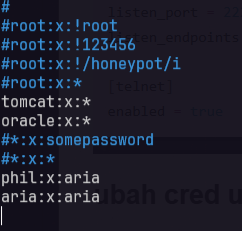

# A. Cowrie (honeypot SSH)
- [github-cowrie/cowrie](https://github.com/cowrie/cowrie)
- [dockerhub-cowrie/cowri](https://hub.docker.com/r/cowrie/cowrie)
- [docs](https://docs.cowrie.org/en/latest/README.html)

```bash
etc/cowrie.cfg - Cowrie’s configuration file.
etc/cowrie.cfg.dist - default settings, don’t change this file
etc/userdb.txt - credentials to access the honeypot
src/cowrie/data/fs.pickle - fake filesystem, this only contains metadata (path, uid, gid, size)
honeyfs/ - contents for the fake filesystem
honeyfs/etc/issue.net - pre-login banner
honeyfs/etc/motd - post-login banner
src/cowrie/data/txtcmds/ - output for simple fake commands
var/log/cowrie/cowrie.json - audit output in JSON format
var/log/cowrie/cowrie.log - log/debug output
var/lib/cowrie/tty/ - session logs, replayable with the bin/playlog utility.
var/lib/cowrie/downloads/ - files transferred from the attacker to the honeypot are stored here
bin/createfs - create your own fake filesystem
bin/playlog - utility to replay session logs
```

## A. setup manual
```bash
sudo apt update && sudo apt upgrade -y
sudo apt install git python3 python3-pip python3-venv libssl-dev libffi-dev -y

git clone https://github.com/cowrie/cowrie.git
cd cowrie

python3 -m venv venv
source venv/bin/activate
pip install --upgrade pip
pip install -r requirements.txt
```
jalankan
```bash
bin/cowrie start
bin/cowrie stop
```
lakukan ssh
```bash
ssh root@localhost -p 2222
# 123
ssh phil@localhost -p 2222
# 123
```

> Log aktivitas akan tersimpan di var/log/cowrie.

```tail -f var/log/cowrie/cowrie.log``` untuk melihat log realtime

### 1. custom config
#### ubah port
```bash
cp etc/cowrie.cfg.dist etc/cowrie.cfgcp
nano etc/cowrie.cfgcp
# Edit etc/cowrie.cfg untuk mengatur port, IP, logging, dsb.
```
Cari bagian [ssh], [telnet]:
```bash
[ssh]
enabled = true          # aktifkan honeypot SSH
listen_port = 2222      # port SSH palsu (jangan pakai 22 kalau server masih ada SSH asli)
listen_endpoints = tcp:2222:interface=0.0.0.0  # 0.0.0.0 agar bisa diakses dari luar

[telnet]
enabled = true          # aktifkan honeypot Telnet
```

#### ubah cred user
```bash
cp etc/userdb.example etc/userdb.txt
nano etc/userdb.txt
# Edit etc/userdb.txt untuk mengubah cred user
```


lakukan restart dan testing seharusnya nanti berhasil
```bash
bin/cowrie restart
```

### 2. create fake filesystem
```bash
mkdir myfs
sudo rsync -a --relative /etc/passwd /etc/shadow /home/ myfs/
bin/createfs myfs src/cowrie/data/fs.pickle
```
gunakan filesystem baru
```bash
mv myfs honeyfs
# Pastikan etc/passwd, etc/group, home/ sudah ada di myfs
# Atur username & password di etc/userdb.txt sesuai user yang ada di /etc/passwd palsu kamu.
```

### 3. ubah fake filesystem, this only contains metadata (path, uid, gid, size)
```bash
# ubah etc/passwd dengan mengubah user atau apapaun
bin/fsctl src/cowrie/data/fs.pickle
# di dalam chroot lakukan perubaha manual yang sesuai dengan passwd
mv /home/phil /home/joe
```

## setup docker
```bash
docker run -p 2222:2222 cowrie/cowrie:latest
ssh -p 2222 root@localhost
# default cred root:123
# default user phil:123
```
