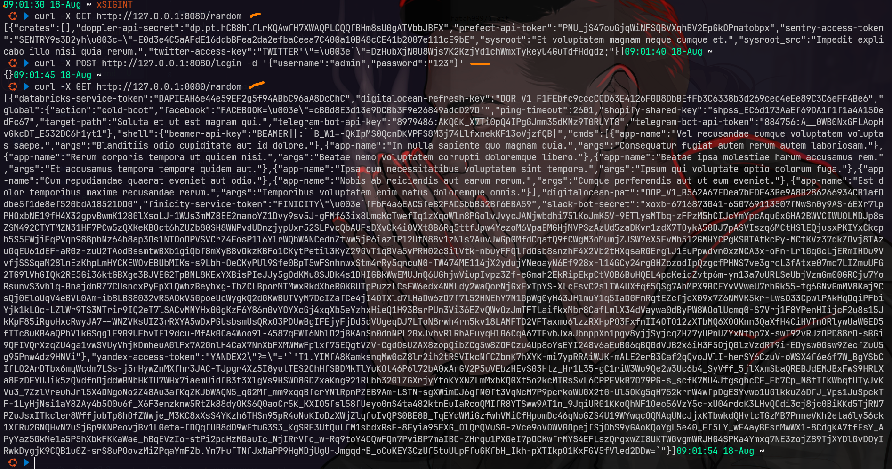

# go-pot
- [https://github.com/ryanolee/go-pot](https://github.com/ryanolee/go-pot)

## setup
```bash
docker run -p 8080:8080 --rm ghcr.io/ryanolee/go-pot:latest start --host=0.0.0.0 --port=8080
```

### setup standalone
```bash
./go-pot start
```

## testing
```bash
curl localhost:8080
curl -v http://127.0.0.1:8080/

# nmap -sV -p 8080 127.0.0.1

# Simulasi attacker request random
curl -X GET http://127.0.0.1:8080/random
curl -X POST http://127.0.0.1:8080/login -d '{"username":"admin","password":"123"}'

for i in {1..5}; do curl -s http://127.0.0.1:8080/; echo ""; done
```


