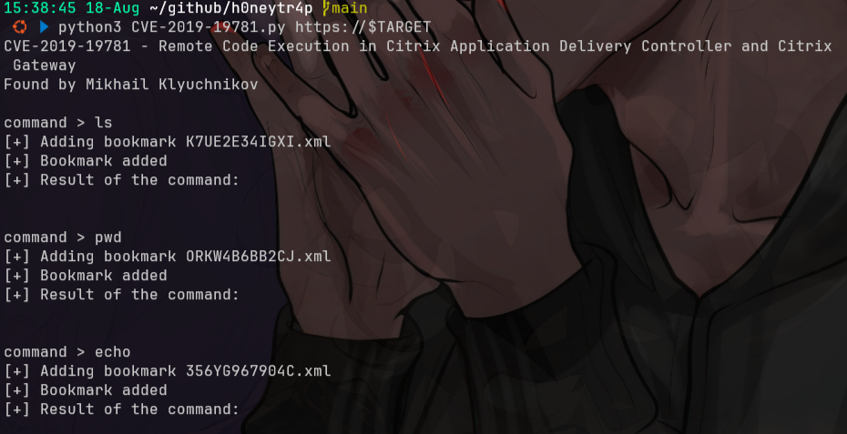

# h0neytr4p
## setup
```bash
git clone https://github.com/t3chn0m4g3/h0neytr4p
cd h0neytr4p
docker compose build
docker compose up
```

## testing
```bash
IP=192.168.1.6
curl http://$IP
curl -k https://$IP

nmap -sV -p 80,443 $IP
```

```bash
ls traps/
ls traps/CVEs/
cat traps/CVEs/*

curl 192.168.1.6/scheduler/ui/js/ffffffffbca41eb4/UIUtilJavaScriptJS
h0neytr4p  | [2025-08-18T15:26:04Z] [Path: /scheduler/ui/js/ffffffffbca41eb4/UIUtilJavaScriptJS] [Trapped: true]

# https://github.com/mpgn/CVE-2019-19781
TARGET=192.168.1.6
curl -vk --path-as-is https://$TARGET/vpn/../vpns/ 2>&1 \
  | grep "You don't have permission to access /vpns/" >/dev/null \
  && echo "VULNERABLE: $TARGET" || echo "MITIGATED: $TARGET"

wget https://raw.githubusercontent.com/mpgn/CVE-2019-19781/refs/heads/master/CVE-2019-19781.py
python3 CVE-2019-19781.py https://$TARGET
```



> TLS handshake error ... client sent an HTTP request to an HTTPS server → artinya client connect ke port 443 tapi kirim plain HTTP, bukan HTTPS.
- [Path: /favicon.ico] [Trapped: false] → artinya request datang tapi belum match rule "trap".
- [Trapped: true] → berarti payload cocok dengan salah satu trap di folder traps/ (misalnya SQLi, XSS, RCE attempt, dll).
