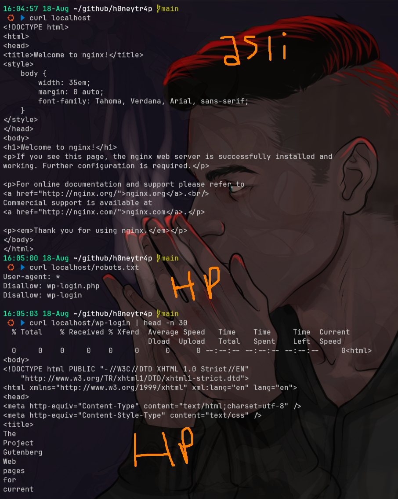

# hellpot
- [https://github.com/yunginnanet/HellPot](https://github.com/yunginnanet/HellPot)

## setup
### setup build (gagal)
```bash
sudo apt update
sudo apt install -y golang-go

git clone https://github.com/yunginnanet/HellPot
cd HellPot
make
```

### setup with excutable file
```bash
wget https://github.com/yunginnanet/HellPot/releases/download/v0.5.4%2Bbuild2/HellPot-v0.5.4+build2-linux-amd64 -O HellPot
```

### use
```bash
chmod +x HellPot
./HellPot --genconfig

# Edit your newly generated config.toml as desired.
./HellPot -c config.toml
```

### test with nginx web
```bash
sudo apt install nginx -y
sudo mv /etc/nginx/sites-available/default /etc/nginx/sites-available/default.bak
sudo rm /etc/nginx/sites-enabled/default

cat << 'EOF' | sudo tee /etc/nginx/sites-available/hellpot.conf
server {
    listen 80;
    server_name yourdomain.com;

    # robots.txt palsu
    location /robots.txt {
        proxy_set_header Host $host;
        proxy_set_header X-Real-IP $remote_addr;
        proxy_pass http://127.0.0.1:8080;
    }

    # jebakan wp-login
    location /wp-login.php {
        proxy_set_header Host $host;
        proxy_set_header X-Real-IP $remote_addr;
        proxy_pass http://127.0.0.1:8080;
    }

    # tambahan: bisa juga /wp-login
    location /wp-login {
        proxy_set_header Host $host;
        proxy_set_header X-Real-IP $remote_addr;
        proxy_pass http://127.0.0.1:8080;
    }
}
EOF

sudo ln -s /etc/nginx/sites-available/hellpot.conf /etc/nginx/sites-enabled/

sudo nginx -t
sudo systemctl restart nginx
```

### test with nginx web

## testing
```bash

curl localhost
curl localhost/wp-login # ketika dia melakukan akses ke path ini bakal di arahkan ke dalam honeypot
```


