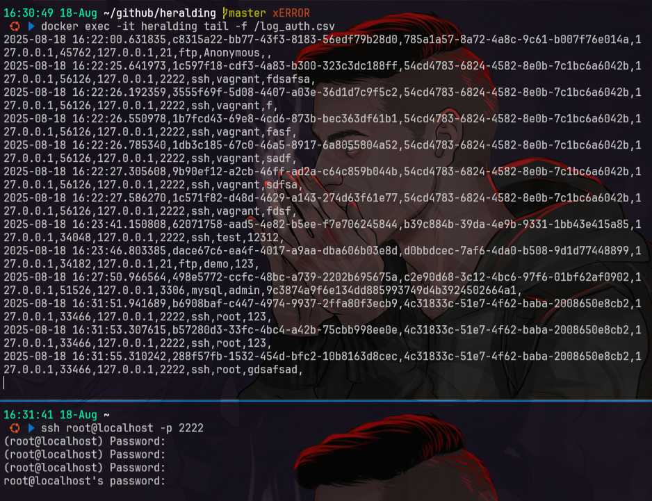

# heralding
- [https://github.com/johnnykv/heralding](https://github.com/johnnykv/heralding)

## setup
```bash
git clone https://github.com/johnnykv/heralding.git
cd heralding
docker build -t heralding .

sed -i "s|port: 22|port: 2222|" heralding/heralding.yml
sed -i "s|port: 80|port: 8080|" heralding/heralding.yml

docker rm -f heralding
docker run --name heralding --net=host heralding
docker exec -it heralding bash

cat log_auth.csv
```

## testing
```bash
nmap localhost
# Starting Nmap 7.80 ( https://nmap.org ) at 2025-08-18 16:22 UTC
# Nmap scan report for localhost (127.0.0.1)
# Host is up (0.00036s latency).
# Not shown: 982 closed ports
# PORT     STATE SERVICE
# 21/tcp   open  ftp
# 23/tcp   open  telnet
# 25/tcp   open  smtp
# 80/tcp   open  http
# 110/tcp  open  pop3
# 143/tcp  open  imap
# 443/tcp  open  https
# 465/tcp  open  smtps
# 993/tcp  open  imaps
# 995/tcp  open  pop3s
# 1080/tcp open  socks
# 2222/tcp open  EtherNetIP-1
# 3306/tcp open  mysql
# 3389/tcp open  ms-wbt-server
# 5432/tcp open  postgresql
# 5900/tcp open  vnc
# 8080/tcp open  http-proxy

ssh test@127.0.0.1 -p 2222
# password: bebas aja (contoh: 123456)

ftp 127.0.0.1
# Name: demo
# Password: password123

telnet 127.0.0.1 23
# coba ketik "root" lalu password "toor"

curl -v http://127.0.0.1:8080

sudo apt install mysql-client
mysql -h 127.0.0.1 -P 3306 -u admin -p
# ketik sembarang password

sudo apt install postgresql -y
psql -h 127.0.0.1 -p 5432 -U test
# Password: bebas

sudo apt install tigervnc-viewer -y
vncviewer 127.0.0.1:5900
```

### log
```bash
docker exec -it heralding cat /log_auth.csv
docker exec -it heralding cat /log_session.csv

docker exec -it heralding tail -f /log_auth.csv
```


