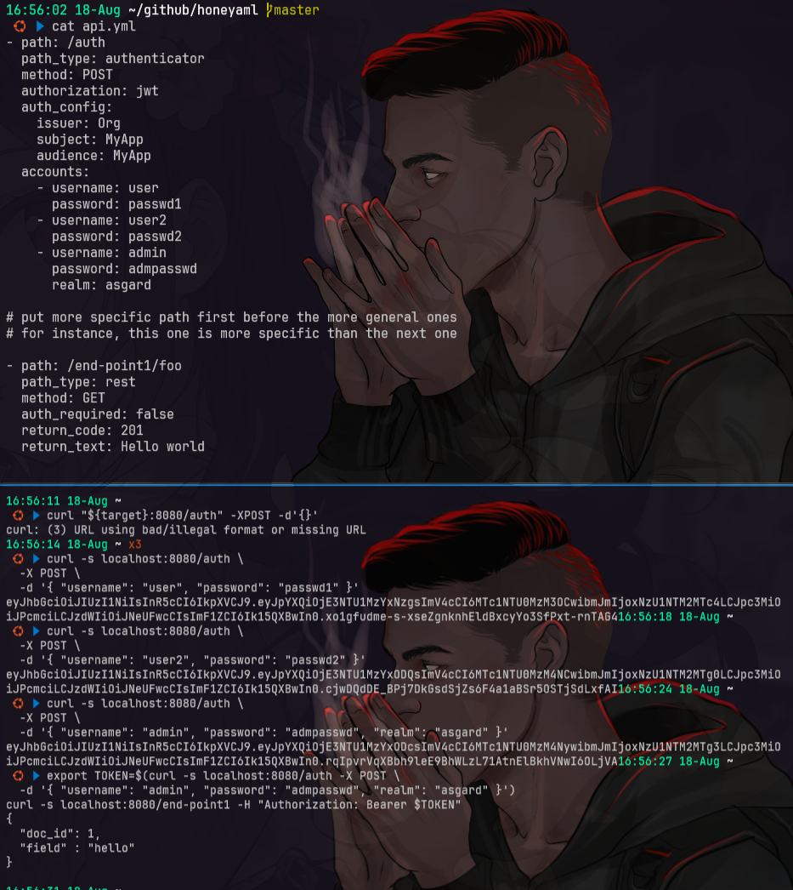

# honeyaml
- [https://github.com/mmta/honeyaml](https://github.com/mmta/honeyaml)

## setup
```bash
git clone https://github.com/mmta/honeyaml
cd honeyaml
mkdir -p logs && chmod 770 logs && sudo chown 10001 logs
docker run --rm --name honeyaml --net=host -v $(pwd)/logs:/honeyaml/logs mmta/honeyaml
```

## testing
```bash
export target=$(docker container inspect honeyaml | jq -r ".[].NetworkSettings.Networks.bridge.IPAddress")

if [ -z "$target" ] || [ "$target" == "null" ]; then
  export target="localhost"
fi

curl "${target}:8080/auth" -XPOST -d'{}'
# incorrect/missing parameter ["password", "realm", "username"]

cat api.yml

curl -s localhost:8080/auth \
  -X POST \
  -d '{ "username": "user", "password": "passwd1" }'
curl -s localhost:8080/auth \
  -X POST \
  -d '{ "username": "user2", "password": "passwd2" }'
curl -s localhost:8080/auth \
  -X POST \
  -d '{ "username": "admin", "password": "admpasswd", "realm": "asgard" }'

export TOKEN=$(curl -s localhost:8080/auth -X POST \
  -d '{ "username": "admin", "password": "admpasswd", "realm": "asgard" }')
curl -s localhost:8080/end-point1 -H "Authorization: Bearer $TOKEN"
```


