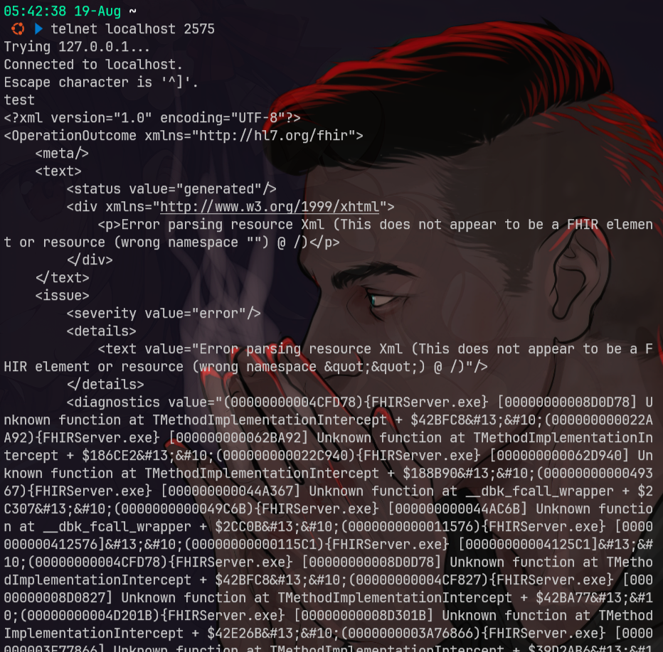
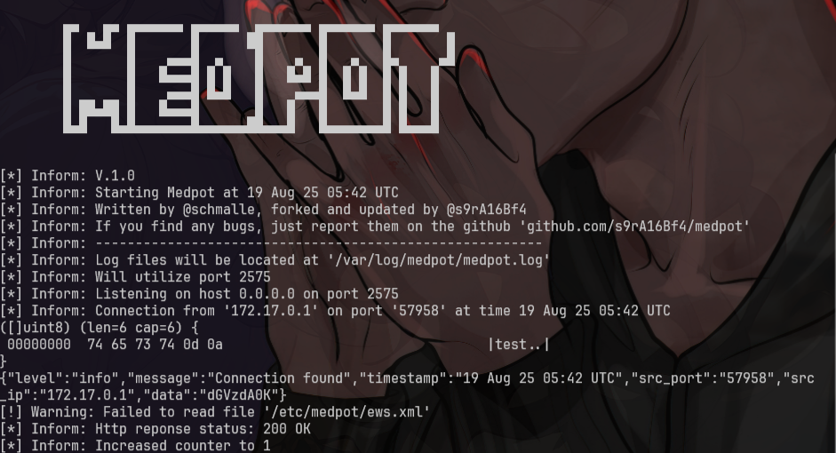

# medpot
- [https://github.com/schmalle/medpot](https://github.com/schmalle/medpot)

Is a honeypot that tries to emulate HL7 / FHIR honeypot

By default the honeypot will try to bind and listen on port 2575

## setup
### setup golang (blm nyoba)
```bash
git clone https://github.com/schmalle/medpot
cd medpot
bash scripts/dependencies.sh
bash scripts/run_medpot.sh
# go run go/*.go
bash scripts/compile_medpot.sh
# go build -o medpot go/*.go
```

### setup docker
```bash
git clone https://github.com/schmalle/medpot
cd medpot

sed -i "s|https://github.com/s9rA16Bf4/medpot.git|https://github.com/schmalle/medpot.git|" Dockerfile

cat << EOF > Dockerfile
FROM golang:1.13-alpine

# Setup apk
RUN apk -U --no-cache add \
    build-base \
    git \
    g++

# Setup go, medpot
RUN cd /tmp && \
    git clone https://github.com/schmalle/medpot.git && \
    cd medpot && \
    go get -d -v ./... && \
    go build -o medpot go/medpot.go go/logo.go && \
    mkdir -p /etc/medpot/ /var/log/medpot && \
    cp ./template/* /etc/medpot/ && \
    touch /var/log/medpot/medpot.log && \
    cp medpot /usr/bin/

# Setup user, groups and configs
RUN addgroup -g 2000 medpot && \
    adduser -S -s /bin/ash -u 2000 -D -G medpot medpot && \
    mkdir -p /var/log/medpot && \
    touch /var/log/medpot/medpot.log && \
    chown -R medpot:medpot /var/log/medpot

# Clean up
RUN apk del --purge build-base git g++ && \
    rm -rf /var/cache/apk/* /root/go /tmp/*

# Start medpot
WORKDIR /usr/bin/
USER medpot:medpot
CMD ["medpot"]
EOF

bash scripts/compile_docker.sh
docker run -d \
  --name medpot \
  -p 2575:2575 \
  --restart always \
  medpot
```

## testing
```bash
telnet localhost 2575

docker logs -f medpot
```



