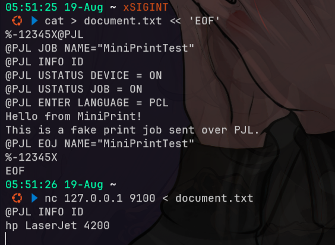
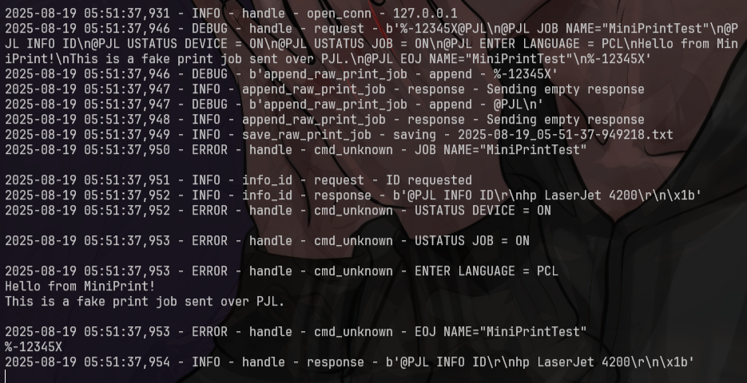

# miniprint
- [https://github.com/sa7mon/miniprint](https://github.com/sa7mon/miniprint)

miniprint acts like a standard networked printer that has been accidentally exposed to the public internet.

It speaks the Printer Job Language (PJL) over the raw network "protocol"

### Printer Protocol Support

|Protocol	|Port	|Support    |
| --- | --- | --- |
|Raw	    | 9100	|Yes        |
|Web	    | 80	|No         |
|IPP	    | 631	|No         |
|LPD	    | 515	|No         |

## setup
### setup docker
```bash
git clone https://github.com/sa7mon/miniprint
cd miniprint
docker build -t miniprint .
docker run -it --rm --net=host --name miniprint miniprint
```

### setup manual (blm nyoba)
```bash
git clone https://github.com/sa7mon/miniprint
cd miniprint
python3 -m venv venv
source venv/bin/activate
pip3 install -r requirements.txt
python3 ./server.py
```

## testing
```bash
# nc 127.0.0.1 9100
telnet 127.0.0.1 9100

cat > document.txt << 'EOF'
%-12345X@PJL
@PJL JOB NAME="MiniPrintTest"
@PJL INFO ID
@PJL USTATUS DEVICE = ON
@PJL USTATUS JOB = ON
@PJL ENTER LANGUAGE = PCL
Hello from MiniPrint!
This is a fake print job sent over PJL.
@PJL EOJ NAME="MiniPrintTest"
%-12345X
EOF

nc 127.0.0.1 9100 < document.txt
```



