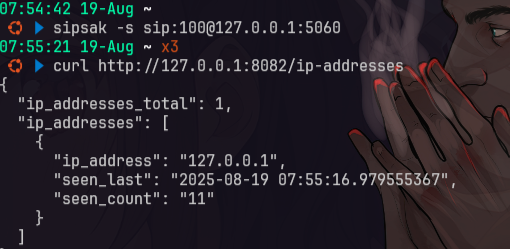

# sentrypeer
- [https://github.com/SentryPeer/SentryPeer](https://github.com/SentryPeer/SentryPeer)

entryPeer itu fungsinya sebagai honeypot SIP (VoIP) dan sistem deteksi fraud. Jadi, dia bukan firewall langsung, tapi lebih ke alat yang menjebak, mengumpulkan, dan berbagi data tentang aktor jahat (bad actors) yang mencoba menyalahgunakan sistem telekomunikasi VoIP.

## setup
### setup docker (build lama)
```bash
git clone https://github.com/SentryPeer/SentryPeer
cd SentryPeer
# sudo docker build --no-cache -t sentrypeer .
docker build -t sentrypeer .
docker run -d -p 5060:5060/tcp -p 5061:5061/tcp -p 5060:5060/udp -p 8082:8082 -p 4222:4222/udp sentrypeer:latest
```

### setup ubuntu
```bash
sudo apt install software-properties-common
sudo add-apt-repository ppa:gavinhenry/sentrypeer

## tidak bisa menggunakan jammy harus focal
sudo sed -i 's/jammy/focal/g' /etc/apt/sources.list.d/gavinhenry-ubuntu-sentrypeer-jammy.list

sudo apt-get update
sudo apt-get install sentrypeer

sentrypeer --version
# Jalankan SentryPeer dengan RESTful API (port 8082) + SIP honeypot (port 5060/5061 TCP/UDP)

sentrypeer -a # jika belum aktif
sudo pkill sentrypeer # memtaikan

# Jalankan dengan REST API + JSON logging + verbose log
sentrypeer -a -j -v
# sentrypeer -a -j -v -l /var/log/sentrypeer.json -f /var/lib/sentrypeer/sentrypeer.db
```

## testing
### testing restful api
```bash
# Coba akses health check endpoint:
curl http://127.0.0.1:8082/health-check

# Cek daftar IP “bad actors” yang sudah tercatat:
curl http://127.0.0.1:8082/ip-addresses
```

### testing sip
```bash
sudo apt-get install sipsak -y
sipsak -s sip:100@127.0.0.1:5060

# Kalau SentryPeer aktif, harusnya dia log request itu dan simpan IP kamu (127.0.0.1) sebagai “bad actor”.
curl http://127.0.0.1:8082/ip-addresses
```



### log
```bash
cat sentrypeer_json.log
jq . ~/github/SentryPeer/sentrypeer_json.log
```
