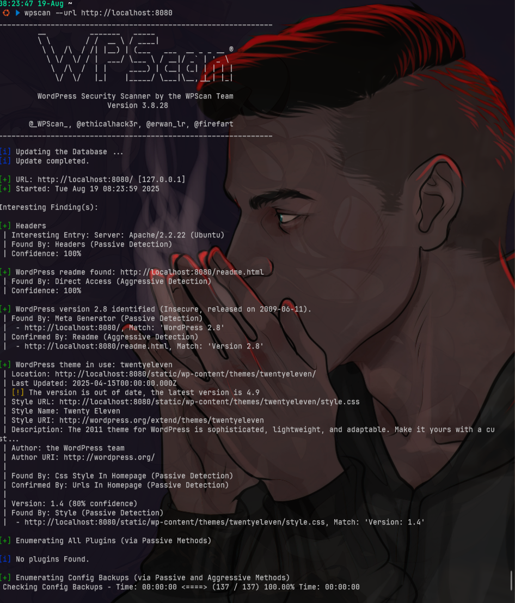
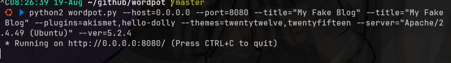
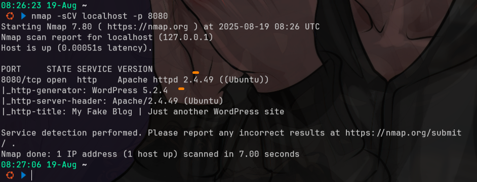

# wordpot
- [https://github.com/gbrindisi/wordpot](https://github.com/gbrindisi/wordpot)

## setup
### setup manual
```bash
git clone https://github.com/gbrindisi/wordpot
cd wordpot

sudo apt install python2 -y
sudo apt install python-pip -y

# sed -i "s|github.com/threatstream/hpfeeds/#egg=hpfeeds-dev|github.com/hpfeeds/hpfeeds/#egg=hpfeeds-dev|" requirements.txt
sed -i '2s|.*|hpfeeds|' requirements.txt # replace baris kedua dari requirements.txt supaya jadi hpfeeds

pip2 install -r requirements.txt

python2 wordpot.py --help

# Custom host & port (misalnya di port 8080):
python2 wordpot.py --host=0.0.0.0 --port=8080 \

# Customisasi tambahan
--title="My Fake Blog" # Judul blog palsu
--plugins=akismet,hello-dolly # Pura-pura punya plugin tertentu
--themes=twentytwelve,twentyfifteen # Pura-pura pakai theme tertentu
--ver=5.2.4 # Set versi WordPress palsu:
--server="Apache/2.4.49 (Ubuntu)" # Ubah Server header biar lebih meyakinkan:
```

<!-- ### setup docker
```bash

``` -->

## testing
```bash
nmap localhost -sCV -p 8080

curl -i http://localhost:8080/
curl -i http://localhost:8080/wp-content/plugins/akismet/
curl -i http://localhost:8080/wp-content/plugins/hello-dolly/
curl -i http://localhost:8080/wp-content/themes/twentytwelve/

# wpascan
sudo apt update
sudo apt install ruby-full build-essential libcurl4-openssl-dev libxml2 libxml2-dev libxslt1-dev ruby-dev -y
sudo gem install wpscan

wpscan --version
wpscan --url http://localhost:8080
wpscan --url http://localhost:8080 --enumerate p,t,u

# wpscan docker
docker pull wpscanteam/wpscan
docker run -it --rm wpscanteam/wpscan --url http://localhost:8080 --enumerate p,t
```




