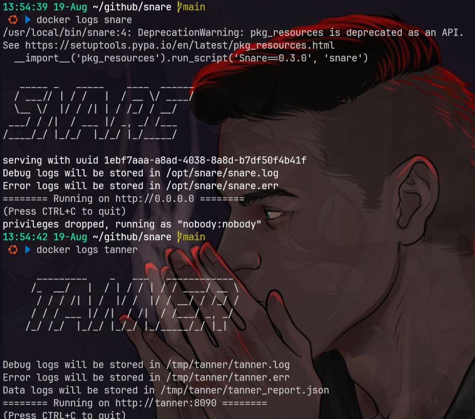

# snare
- [https://github.com/mushorg/snare](https://github.com/mushorg/snare)

## setup
```bash
git clone https://github.com/mushorg/snare.git
cd snare
python3 -m venv venv
source venv/bin/activate

pip3 install -r requirements.txt
python3 setup.py install

clone --target http://example.com --path <path to base dir>
snare --port 8080 --page-dir example.com --path <path to base dir>
```

> Test: Visit http://localhost:8080/index.html

### setup docker
```bash
docker network create tanner_local

git clone https://github.com/mushorg/snare.git
cd snare

sed -i "s|FROM python:3.6-alpine3.8|FROM python:3.8-alpine|" Dockerfile
sed -i "s|"80:80"|"8080:80"|" docker-compose.yml
sed -i '/8080:80/a\    environment:\n     - TANNER=tanner' docker-compose.yml

sed -i 's|snare_local:|tanner_local:\n    external: true|' docker-compose.yml
sed -i 's|snare_local|tanner_local|' docker-compose.yml

# sed -i '/snare_local:/a\  tanner_local:\n    external: true' docker-compose.yml

docker compose up -d
```

# tanner
- [https://github.com/mushorg/tanner](https://github.com/mushorg/tanner)

## setup
```bash
git clone https://github.com/mushorg/tanner.git
cd tanner/docker

sed -i 's|tanner_local:|tanner_local:\n    external: true|' docker-compose.yml

docker compose up -d
```

## testing
```bash
curl http://localhost:8080
curl http://localhost:8090/version
curl "http://localhost:8080/index.php?cmd=id"
```

## log
```bash
docker logs snare
docker logs tanner

docker exec -it tanner cat /tmp/tanner/tanner.log
docker exec -it tanner cat /tmp/tanner/tanner.err
docker exec -it tanner cat /tmp/tanner/tanner_report.json
```


