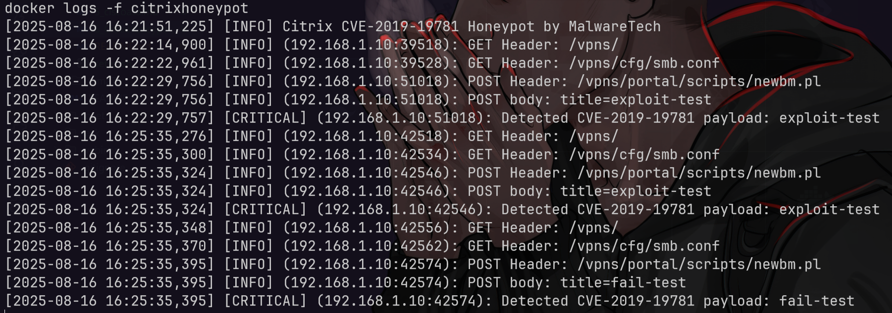

# CitrixHoneypot
- [https://github.com/MalwareTech/CitrixHoneypot](https://github.com/MalwareTech/CitrixHoneypot)

## setup
### setup manual
```bash
git clone https://github.com/MalwareTech/CitrixHoneypot
cd CitrixHoneypot
mkdir logs ssl
openssl req -newkey rsa:2048 -nodes -keyout ssl/key.pem -x509 -days 365 -out ssl/cert.pem
python3 CitrixHoneypot.py
```

### setup docker
```bash
git clone https://github.com/MalwareTech/CitrixHoneypot
cd CitrixHoneypot
mkdir logs ssl
openssl req -newkey rsa:2048 -nodes -keyout ssl/key.pem -x509 -days 365 -out ssl/cert.pem

sed -i '/ssl.wrap_socket/,+3c\
context = ssl.SSLContext(ssl.PROTOCOL_TLS_SERVER)\n\
context.load_cert_chain(certfile="ssl/cert.pem", keyfile="ssl/key.pem")\n\
httpd.socket = context.wrap_socket(httpd.socket, server_side=True)' CitrixHoneypot.py

docker build -t citrixhoneypot .
docker run -d --rm -p 443:443 \
  --name citrixhoneypot \
  -v $PWD:/CitrixHoneypot \
  -w /CitrixHoneypot \
  citrixhoneypot

docker logs -f citrixhoneypot
```

## testing
```bash
IP=192.168.1.10

# type 1 scan detection
curl -vk "https://$IP/vpn/../vpns/"
# type 2 scan detection
curl -vk "https://$IP/vpn/../vpns/cfg/smb.conf"
# exploit attempt (payload in POST)
curl -vk -X POST "https://$IP/vpns/portal/scripts/newbm.pl" \
  -d "title=exploit-test"
```

```bash
cat > exp.sh << EOF
#!/bin/bash
# Testing Citrix CVE-2019-19781 Honeypot

IP="127.0.0.1"   # ganti ke IP honeypot kamu

echo "[*] Type 1 scan detection"
curl -vk "https://$IP/vpn/../vpns/"

echo -e "\n[*] Type 2 scan detection"
curl -vk "https://$IP/vpn/../vpns/cfg/smb.conf"

echo -e "\n[*] Exploit attempt (payload in POST)"
curl -vk -X POST "https://$IP/vpns/portal/scripts/newbm.pl" \
  -d "title=exploit-test"

echo -e "\n[*] Struggle check test (no ../ traversal)"
curl -vk "https://$IP/vpns/"
curl -vk "https://$IP/vpns/cfg/smb.conf"
curl -vk -X POST "https://$IP/vpns/portal/scripts/newbm.pl" \
  -d "title=fail-test"
EOF
bash exp.sh
```


