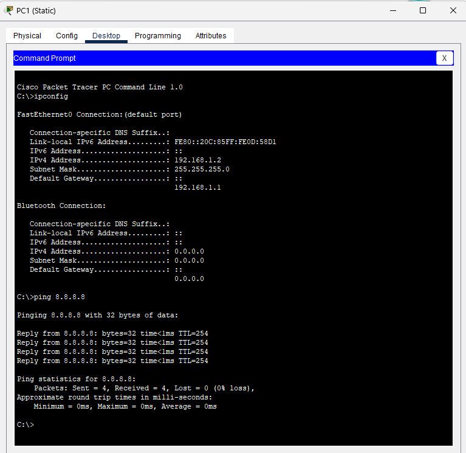

# Simulasi NAT Cisco: Internet untuk Client & Akses Server via Router
## Topology


## Configurasi
### 1. tambahkan IP Address Pada Tiap Perangkat
#### a. PC
- PC1 (Static)
  - IP: 192.168.1.2/24
  - Netmask: 255.255.255.0
  - Gateway: 192.168.1.1
  - DNS: 8.8.8.8
- PC2 (DHCP)
  - IP DHCP

#### b. R1
```bash
enable
configure terminal
hostname R1
interface Loopback0
 ip address 1.1.1.1 255.255.255.255
interface GigabitEthernet0/0
 ip address 192.168.1.1 255.255.255.0
 no shutdown
ip dhcp pool LOCAL
 network 192.168.1.0 255.255.255.0
 default-router 192.168.1.1
 dns-server 8.8.8.8
ip dhcp excluded-address 192.168.1.1 192.168.1.100
interface GigabitEthernet0/1
 ip address 102.15.12.1 255.255.255.252
 no shutdown
```

#### c. R2
```bash
enable
configure terminal
hostname R1 
interface Loopback0
 ip address 8.8.8.8 255.255.255.255
interface GigabitEthernet0/0
 ip address 102.15.12.2 255.255.255.252
 no shutdown
interface GigabitEthernet0/1
 ip address 172.16.1.1 255.255.255.0
 no shutdown
```

#### d. Server
- Server (Static)
  - IP: 172.16.1.254/24
  - Netmask: 255.255.255.0
  - Gateway: 172.16.1.1
- jangan lupa enable Web Server dan DNS (opsional jika ingin ditambahkan)
  
  

### 2. Configurasikan Default Route R1 dan NAT PAT untuk client Akses Internet, dan Konfigurasi agar ip router di port Forwarding ke Server
#### a. Konfigurasi NAT R1
```bash
ip route 0.0.0.0 0.0.0.0 102.15.12.2 
access-list 1 permit any
ip nat inside source list 1 interface GigabitEthernet0/1 overload

interface GigabitEthernet0/0
 ip nat inside
interface GigabitEthernet0/1
 ip nat outside
```

#### b. verifikasi Ping
- buka PC1 atau PC2.
- lalu buka command prompt dan lakukan ping ke ip addresss 8.8.8.8
  

#### c. Konfigurasi NAT R2
```bash
ip nat inside source static 172.16.1.254 8.8.8.8
interface GigabitEthernet0/0
 ip nat outside
interface GigabitEthernet0/1
 ip nat inside
```

#### d. verifikasi Akses Server
