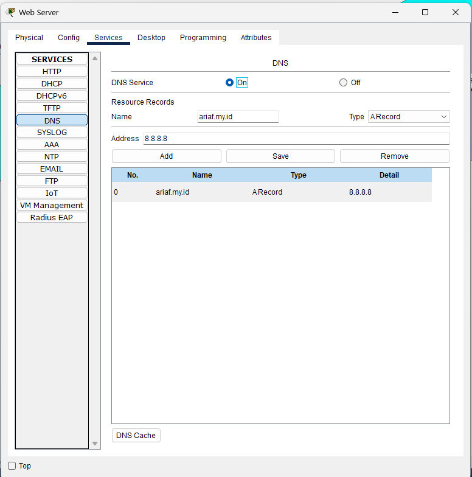
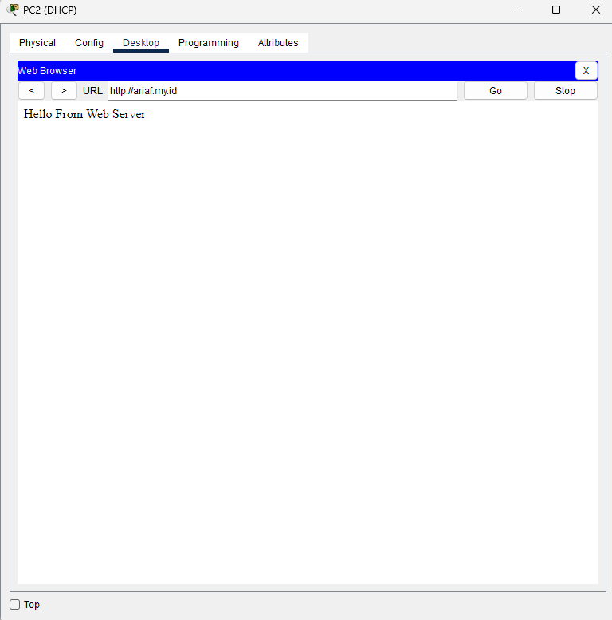

# Simulasi NAT Cisco: Internet untuk Client & Akses Server via Router

## 🧭 Deskripsi Topologi

Simulasi ini menggambarkan skenario jaringan dengan dua router (R1 dan R2), dua PC client (PC1 dan PC2), dan satu server. Tujuan utama:

* **Client (PC1 & PC2)** dapat **mengakses internet** melalui NAT Overload (PAT) di R1.
* **Server** berada di jaringan private **172.16.1.0/24**, dan dapat diakses dari internet menggunakan **Static NAT** pada R2.
* **PC1** menggunakan konfigurasi **IP statis**, sementara **PC2** mendapatkan IP melalui **DHCP** dari R1.

📌 **Gambaran Topologi:**


---

## ⚙️ Konfigurasi Jaringan

### 1. 🖥️ IP Address Tiap Perangkat

#### a. PC

* **PC1 (Static)**

  * IP: `192.168.1.2/24`
  * Gateway: `192.168.1.1`
  * DNS: `8.8.8.8`
* **PC2 (DHCP)**

  * Otomatis mendapatkan IP dari DHCP pool `192.168.1.101 - 192.168.1.254`

#### b. Router R1

```bash
enable
configure terminal
hostname R1

interface Loopback0
 ip address 1.1.1.1 255.255.255.255

interface GigabitEthernet0/0
 ip address 192.168.1.1 255.255.255.0
 no shutdown

ip dhcp excluded-address 192.168.1.1 192.168.1.100
ip dhcp pool LOCAL
 network 192.168.1.0 255.255.255.0
 default-router 192.168.1.1
 dns-server 8.8.8.8

interface GigabitEthernet0/1
 ip address 102.15.12.1 255.255.255.252
 no shutdown
```

#### c. Router R2

```bash
enable
configure terminal
hostname R2

interface Loopback0
 ip address 8.8.8.8 255.255.255.255

interface GigabitEthernet0/0
 ip address 102.15.12.2 255.255.255.252
 no shutdown

interface GigabitEthernet0/1
 ip address 172.16.1.1 255.255.255.0
 no shutdown
```

#### d. Server

* **IP Static**: `172.16.1.254/24`
* **Gateway**: `172.16.1.1`
* Aktifkan fitur:

  * ✅ Web Server
  * ✅ DNS Server (opsional)

📸



---

### 2. 🔄 Konfigurasi NAT & Routing

#### a. NAT Overload (PAT) di R1

```bash
ip route 0.0.0.0 0.0.0.0 102.15.12.2

access-list 1 permit any
ip nat inside source list 1 interface GigabitEthernet0/1 overload

interface GigabitEthernet0/0
 ip nat inside
interface GigabitEthernet0/1
 ip nat outside
```

📱 **Tujuan**: Client dari jaringan lokal bisa mengakses internet menggunakan IP publik dinamis (PAT).

#### b. Verifikasi Akses Internet

* Dari PC1 atau PC2, buka Command Prompt lalu ping:

```bash
ping 8.8.8.8
```

📸


#### c. Static NAT di R2 (Port Forwarding)

```bash
ip nat inside source static 172.16.1.254 8.8.8.8

interface GigabitEthernet0/0
 ip nat outside
interface GigabitEthernet0/1
 ip nat inside
```

🌟 **Tujuan**: Mengarahkan IP publik `8.8.8.8` ke server `172.16.1.254`.

#### d. Verifikasi Akses Server dari Client

* Buka browser di PC1/PC2, akses `http://8.8.8.8`
  📸
  

---

## ✅ Ringkasan Fitur

| Perangkat | Fitur                                 |
| --------- | ------------------------------------- |
| PC1       | Static IP + Gateway                   |
| PC2       | DHCP IP dari R1                       |
| R1        | DHCP Server + NAT PAT + Default Route |
| R2        | Static NAT (Port Forwarding)          |
| Server    | Web Server + DNS (optional)           |

---

Jika kamu butuh file `.pkt` atau file konfigurasi lengkap, silakan minta ya!