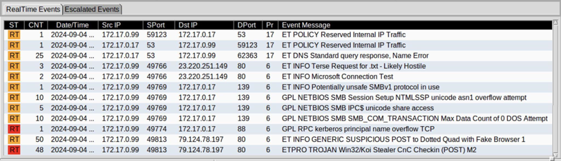
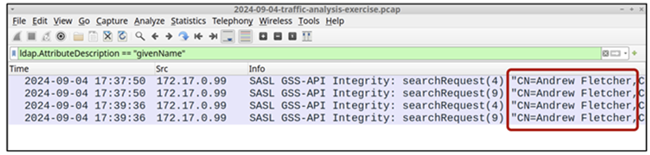
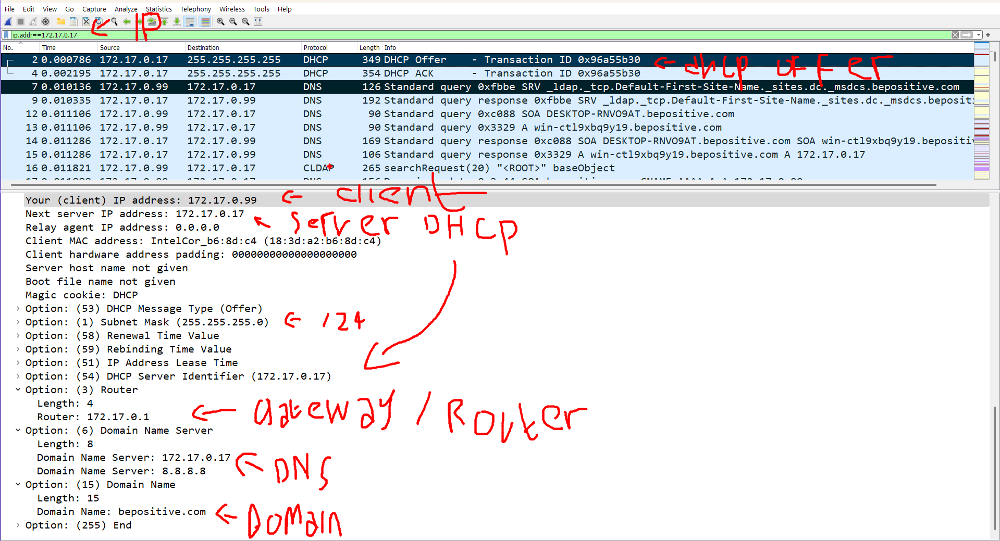
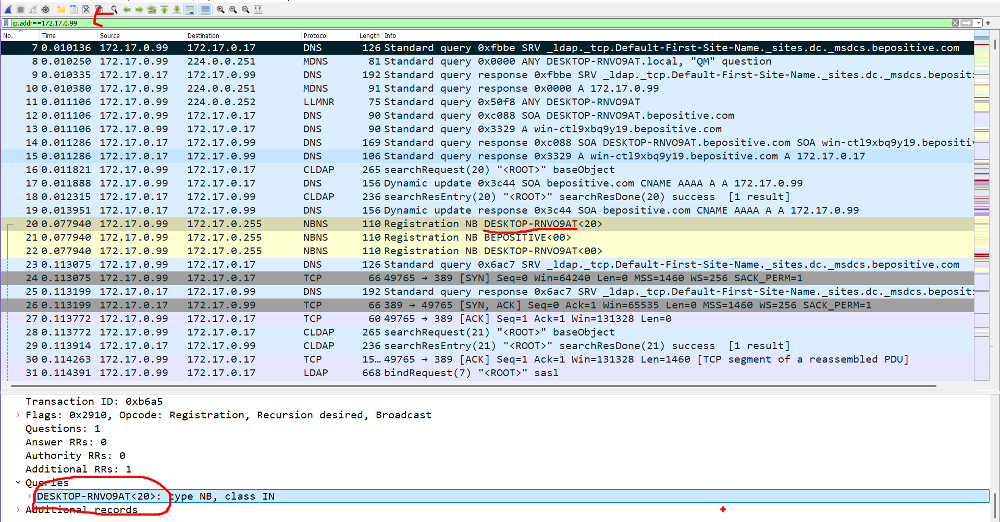
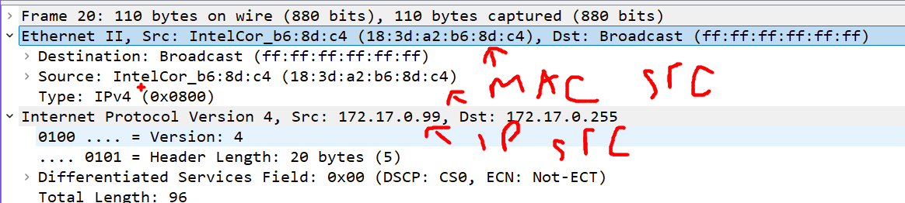
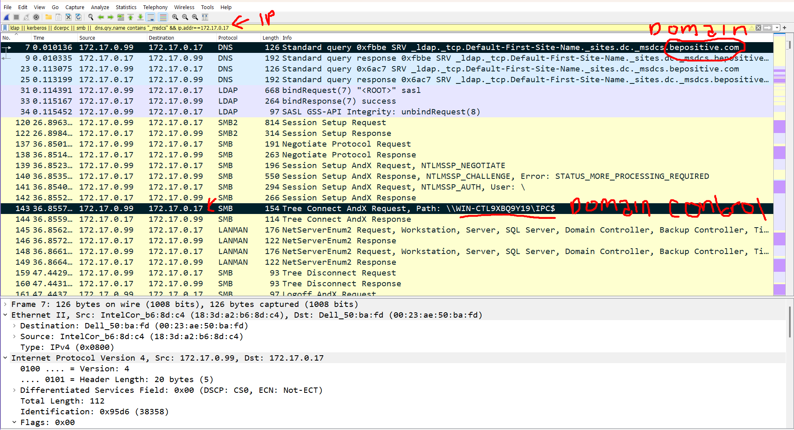
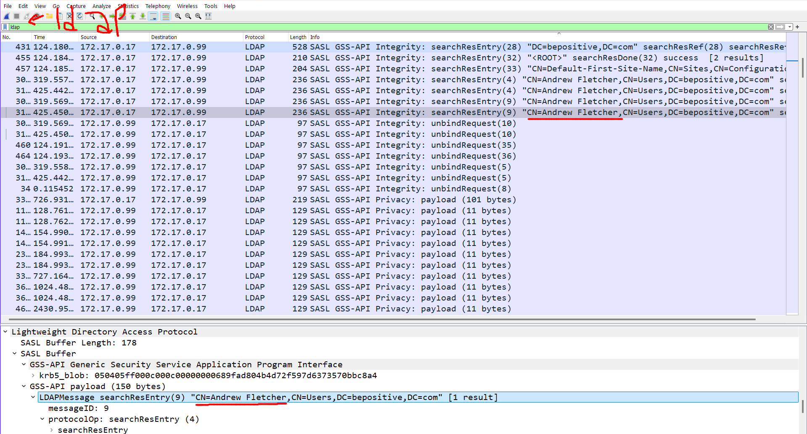
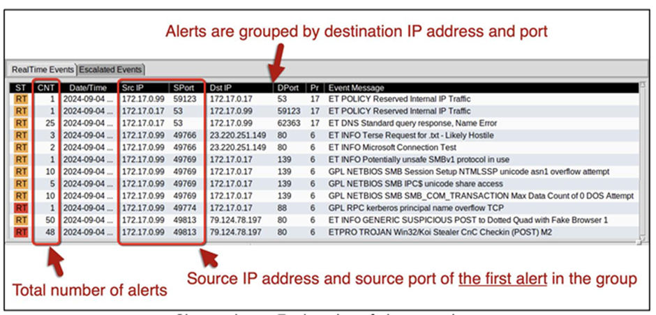

# Malware Incident Report

## ENVIRONMENT

* LAN segment range: 172.17.0.0/24 (172.17.0.0 through 172.17.0.255)
* Domain: bepositive.com
* AD environment name: bepositive
* Domain Controller: 172.17.0.17 - WIN-CTL9XBQ9Y19\IPC\$
* LAN segment gateway: 172.17.0.1
* LAN segment broadcast address: 172.17.0.255

## BACKGROUND


Pada lingkungan jaringan internal, sistem telah memunculkan serangkaian peringatan dari IDS (Intrusion Detection System). Teridentifikasi bahwa salah satu perangkat endpoint (172.17.0.99) memperlihatkan indikasi kompromi dan menunjukkan perilaku yang konsisten dengan pola infeksi malware.

## INCIDENT SUMMARY

Pada tanggal **4 September 2024**, sistem deteksi intrusi (IDS) pada jaringan `bepositive.com` mendeteksi aktivitas mencurigakan dari host internal `172.17.0.99` (DESKTOP-RNVO9AT) yang digunakan oleh user `Andrew Fletcher (afletcher)`.

### Temuan Teknis:

* Host melakukan komunikasi ke IP luar `79.124.78.197` menggunakan HTTP POST.
* Terindikasi mengakses URL mencurigakan:

  * `/index.php?id=&subid=qIOuKk7U`
  * `/foots.php`
* Mengakses layanan sensitif:

  * **SMBv1** dan **Kerberos** ke Domain Controller `172.17.0.17`
* Menggunakan fake browser signature saat koneksi keluar.
* Terdeteksi aktivitas DNS abnormal.
* Alert IDS:

  * `ETPRO TROJAN Win32/Koi Stealer CnC Checkin`

### Indikasi Kompromi (IoC):

* **IP C2**: `79.124.78.197`
* **URL mencurigakan**:

  * `/index.php?id=&subid=qIOuKk7U`
  * `/foots.php`
* **Protokol yang digunakan**: HTTP POST, SMBv1, Kerberos

## VICTIM DETAILS

* **Hostname**: DESKTOP-RNVO9AT
* **IP Address**: 172.17.0.99
* **MAC Address**: 18:3d\:a2\:b6:8d\:c4
* **User**: Andrew Fletcher (afletcher)

## ANALISIS (Gaya Santai Biar Gampang Paham 😎)

Jadi gini, di jaringan `bepositive.com`, tiba-tiba ada satu PC (172.17.0.99) yang bikin rame alert IDS. Setelah dicek, ternyata si PC ini kena malware bernama **Koi Stealer**. Ini malware yang suka banget ngirim data sensitif ke luar dan nyoba masuk ke sistem lain lewat protokol lawas kayak SMBv1.

Beberapa hal yang bikin curiga:

* Dia konek ke IP luar yang mencurigakan (79.124.78.197) pakai HTTP POST.
* URL-nya juga aneh: `/index.php?id=&subid=qIOuKk7U`, `/foots.php`
* Dia nyoba akses SMBv1 dan Kerberos ke Domain Controller, bisa jadi nyoba ambil kredensial atau nyebar ke device lain.
* Parahnya lagi, dia nyamar jadi browser palsu buat ngehindarin deteksi.

Buat sekarang, penting banget buat **isolasi si host**, ambil image buat forensik lanjutan, dan pastikan semua endpoint lainnya dicek juga. Jangan lupa **disable SMBv1** kalau belum, dan update sistem keamanan secepatnya!

## REKOMENDASI

1. **Isolasi** host `172.17.0.99` dari jaringan segera.
2. **Ambil memory & disk image** untuk investigasi forensik lanjutan.
3. **Cek seluruh sistem** di subnet yang sama untuk tanda-tanda infeksi.
4. **Matikan SMBv1** dan gunakan protokol yang lebih aman.
5. **Perbarui sistem deteksi dan antivirus**.
6. **Laporkan insiden ini ke tim manajemen dan audit** sebagai potensi data breach.

## KESIMPULAN

Insiden ini menunjukkan bahwa host `172.17.0.99` telah terinfeksi oleh malware **Koi Stealer**, yang berbahaya karena mampu mencuri data dan menyebar melalui jaringan internal. Perlu tindakan cepat berupa isolasi, investigasi, dan perbaikan sistem untuk mencegah penyebaran lebih lanjut dan meminimalisir kerugian.

## Reference
<!--  -->
- ```ip.addr==172.17.0.17```
  
  
  
- ```ldap || kerberos || dcerpc || smb ||  dns.qry.name contains "_msdcs" && ip.addr==172.17.0.17```
  
- ```ldap```
  
- alert ids
  