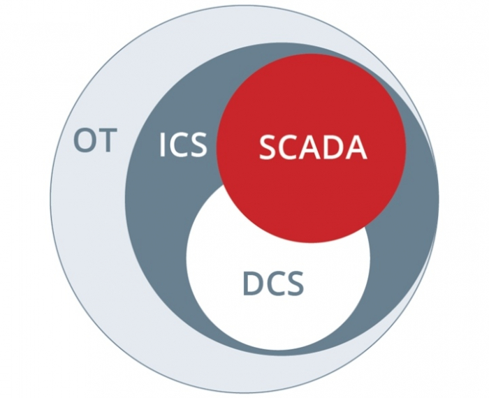
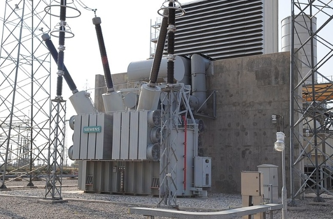
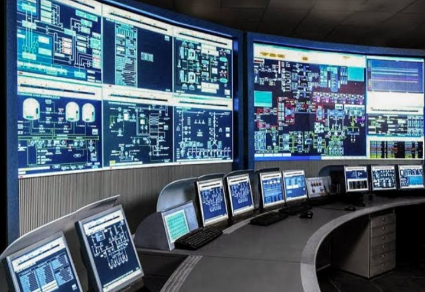
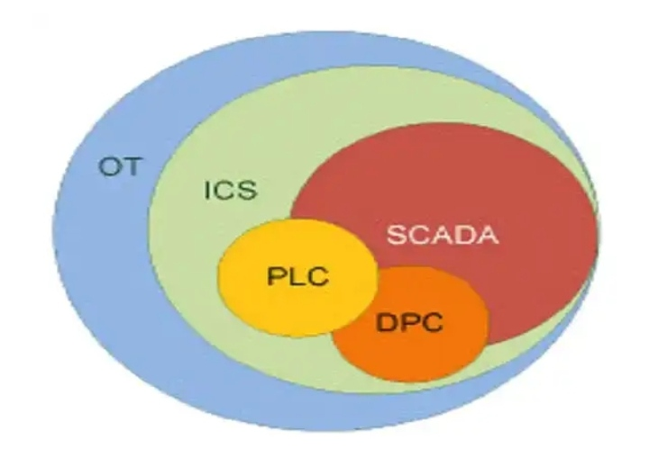

# Research serangan ICS/SCADA
sebelum kita mengetahui serangan ICS / SCADA kita perlu tahu dulu apa sih itu OT, ICS, SCADA, dan DCS?

## Apa Itu OT, ICS, SCADA, dan DCS?
Setiap hari, banyak teknologi bekerja di belakang anda sehingga memungkinkan kehidupan modern dan canggih berjalan. Dua contoh yang paling penting termasuk Teknologi Informasi (TI) dan Teknologi Operasional (OT). Kebanyakan dari kita mengenali IT sebagai istilah yang secara luas mencakup komputasi digital. Nah, bagaimana dengan OT?

OT mungkin sulit dimengerti, tetapi itu hanya karena kebanyakan dari kita tidak mengetahui nomenklatur-nya. Belakangan, perkembangan yang menarik membawa konvergensi antara OT dan IT yang memiliki implikasi besar bagi teknologi dan industri.

Dilansir dari Securicon, istilah OT, ICS, SCADA, dan DCS memang harus banyak diketahui dan dipahami banyak orang. Apapun alasannya, perangkat dan data di dalamnya bisa membantu anda dalam kehidupan sehari-hari tanpa disadari.

### 1. Operational Technology (OT)
OT atau Teknologi Operasional mencakup sistem komputasi yang mengelola operasional industri. Ini termasuk pemantauan Minyak dan Gas, Utilitas Listrik, operasional manufaktur, dan banyak lagi.

Sederhananya, OT menjalankan jaringan yang memungkinkan norma-norma dalam sebuah peradaban manusia untuk berlanjut seperti menyalakan listrik di rumah Anda atau air bersih yang mengalir ke rumah anda lalu keluar melalui keran.

### 2. Industrial Control System (ICS)
Industrial Control System (ICS) adalah istilah umum yang mencakup SCADA dan DCS. Jaringan ICS dapat memantau banyak infrastruktur dan sistem bahan baku.

Contohnya seperti berikut ini:

- Mesin dan sabuk yang berjalan dalam operasi penambangan
- Konsumsi daya di jaringan listrik
- Tekanan katup di fasilitas gas alam

Jaringan ICS sangat penting untuk mission critical, yang membutuhkan semua hal yang bersifat segera dan ketersediaan tinggi (high-availability). Dalam banyak hal, penekanan 'segera' dan 'ketersediaan' inilah yang memberikan perbedaan utama antara sistem IT dan OT/ICS.

Untuk IT, keamanan adalah prioritas tinggi yang dilindungi oleh trias Confidentiality, Integrity, and Availability (CIA). Sebaliknya dalam jaringan OT/ICS, integritas dan kerahasiaan menempati urutan kedua setelah ketersediaan (high-availability).

### 3. Supervisory Control and Data Acquisition (SCADA)
SCADA adalah arsitektur sistem untuk mengelola proses yang besar dan kompleks. Sistem SCADA biasanya ditemukan di penyedia utilitas seperti transmisi gas alam dan tenaga listrik, di mana fungsi kontrol didistribusikan di wilayah geografis yang luas.

Sistem SCADA terdiri dari tiga komponen utama:

- Sebuah pusat perintah (central command center) yang terdiri dari semua server yang menjalankan perangkat lunak SCADA.
- Beberapa, sistem kontrol lokal yang terletak jauh (remote) secara langsung mengontrol dan mengotomatisasi semua peralatan dan proses.
- Sistem komunikasi menghubungkan server di pusat komando ke lokasi terpencil

Tujuan utama SCADA adalah akuisisi data: jaringan terdiri dari beberapa unit terminal jarak jauh (Remote Terminal Units/RTU) yang digunakan untuk mengumpulkan data kembali atau menuju pusat komando.

Data-data ini digunakan untuk membuat keputusan tingkat tinggi.

### 4. Distributed Control System (DCS)
DCS adalah proses kontrol terhadap sebuah sistem yang menghubungkan pengontrol, sensor, terminal operator dan aktuator. Semua proses ini akan menghasilkan data.

Fungsi akuisisi data dan kontrol data di DCS dilakukan oleh prosesor terdistribusi yang terletak di dekat perangkat periferal atau instrumen.

Sementara DCS dan SCADA secara fungsional sangat mirip, DCS umumnya digunakan pada fasilitas pemrosesan besar dan kontinu. Operasionalnya hampir selalu dikontrol di tempat dan jarak jauh.

## Ancaman Besar yang Menyerang ICS/SCADA
Untuk memahami serangan dan ancaman terhadap Supervisory Control and Data Acquisition (SCADA) memang cukup rumit, tetapi itu bisa sangat sederhana jika anda memahami bahwa SCADA menyangkut hajat hidup orang banyak.

Oke, untuk lebih simpelnya, coba kita bayangkan hal berikut ini. Misalkan sebuah fasilitas pengolahan air bekerja dengan menggunakan jasa vendor pihak ke-3.

Vendor itu mengelola fasilitas dari jarak jauh (remote command). Untuk melakukannya, fasilitas perlu memaparkan beberapa proses mereka ke internet. Begitu fasilitas terhubung, mereka mengekspos operasional kepada pelaku yang berpotensi jahat hanya untuk menunggu mengeksploitasi atau menggelar insiden.

Kemudian coba munculkan pertanyaan ini di benak anda:

1. Apa yang akan terjadi jika proses fasilitas terganggu?
2. Apa yang akan terjadi jika penjahat dunia maya atau hacker mengambil alih fasilitas ini?
3. Berapa banyak kerusakan yang dapat mereka sebabkan sebelum mereka terdeteksi?
4. Berapa banyak korban jika insiden terjadi secara langsung maupun tidak langsung?

Jawaban atas pertanyaan-pertanyaan ini cukup meresahkan. Apalagi jika anda masih buta terhadap keamanan informasi dan keamanan sistem elektronik. Tapi, untungnya, mereka juga bisa dihindari.

### Masalah Sistem Kontrol Industri (Industrial Control System/ICS)
Jika Anda bekerja atau terkait di salah satu industri ini, kemungkinan besar Anda menggunakan ICS, dan pekerjaan anda terbuka untuk diserang di sektor seperti:

1. Energi
2. Air
3. Migas
4. Pembangkit listrik
5. Sistem Kontrol Lalu Lintas (Traffic Control System).
6. Finansial dan sejenisnya

Jika Anda tidak berada di salah satu industri ini, anda juga perlu dan wajib tahu. Jika Anda mengelola fasilitas industri, maka Anda memerlukan ICS, tidak peduli berapa banyak kerentanan yang mengancam dan serangan yang akan terjadi di masa depan.

ICS menawarkan satu-satunya metode efektif untuk mengendalikan proses kompleks terkait dengan pembuatan, produksi, dan distribusi.

ICS Anda adalah sistem kompleks yang menyatukan semua komponen individu yang harus bekerja bersama untuk mencapai tujuan fasilitas. Komponen ICS dapat mencakup beberapa sistem kontrol individual, termasuk:

1. Supervisory Control and Data Acquisition (SCADA)
2. Distributed Control System (DCS)
3. Programmable Logical Computer (PLC)
4. Remote Terminal Units (RTU)
5. Intelligent Electronic Devices (IED)

Masing-masing komponen ini adalah bagian penting dari Teknologi Pengoperasian (Operation Technology/OT) dan semuanya menjadikan ICS sebagai target utama untuk serangan cyber (cyber attack).

### Baca Kerentanan ICS Ini, Anda Harus Tahu!
Ini bukan teori. Kelemahan keamanan mendalam di ICS paling terkenal dicontohkan salah satunya oleh serangan Stuxnet pada fasilitas pengayaan uranium Iran tahun 2010. Kemudian Malware BlackEnergy yang dikerahkan melawan jaringan listrik Ukraina pada 2015.

Pada akhirnya, sebagian besar ICS tidak memiliki praktik keamanan dasar dan secara inheren rentan terhadap beberapa kerentanan signifikan.

Kerentanan itu adalah:
#### 1. Paparan kerentanan melalui internet
ICS bukanlah hal yang baru, tetapi kerentanan ICS jauh sebelum pertumbuhan internet terjadi. Operasi ICS terbatas pada pabrik yang dilayani ICS. Tetapi banyak penyebaran ICS sekarang mendigitalkan dan menghubungkan diri ke internet.

Konektivitas internet wajib, guna memperluas operasi, berintegrasi dengan platform lain, dan harus lebih mudah diakses. Sayangnya, banyak perusahaan menggunakan koneksi tidak aman untuk memutakhirkan dan memodernisasi ICS dan memungkinkan akses backdoor bagi pihak jahat untuk memasuki lingkungan ICS.

Digitalisasi dapat menciptakan masalah besar. Bahkan ketika fasilitas industri menyebarkan pemantauan keamanan yang andal. Seringkali fasilitas industri hanya menyediakan akses eksternal ke vendor yang memelihara sistem mereka. Tetapi jika vendor eksternal tersebut tidak mematuhi kebijakan keamanan sendiri yang ketat, maka mereka dapat mengancam ICS fasilitas industri tersebut.

Kadang-kadang, itu bahkan lebih sederhana - jika vendor menggunakan VPN yang tidak terkonfigurasi, mereka dapat membahayakan ICS klien dengan gagal membatasi akses dengan benar.

#### 2. Segregasi yang lemah
Ini adalah salah satu faktor paling umum yang dapat membahayakan ICS. Ketika fasilitas memungkinkan pemisahan yang tidak memadai antara IT dan lingkungan OT, maka mereka dapat secara tidak sengaja membiarkan mesin yang terhubung ke jaringan IT untuk mencapai perangkat di jaringan ICS. Ini kemudian memungkinkan serangan malware pada sistem IT untuk menyebar ke OT.

#### 3. Konfigurasi default
Mari kita perjelas - beberapa tambalan (patch) dibuat untuk kerentanan yang diketahui dalam lingkungan ICS, dan sistem vendor. Tetapi banyak fasilitas yang belum mengimplementasikan tambalan ini, dan terus menggunakan konfigurasi default.

Kenapa?

Karena banyak fasilitas industri tidak mampu membayar downtime yang diperlukan untuk menambal ICS. Mereka, para pelaku industri, tidak dapat mengalami penurunan produksi dan kehilangan pendapatan yang terlibat. Jadi, mereka mengatakan pada diri sendiri bahwa ICS yang dimiliki terisolasi dengan aman, atau bahwa mereka tidak memiliki kebijakan yang ditangani oleh tambalan, dan mereka mempertahankan konfigurasi default

#### 4. Kelemahan dalam protokol ICS
Ingat! ICS kemungkinan tidak dibangun untuk terhubung ke internet. Jadi, ICS Anda tidak dirancang dengan mempertimbangkan keamanan. Dan jika Anda masih menggunakan protokol yang sama dengan yang digunakan pada pengaturan ICS awal, maka Anda mengoperasikan sistem yang pada dasarnya tidak aman.

Sebagai contoh - protokol MODBUS menggunakan komunikasi cleartext, yang memungkinkan penyerang menguping lalu lintas. Protokol MODBUS tidak memiliki otorisasi yang tepat, yang dapat mengarah pada tindakan tidak sah seperti memperbarui program logika tangga atau mematikan PLC.

#### 5. Kelemahan dalam aplikasi ICS
Aplikasi ICS dan HMI juga dapat rentan terhadap serangan berbasis web atau berbagai serangan berbasis klien, seperti SQL Injection, Command Injection, atau manipulasi Parameter. Aplikasi-aplikasi ini cenderung tidak memiliki protokol enkripsi, yang mengarah pada penjahat cyber yang melakukan sniffing kredensial yang sederhana — tetapi efektif.

Mereka kemudian dapat dengan mudah membuat serangan skrip lintas situs (cross-site scripting), yang dengan cepat dapat menyebabkan penjahat menyelesaikan Sesi Pembajakan di ICS.

#### 6. Kurangnya kesadaran keamanan
Ini adalah masalah yang sangat umum. Mungkin karena tidak tahu atau tidak paham. Bahkan jika ICS Anda relatif aman, ICS akan tetap terbuka untuk kesalahan pengguna, atau serangan yang menargetkan karyawan secara langsung.

Karyawan sering menjadi korban serangan social engineering, phishing, dan spear-phishing, hanya karena mereka kurang/tidak memiliki kesadaran keamanan. Jika karyawan Anda tidak memiliki kebiasaan keamanan yang baik, maka mereka dapat dikompromikan dengan satu klik yang salah.

Dari sana, penyerang dapat menyebar dari mesin karyawan yang disusupi dan menembus jauh ke dalam jaringan Anda melalui gerakan lateral.

### Ancaman-ancaman Terhadap ICS
Hampir setiap ICS juga merupakan target utama untuk berbagai serangan cyber:

#### 1. Ancaman malware
Karyawan Anda di lingkungan kantor dan ICS mungkin menggunakan media portabel yang dapat dilepas, seperti USB, CD, DVD, dan kartu SD. Semua ini dapat digunakan untuk mentransfer malware yang dengan menanamkannya dalam file JPG atau.PDF yang tidak menarik.

Setelah salah satu dari perangkat penyimpanan media ini dikompromikan, maka ia dapat digunakan untuk mem-bypass keamanan fisik dan menginfeksi lingkungan ICS Anda.

Ini terjadi setiap saat. Karyawan sering membawa USB flash drive kantor ke rumah dan menghubungkannya ke laptop. Perangkat pribadi ini jarang diamankan, dan sering mengandung malware.

Serangan malware Stuxnet adalah contoh yang paling pas. Serangan ini diketahui pertama kali memasuki ICS Siemens ketika salah satu insinyur mereka membawa hard drive dan menggunakannya di Siemens.

#### 2. Serangan Insider Threat (orang dalam)
Serangan 'orang dalam' adalah ancaman signifikan dalam setiap organisasi. Ini berlaku ke semua orang. Karyawan internal cenderung mengkompromikan ICS melalui malpraktik, baik sengaja dan tidak disengaja. Kompromi yang tidak disengaja adalah hal yang umum, Anda kemungkinan memiliki setidaknya beberapa karyawan atau orang dalam yang tidak puas dibayar yang berniat menyerang balik atau mencuri aset dan siap mengkompromikan sistem Anda.

#### 3. Penolakan layanan
ICS kemungkinan menggunakan koneksi kabel dan nirkabel. Jika Anda mengalami serangan pada koneksi ini, Anda mungkin mengalami gangguan komunikasi real-time antara komponen ICS Anda. Ini mungkin kedengarannya tidak banyak, tetapi untuk ICS, penundaan selama beberapa detik dapat menciptakan dampak negatif yang parah pada operasional.

Dan ini hanya satu dari banyak jenis serangan DoS yang dapat digunakan terhadap komponen Anda. Lainnya termasuk PLC. Mereka rapuh di alam, dan pemindaian port tunggal besar dapat crash PLC Anda dan dengan mudah mengganggu sisa operasi Anda.

#### 4. Ancaman pihak ketiga
Semakin Anda menggunakan outsourcing dukungan sistem untuk pengaturan ICS, semakin perusahaan akan membuka diri untuk kompromi dari mesin yang terinfeksi dari staf pendukung pihak ke-3 Anda.

Ini terjadi karena Anda tidak memiliki kendali langsung atas infrastruktur penyedia layanan pihak ke-3 Anda. Ini meningkatkan risiko mengeksploitasi setiap terjadi penyebaran outsourcing baru.

#### 5. Kerusakan teknis atau fisik
Terkadang, kompromi ICS bukanlah teknologi tinggi. Penyebabnya kegagalan tingkat komponen, seperti putusnya kabel listrik Anda, kegagalan hard disk, crash sistem, dan kabel yang putus. Masalah tingkat dasar ini dapat membuat kegagalan runtime pada perangkat lunak yang dapat mengganggu operasional hingga korban harus mengatur ulang atau memperbaiki perangkat lunak atau sistem.

### Kesimpulan

Untuk waktu yang lama, ICS Anda aman. Tapi hari ini, ICS kemungkinan besar terkena ancaman cyber yang sama dengan sistem IT. Saat ICS berkembang, itu menciptakan vektor serangan baru yang membuat korban menderita lebih banyak serangan setiap hari.

Dan jika Anda membiarkan ICS Anda dilanggar, Anda mungkin mengalami kerusakan fisik. Hanya ada satu solusi untuk mengamankan ICS. Anda harus mengembangkan kemampuan untuk mengidentifikasi dengan cepat, mengendalikan, dan memitigasi ancaman keamanan, segera mengontrol dan memitigasi ancaman dan kerentanan keamanan.

### Referensi
- [Apa-Itu-OT-ICS-SCADA-dan-DCS](https://cyberthreat.id/read/5443/Apa-Itu-OT-ICS-SCADA-dan-DCS)
- [Yuk, Ketahui Ancaman Besar yang Menyerang ICS/SCADA](https://cyberthreat.id/read/5281/Yuk-Ketahui-Ancaman-Besar-yang-Menyerang-ICSSCADA)