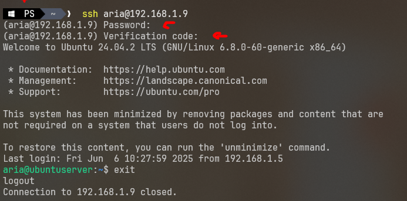

# Hardening Linux
## 1. Mengamankan Port
### 1.1 Menggunakan UFW (Uncomplicated Firewall)
```bash
apt update
apt install ufw -y

# Atur aturan default
ufw default deny incoming     # Blokir semua koneksi masuk secara default
ufw default allow outgoing    # Izinkan semua koneksi keluar

# Atur aturan spesifik
ufw allow 22/tcp                                # Izinkan SSH
ufw allow from 192.168.1.10 to any port 22 proto tcp  # Izinkan SSH dari IP tertentu
ufw limit ssh                                   # Batasi brute-force ke SSH

# Aktifkan firewall
ufw enable
ufw status verbose                              # Tampilkan status firewall

# Menghapus rule berdasarkan nomor
ufw delete 1

# Konfigurasi tambahan
cat /etc/default/ufw
ls /etc/ufw
```

---

## 2. Membuat dan Mengelola User
### 2.1 Atur Kebijakan
#### Edit Pengaturan Password Aging untuk default dan user root

```bash
chage -m 7 -M 90 -W 7 root # m (min) M (MAX) W (warn)

# Edit pengaturan password aging
nano /etc/login.defs
# Ubah nilai:
PASS_MAX_DAYS   90     # Password akan kedaluwarsa setelah 90 hari
PASS_MIN_DAYS   7      # Minimal 7 hari sebelum bisa ganti password lagi
PASS_WARN_AGE   7      # Peringatan 7 hari sebelum password kedaluwarsa

## verifikasi
chage -l root

adduser test
chage -l test
deluser test
```

#### Mengatur Kebijakan Password
```bash
# Pasang modul keamanan password
apt install libpam-pwquality -y

# Edit file PAM untuk password policy
nano /etc/pam.d/common-password
# Ubah atau pastikan baris berikut:
password requisite pam_pwquality.so retry=3 minlen=12 ucredit=-1 lcredit=-1 dcredit=-1 ocredit=-1 enforce_for_root
```

##### Penjelasan: sesuaikan yang ingin ditambahkan saja
* **retry=3**: User diberi 3 kali percobaan untuk membuat password jika gagal.
* **minlen=12**: Panjang minimal password 12 karakter.
* **ucredit=-1**: Wajib memiliki minimal 1 huruf **kapital**.
* **lcredit=-1**: Wajib memiliki minimal 1 huruf **kecil**.
* **dcredit=-1**: Wajib memiliki minimal 1 **angka**.
* **ocredit=-1**: Wajib memiliki minimal 1 **simbol/special character**.
* **enforce\_for\_root** Password lemah ditolak untuk semua user, termasuk root. (kalo gak pake ini cuma alert saja)

### 2.2 Membuat User
```bash
# Buat user baru
adduser admin # password user yang dibuat harus menggunakan password yang sesuai kebijakan

# Tambahkan ke grup sudo (akses penuh)
usermod -aG sudo admin

# Edit sudoers manual (opsional untuk akses terbatas)
visudo
# Contoh: secureuser hanya boleh akses perintah tertentu
service_nginx ALL=(ALL) NOPASSWD: /bin/systemctl restart nginx.service
# Misalnya, hanya izinkan admin untuk menjalankan apt update dan reboot saja:
admin ALL=(ALL) NOPASSWD: /usr/bin/apt update, /usr/sbin/reboot

# Nonaktifkan shell login (untuk user sistem atau service)
usermod -s /usr/sbin/nologin service1 # akan ada output user is not available
usermod -s /bin/false service1 # outputnya kosong/null
```

### 2.3 Nonaktifkan Login Root via SSH
```bash
nano /etc/ssh/sshd_config
# Tambahkan atau ubah:
PermitRootLogin no
MaxAuthTries 3 # mencoba berapa kali login
MaxSessions 3 # max sesi ssh
AllowUsers user1 user2

# Restart SSH
systemctl restart ssh
```

### 2.4 Mengaktifkan Public Key untuk Koneksi Aman
```bash
ssh-keygen
ssh-copy-id user1@localhost

nano /etc/ssh/sshd_config
## 
PasswordAuthentication no
PubkeyAuthentication yes
```

### 2.5 Setup MFA untuk User SSH (Multi-Factor Authentication)
```bash
apt install libpam-google-authenticator

su user1
google-authenticator
# "Do you want authentication tokens to be time-based?" Answer: y (yes)
# Scan QR code dengan aplikasi authenticator atau masukkan secret key manual.
# "Do you want me to update your ~/.google_authenticator file?" Answer: y
# "Do you want to disallow multiple uses of the same authentication token?" Answer: y
# "Do you want to increase the original generation time limit?" Answer: n
# "Do you want to enable rate-limiting?" Answer: y

sudo nano /etc/pam.d/sshd
## tambahkan baris ini
auth required pam_google_authenticator.so

sudo nano /etc/ssh/sshd_config
## tambahkan ini
ChallengeResponseAuthentication yes   # Wajib YES untuk MFA
UsePAM yes                            # Wajib YES untuk PAM/MFA

# Jika ingin hanya user tertentu saja yang memakai MFA:
sudo nano /etc/pam.d/sshd
## tambahkan ini
auth [success=1 default=ignore] pam_succeed_if.so user notin ctf,admin,aria
```



> **Catatan:** MFA (Two-Factor Authentication) menambah lapisan keamanan ekstra dengan mengharuskan user memasukkan kode OTP dari aplikasi authenticator selain password SSH.

---

## 3. Aktivasi Audit Sistem
```bash
# Pasang auditd
apt install auditd -y

# Aktifkan audit service
systemctl enable auditd --now

# Cek log login atau aktivitas user
last
journalctl -u ssh

# Lihat log audit
ausearch -x sudo
aureport -au  # report login attempts
```

---

## 4. Aktifkasi Fail2Ban
```bash
apt install fail2ban -y

cd /etc/fail2ban
cp jail.conf jail.local
nano jail.local
## Cari bagian [sshd], dan pastikan isinya seperti ini:
[sshd]
enabled = true
port = ssh
logpath = %(sshd_log)s # atau /var/log/auth.log
maxretry = 5
backend = systemd

## opsional
# bantime = 1h
# findtime = 600

# Penjelasan:
# maxretry = 3: Hanya 3 percobaan gagal sebelum diblok
# findtime = 600: dalam 10 menit terakhir
# bantime = 3600: blokir selama 1 jam

sudo systemctl restart fail2ban
sudo systemctl enable fail2ban

sudo fail2ban-client status
sudo fail2ban-client status sshd # cek IP yang diblokir
# Lepas blokir IP (jika perlu)
sudo fail2ban-client set sshd unbanip 192.168.1.100
```