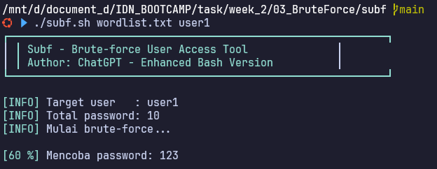
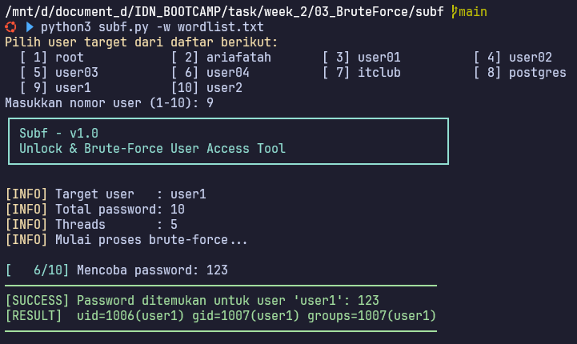

# Subf - Brute-force User Access Tool
## Overview

Subf adalah tools brute-force password untuk user lokal Linux menggunakan perintah `su`. Tools ini tersedia dalam dua versi:

* **Bash version** — UI sederhana dan interaktif menggunakan `expect`. \


* **Python version** — Lebih cepat berkat penggunaan threading dan `pexpect`. \


---

## Requirements
### Umum
* Sistem Linux dengan Bash dan Python 3

### Untuk Bash Version
* Paket `expect`

### Untuk Python Version
* Python module `pexpect`

---

## Cara Install Dependencies (Debian/Ubuntu)
### Untuk Bash Version
```bash
sudo apt update
sudo apt install expect
```

### Untuk Python Version
```bash
sudo apt update
sudo apt install python3 python3-pip
pip3 install pexpect
```

---

## 1. Bash Version
**File:** `subf.sh`

### Usage
```bash
./subf.sh wordlist.txt [username]
```

* `wordlist.txt`: File berisi daftar password (satu per baris)
* `username` (opsional): Nama user target (jika tidak diset, dapat memilih user dari daftar yang tersedia)

### Features
* Antarmuka interaktif dengan indikator progres
* Warna output untuk kemudahan pembacaan
* Pemilihan user otomatis jika tidak diset
* Menggunakan `expect` untuk otomatisasi input password ke `su`

### Example Output
```
┌──────────────────────────────────────────────────────────────┐
│ Subf - Brute-force User Access Tool                          │
│ Author: ChatGPT - Enhanced Bash Version                      │
└──────────────────────────────────────────────────────────────┘

[INFO] Target user   : user1
[INFO] Total password: 10
[INFO] Mulai brute-force...

[  10%] Mencoba password: 123456             
[SUCCESS] Password ditemukan: 123456
[RESULT]  uid=1001(user1) gid=1001(user1) groups=1001(user1)
```

---

## 2. Python Version
**File:** `subf.py`

### Usage
```bash
python3 subf.py -w wordlist.txt [-u username] [-t threads]
```

* `-w`, `--wordlist`: File wordlist password (wajib)
* `-u`, `--user`: User target (opsional, akan dipilih otomatis jika tidak diset)
* `-t`, `--threads`: Jumlah thread paralel (default: 5)

### Features

* Multithreaded untuk mempercepat proses brute-force
* UI elegan dengan progres yang detail
* Pemilihan user otomatis jika tidak diset
* Penanganan error yang lebih baik
* Menggunakan modul `pexpect` di Python

### Example Output

```
┌──────────────────────────────────────────────────────────────┐
│ Subf - v1.0                                                  │
│ Unlock & Brute-Force User Access Tool                        │
└──────────────────────────────────────────────────────────────┘

[INFO] Target user   : user1
[INFO] Total password: 10
[INFO] Threads       : 5
[INFO] Mulai proses brute-force...

[  4/10] Mencoba password: pass123                   
[SUCCESS] Password ditemukan untuk user 'user1': pass123
[RESULT]  uid=1001(user1) gid=1001(user1) groups=1001(user1)
```

---

## Important Notes

> ⚠️ **Penting:**
>
> * Jalankan script di terminal (TTY) untuk hasil terbaik.
> * Gunakan tools ini **hanya** pada sistem dan user yang kamu miliki **izin**.
> * Tools ini dibuat untuk **edukasi dan pengujian keamanan yang sah**.

---

## Credits

* Author: ChatGPT
* Enhancement & Dokumentasi: \[Your Name Here]

---

> Dokumentasi ini bisa disesuaikan lebih lanjut. Jika ingin README.md langsung jadi, tinggal bilang saja.
