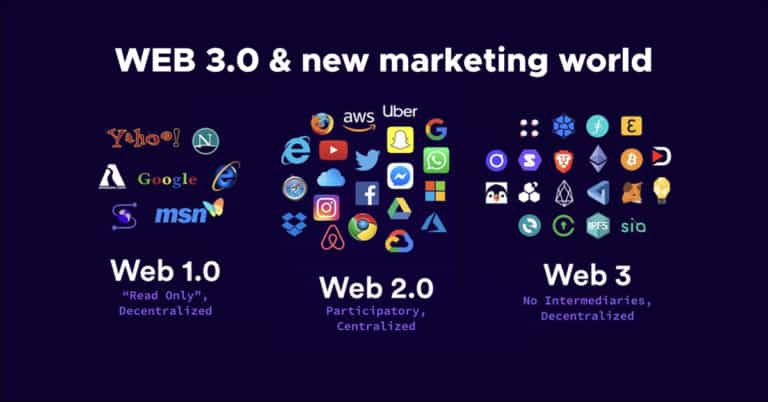

# Web 3, ECC, dan Cryptocurrency
## Web 3
Sebelum membahas Web 3, mari kita bahas terlebih dahulu evolusi dari Web 1.0, Web 2.0, hingga Web 3.0.

### Web 1.0
Web 1.0 adalah generasi awal dari internet. Pada masa ini, website bersifat statis dan hanya dapat dibaca. Konten dibuat dan dikontrol oleh pemilik situs, tanpa adanya interaksi dari pengguna.

### Web 2.0
Web 2.0 membawa perubahan besar dengan adanya interaksi dua arah. Pengguna dapat berpartisipasi, mengunggah konten, dan berinteraksi satu sama lain melalui media sosial, forum, dan platform berbasis user-generated content seperti YouTube, Facebook, dan lainnya.

### Web 3.0
Web 3.0 merupakan tahap selanjutnya dari evolusi internet yang mengedepankan desentralisasi, kepemilikan data oleh pengguna, dan teknologi blockchain. Web 3 memberikan kontrol lebih kepada pengguna dan mengurangi dominasi platform terpusat.

#### DAO (Decentralized Autonomous Organization)
DAO adalah organisasi yang dijalankan oleh smart contract di blockchain tanpa adanya otoritas pusat. Semua keputusan diambil berdasarkan konsensus komunitas melalui sistem voting.

#### Web 3.0 Foundation
Web 3.0 Foundation adalah organisasi yang mendukung pengembangan teknologi Web 3, seperti Polkadot dan protokol open-source lainnya untuk menciptakan internet yang lebih adil, aman, dan desentralistik.

---

## ECC (Elliptic Curve Cryptography)
ECC adalah metode kriptografi kunci publik yang menggunakan kurva eliptik untuk menciptakan kunci yang lebih kecil namun tetap sangat aman. ECC menjadi penting dalam Web 3 karena efisiensinya dan tingkat keamanan yang tinggi, menjadikannya cocok untuk perangkat dan sistem terdesentralisasi.

Keunggulan ECC antara lain:
* Lebih kecil ukuran kunci
* Proses enkripsi dan dekripsi lebih cepat
* Aman terhadap serangan brute force

ECC digunakan dalam blockchain untuk tanda tangan digital dan enkripsi transaksi.

---

## Cryptocurrency
Cryptocurrency adalah mata uang digital yang menggunakan kriptografi untuk keamanan dan berjalan di atas jaringan blockchain. Contoh cryptocurrency populer adalah Bitcoin, Ethereum, dan lainnya.

Cryptocurrency mendukung prinsip Web 3:
* Transaksi peer-to-peer tanpa pihak ketiga
* Transparansi melalui teknologi blockchain
* Kepemilikan penuh oleh pengguna

Dengan integrasi ECC, transaksi crypto menjadi lebih aman dan efisien.

---

# Referensi
* [https://rizqynayla1107.blogspot.com/2025/06/bongkar-cara-kerja-web3-ecc-amanin.html](https://rizqynayla1107.blogspot.com/2025/06/bongkar-cara-kerja-web3-ecc-amanin.html)
* [https://www.nadcab.com/blog/ecc-in-web3-networks](https://www.nadcab.com/blog/ecc-in-web3-networks)
* [https://www.youtube.com/watch?v=nHhAEkG1y2U\&t=1s](https://www.youtube.com/watch?v=nHhAEkG1y2U&t=1s)
* [https://www.youtube.com/watch?v=WVFw0c9j4KM](https://www.youtube.com/watch?v=WVFw0c9j4KM)