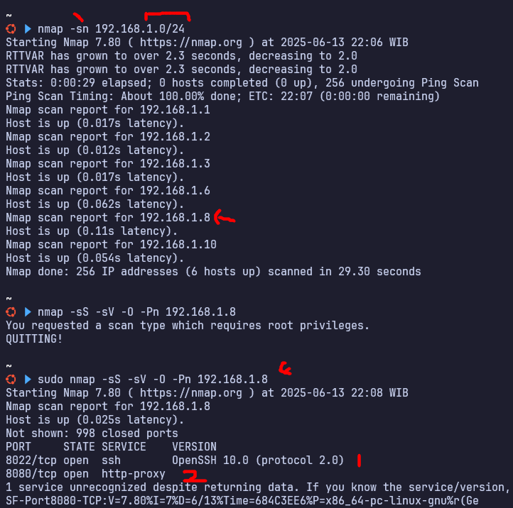
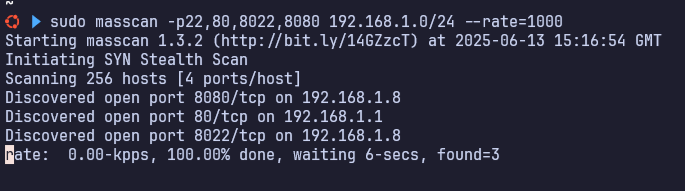
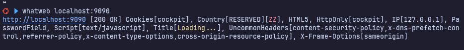
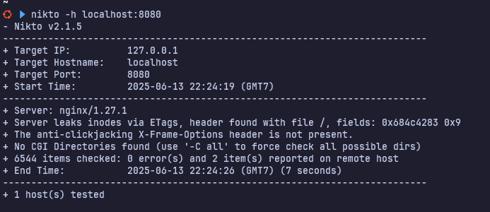
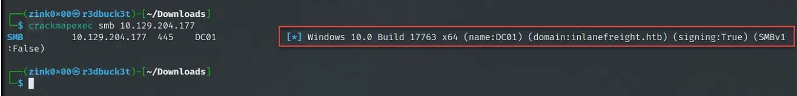
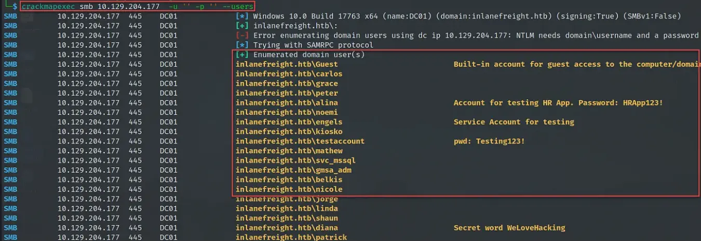
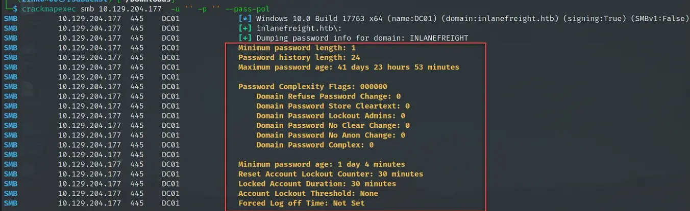

# 🔍 Scanning & Enumeration Tools
## 1. **Network Scanning**
Digunakan untuk mendeteksi host aktif dan port terbuka.

* **`nmap`** – Tools paling populer untuk scan host, port, service, OS fingerprinting.
  Contoh: `nmap -sS -sV -O -Pn 10.10.10.10`
  
* **`masscan`** – Mirip nmap tapi jauh lebih cepat, cocok untuk scan port skala besar.
  Contoh: `masscan -p1-65535 10.10.10.0/24 --rate=10000`
  

> 📌 *Lakukan ini dulu sebelum lanjut ke web atau service enumeration.*

---

## 2. **Service Enumeration**
Untuk identifikasi service, banner, atau vulnerability awal.

* **`whatweb`** – Mendeteksi teknologi dan framework pada web (CMS, plugin, dll).
  Contoh: `whatweb http://target.com`
  
* **`nikto`** – Web server vulnerability scanner (versi lama, config error, dll).
  Contoh: `nikto -h http://target.com`
  
* **`crackmapexec`** – Untuk enumerasi jaringan berbasis Windows/SMB (user list, password policy, shares, dll).
  Contoh: `cme smb 10.10.10.10 -u user -p pass`
  
  
  
  - [ref](https://techyrick.com/crackmapexec/)

---

## 3. **Directory/Endpoint Bruteforce**
Mencari hidden path atau file penting di web server.

* **`gobuster`** – Bruteforce path di web server (lebih ringan dari dirbuster).
  Contoh: `gobuster dir -u http://target.com -w /usr/share/wordlists/dirb/common.txt`
* **`dirbuster`** – GUI tool, cocok buat eksplorasi visual, tapi lebih lambat.
  Cocok untuk beginner atau ketika ingin visualisasi hasil scan.
* **`feroxbuster`** – Fast & recursive web content scanner (lebih modern dari gobuster).
  Contoh: `feroxbuster -u http://target.com -w wordlist.txt -r`

---

## ✨ Tools Tambahan (Opsional tapi Berguna)
* **`amass`** – Subdomain enumeration (baik untuk passive & active recon).
* **`subfinder`** – Cepat untuk enumerasi subdomain (pasif).
* **`httpx`** – Memeriksa domain/subdomain aktif dan HTTP response.
* **`naabu`** – Fast port scanner seperti masscan tapi lebih integratif dengan tools projectdiscovery.
* **`wafw00f`** – Deteksi firewall/WAF di depan web server.
* **`nuclei`** – Scanner template-based untuk mencari vuln secara cepat.
* **`enum4linux`** – SMB enumerator, cocok untuk target berbasis Windows.

---

## ✅ Saran Urutan Praktis (untuk Pentest/CTF)
```
1. Ping sweep / host discovery → (nmap / masscan)
2. Port scanning → (nmap / masscan / naabu)
3. Service detection → (nmap -sV, whatweb, nikto)
4. SMB enum → (enum4linux / crackmapexec)
5. Subdomain enum → (amass / subfinder)
6. Directory brute-force → (gobuster / feroxbuster)
7. Vuln scanning → (nuclei / nikto / nmap scripts)
```