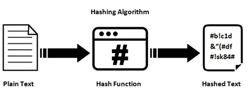
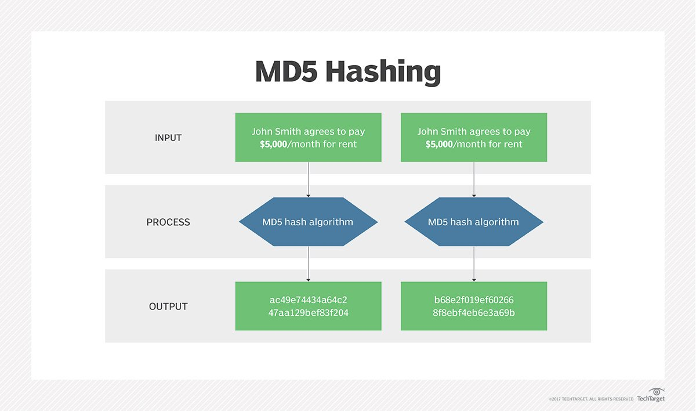

# Algoritma Hashing
Dalam dunia  komputer dan pemrograman, algoritma hashing adalah salah satu teknik yang penting dan sering digunakan. Algoritma ini memiliki peran penting dalam menghasilkan nilai unik yang disebut “hash” dari data input.

## Apa itu Algoritma Hashing?
 \
Algoritma hashing adalah suatu proses matematika yang mengubah data yang panjang menjadi sejumlah nilai tetap yang lebih pendek. Nilai tetap ini disebut hash atau message digest. Algoritma ini menggunakan fungsi hash untuk menghasilkan nilai hash yang unik untuk setiap input yang berbeda. Nilai hash yang dihasilkan bersifat deterministik, artinya input yang sama akan menghasilkan nilai hash yang sama pula.

### Prinsip Dasar Algoritma Hashing
Prinsip dasar dari algoritma ini adalah bahwa setiap input data akan menghasilkan output hash yang unik. Jika terjadi perubahan sedikit pun pada input data, maka hash yang dihasilkan juga akan berbeda secara signifikan. Prinsip ini memungkinkan kita untuk mendeteksi adanya perubahan pada data dengan membandingkan hash yang dihasilkan.

---

## Jenis-jenis Algoritma Hashing
Terdapat berbagai jenis algoritma ini yang umum digunakan, di antaranya adalah:

### 1. MD5 (Message Digest Algorithm 5)
MD5 adalah salah satu algoritma hashing kriptografi yang paling dikenal dan digunakan secara luas sejak diperkenalkan oleh Ronald Rivest pada tahun 1991. MD5 menghasilkan nilai hash sepanjang 128-bit (biasanya ditampilkan sebagai string heksadesimal sepanjang 32 karakter).

#### Cara Kerja MD5
1. **Input**: Algoritma menerima input berupa teks atau data, contohnya:
   * "John Smith agrees to pay \$5,000/month for rent"
2. **Proses Hashing**:
   * Input tersebut diproses menggunakan algoritma MD5. Algoritma ini memecah data menjadi blok-blok 512-bit, kemudian memprosesnya dengan serangkaian operasi bitwise dan matematika.
3. **Output**: Hasil akhirnya adalah string heksadesimal sepanjang 32 karakter yang tampak acak. Contoh:
   * `ac49e74434a64c247aa129bef83f204`
   * Catatan: Jika terdapat **perubahan sangat kecil** pada input (misalnya spasi atau tanda baca), hasil hash akan berubah **total**. Ini dikenal sebagai efek avalanche.

Gambar tersebut menunjukkan dua input yang terlihat identik, tetapi sebenarnya berbeda (kemungkinan ada perbedaan karakter tak terlihat atau spasi). Meskipun terlihat sama, ketika diproses dengan algoritma MD5, keduanya menghasilkan output hash yang **berbeda total**. Hal ini menegaskan bahwa MD5 sangat sensitif terhadap perubahan input sekecil apa pun.

#### Kelebihan MD5
* Cepat dan efisien untuk hashing data.
* Banyak didukung oleh berbagai sistem dan bahasa pemrograman.

#### Kekurangan MD5
* **Collision vulnerability**: Dua input berbeda bisa menghasilkan output hash yang sama.
* **Tidak cocok untuk keamanan**: Tidak direkomendasikan untuk tanda tangan digital, enkripsi password, atau verifikasi integritas penting.
* **Sudah usang untuk keamanan kriptografi modern**.

#### Kesimpulan
MD5 masih bisa digunakan untuk kebutuhan non-sekuriti seperti checksum file atau deteksi perubahan data kecil. Namun, untuk keamanan (seperti password atau tanda tangan digital), algoritma yang lebih kuat seperti SHA-256 atau bcrypt sangat disarankan.

---

### 2. SHA (Secure Hash Algorithm) - Ringkasan Penting
SHA (Secure Hash Algorithm) adalah keluarga fungsi hash kriptografi yang dirancang untuk memastikan integritas dan keamanan data digital. Fungsi hash ini mengambil input (misalnya, kata sandi atau file) dan menghasilkan output tetap yang unik, disebut hash. Dirancang oleh NSA dan distandardisasi oleh NIST, SHA digunakan luas dalam sistem keamanan modern seperti enkripsi, tanda tangan digital, sertifikat SSL, dan blockchain.

Hash yang dihasilkan berperan seperti sidik jari digital: bahkan perubahan kecil pada input akan menghasilkan hash yang sangat berbeda (dikenal sebagai efek longsoran salju). Karena sifat ini, hash tidak bisa dibalik, artinya Anda tidak bisa mendapatkan input asli hanya dari hash-nya. Hal ini penting dalam menjaga kerahasiaan data pengguna.

Contoh: Kata sandi "likeflowers" diubah oleh SHA-256 menjadi:
`9a96c8326d228471d1f01616d92a2d2b0e796c9a8d0624df9a9b7d0246475a42`

Hash ini kemudian disimpan, bukan kata sandi aslinya. Jadi, jika basis data diretas, peretas tidak dapat melihat kata sandi asli, hanya bentuk terenkripsi (hash-nya).

#### Perbandingan Versi SHA
Berikut adalah versi utama dari SHA yang umum digunakan dan perbedaannya:
* **SHA-1**: Menghasilkan hash 160-bit. Cepat, tetapi kini dianggap tidak aman karena rawan serangan tabrakan. Dulu digunakan untuk tanda tangan digital dan sertifikat SSL, namun sekarang sudah ditinggalkan.
* **SHA-2**: Keluarga fungsi hash yang lebih aman dan luas digunakan. Termasuk SHA-224, SHA-256, SHA-384, SHA-512, SHA-512/224, dan SHA-512/256. Digunakan dalam banyak protokol seperti TLS, PGP, SSH, IPsec, dan sistem blockchain. SHA-2 menjadi standar industri saat ini.
* **SHA-256**: Salah satu varian paling umum dari SHA-2. Menghasilkan hash 256-bit (64 karakter heksadesimal). Menawarkan keamanan kuat dengan performa yang baik. Sangat populer dalam sistem keamanan web dan jaringan, serta digunakan dalam blockchain seperti Bitcoin.
* **SHA-512**: Varian SHA-2 lainnya dengan panjang hash 512-bit. Lebih aman dan kompleks, tetapi membutuhkan daya komputasi lebih besar. Cocok untuk aplikasi dengan kebutuhan keamanan tinggi dan sumber daya memadai. Meski begitu, efisiensi penggunaannya perlu diperhatikan dalam sistem terbatas.

#### Tabel Perbandingan
| Versi   | Panjang Hash | Keamanan    | Kecepatan    | Status                |
| ------- | ------------ | ----------- | ------------ | --------------------- |
| SHA-1   | 160-bit      | Lemah       | Cepat        | Usang                 |
| SHA-256 | 256-bit      | Kuat        | Sedang       | Standar Umum          |
| SHA-512 | 512-bit      | Sangat Kuat | Lebih Lambat | Untuk Keamanan Tinggi |

#### Karakteristik SHA
* **Efek Longsoran Salju**: Perubahan satu bit dalam input menghasilkan hash yang sangat berbeda.
* **Deterministik**: Input yang sama akan selalu menghasilkan hash yang sama.
* **Tidak Dapat Dibalik**: Sulit (praktis tidak mungkin) untuk merekonstruksi input dari output.
* **Tahan Tabrakan (Collision Resistant)**: Sulit menemukan dua input berbeda yang menghasilkan hash sama.

#### Catatan Penting
* SHA-1 telah terbukti rentan terhadap serangan dan tidak lagi direkomendasikan.
* SHA-256 menawarkan keseimbangan antara kecepatan dan keamanan untuk sebagian besar aplikasi.
* SHA-512 memberikan keamanan tambahan, tetapi memerlukan memori dan daya lebih besar.
* SHA-2 secara umum aman, namun belum tahan terhadap serangan komputasi kuantum.
* SHA-3, sebagai penerus SHA-2, dirancang dengan struktur internal berbeda dan dipertimbangkan untuk penggunaan masa depan yang membutuhkan ketahanan terhadap serangan kuantum.

### 3. BLAKE2 & BLAKE3 🔐
#### BLAKE2
BLAKE2 dirilis pada tahun 2012 sebagai penerus dari keluarga BLAKE (finalis SHA -3). Algoritma ini dirancang untuk memberikan kecepatan tinggi pada CPU modern, tanpa mengorbankan tingkat keamanan.

**Kelebihan BLAKE2:**
* Lebih cepat dari SHA -256 dan SHA -3, khususnya pada sistem 64 -bit dan ARM.
* Mendukung output hash dengan panjang variabel (224, 256, 384, atau 512 bit).
* Memiliki mode internal “keyed mode”, yang bisa menggantikan kebutuhan HMAC secara langsung.

**Kekurangan BLAKE2:**
* Karena lebih baru, margin keamanannya sedikit lebih kecil dibanding SHA -2. Namun, tetap dianggap aman dalam praktik umum.

#### BLAKE3
Diluncurkan pada 9 Januari 2020, BLAKE3 merupakan evolusi dari BLAKE2 yang jauh lebih cepat dan menggunakan pendekatan struktur pohon (Merkle Tree) serta hanya 7 ronde (dibandingkan 10 di BLAKE2).

**Keunggulan BLAKE3:**
* Sangat cepat: Hingga 5× lebih cepat dari BLAKE2 dan sekitar 15× lebih cepat dari SHA -3 -256.
* Dirancang untuk paralelisme tinggi: Memanfaatkan multi-core CPU dan instruksi SIMD, ideal untuk pemrosesan file besar.
* Multifungsi: Mendukung XOF (eXtendable Output Function), KDF (Key Derivation Function), PRF (Pseudo Random Function), dan MAC (Message Authentication Code).
* Aman terhadap serangan length-extension dan memiliki tingkat keamanan sebanding dengan SHA -256 (\~128-bit).

**Catatan Penting:**
* Jumlah ronde yang lebih sedikit memicu diskusi tentang margin keamanan jangka panjang, meskipun hingga kini belum ditemukan serangan yang signifikan.

**Ringkasan:**
* **BLAKE2**: Aman, cepat, dan fleksibel — cocok sebagai pengganti SHA -256 dalam kebanyakan aplikasi.
* **BLAKE3**: Super cepat dan efisien untuk pemrosesan data skala besar, sistem file modern, dan penggunaan multithread.

---

### 4. NTLM Hash
NTLM (NT LAN Manager) adalah protokol autentikasi lama yang digunakan oleh sistem operasi Windows, terutama sebelum adopsi luas Kerberos. NTLM menyimpan hash kata sandi pengguna dan terdiri dari dua versi utama:

#### NTLMv1
* Menggunakan algoritma hash yang lemah seperti MD4 dan LM Hash.
* Sangat rentan terhadap serangan brute-force, rainbow tables, dan relay attack.
* Sudah tidak direkomendasikan untuk digunakan karena tingkat keamanannya sangat rendah.

#### NTLMv2
* Merupakan perbaikan dari NTLMv1 dengan penggunaan HMAC -MD5, nonce, dan timestamp.
* Meskipun lebih kuat, NTLMv2 **masih memiliki kelemahan**, seperti:
  * Rentan terhadap serangan *pass-the-hash* (hash dapat digunakan ulang tanpa dekripsi).
  * Tidak mendukung *mutual authentication*, membuka peluang *man-in-the-middle attack*.
  * Password yang lemah atau pendek sangat mudah untuk dibobol melalui brute-force.
**Dampak Keamanan:**
NTLM sering dieksploitasi dalam serangan phising, misalnya dengan memancing pengguna membuka file `.library-ms` yang mencuri hash untuk diserang ulang melalui relay ke Active Directory.

**Rekomendasi:**
* Gunakan Kerberos untuk autentikasi jika memungkinkan.
* Nonaktifkan NTLMv1 dan LM hash.
* Aktifkan SMB signing, MFA, dan solusi keamanan modern lainnya.

---

### 5. CRC (Cyclic Redundancy Check)
CRC adalah algoritma sederhana yang digunakan bukan untuk keamanan, melainkan untuk **deteksi kesalahan** dalam transmisi atau penyimpanan data. CRC banyak digunakan di jaringan komputer (Ethernet, Wi-Fi) dan media penyimpanan (USB, hard disk).

#### Cara Kerja:
CRC menghitung sisa pembagian polinomial dari data dalam medan GF(2), kemudian menyertakan hasil tersebut sebagai "checksum". Penerima akan menghitung ulang CRC dan memeriksa kecocokannya untuk memastikan data tidak rusak.

#### Kelebihan CRC:
* Sangat ringan dan cepat, mudah diimplementasikan di perangkat keras.
* Efektif dalam mendeteksi *burst errors* (kesalahan berturut-turut) hingga panjang tertentu.
* Banyak varian: CRC -8, CRC -16, CRC -32, CRC -CCITT, disesuaikan dengan kebutuhan aplikasi.

#### Kekurangan CRC:
* **Tidak aman untuk kriptografi**: CRC mudah dimanipulasi atau dipalsukan.
* Tidak memiliki autentikasi, sehingga tidak mampu melindungi data dari modifikasi yang disengaja.
* **Bukan algoritma hashing kriptografi** — untuk keamanan data sebaiknya gunakan MAC (Message Authentication Code) atau tanda tangan digital.

## referensi
- [Apa Itu Algoritma Hashing? Pengertian, Jenis dan Implementasi](https://kantinit.com/programming/apa-itu-algoritma-hashing-pengertian-jenis-dan-implementasi/)
- [sha1-sha2-sha256-sha-512](https://www.ssldragon.com/id/blog/sha1-sha2-sha256-sha-512/)