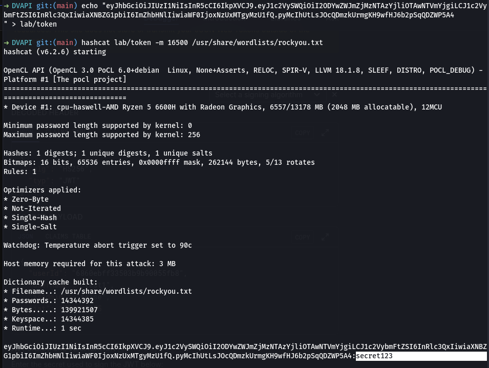

# DVAPI (Damn Vulnerable API)
## 1. Informasi Umum

- **Nama Peserta**        : Aria Fatah
- **Tanggal Praktikum**   : 27 Juni 2025
- **Nama Praktikum**      : API Penetration Testing OWASP API Top 10
- **Target Sistem**       : DVAPI (Damn Vulnerable API)
- **IP/URL Target**       : [http://localhost:8082](http://localhost:8082)

---

## 2. Tujuan Praktikum
Tujuan dari praktikum ini adalah **mengidentifikasi dan mengeksploitasi kerentanan umum pada aplikasi web**, seperti **XSS, SQL Injection, Command Injection**, dan **CSRF**, menggunakan target vulnerable DVWA.

---

## 3. Tools dan Bahan
- **Tools Utama**:
  - Firefox/Chrome DevTools

- **VM/Lab Environment**:
  - DVAPI (Docker container)
  - Kali Linux (attacker machine)

---

## 4. Metodologi Pengujian
Metode pengujian mengacu pada standar **NIST SP 800-115**:

1. **Planning**
2. **Discovery**
3. **Attack**
4. **Reporting**

---

## 5. Langkah-Langkah Praktikum
1. Menjalankan DVAPI menggunakan Docker-Compose: 
   ```bash
   git clone https://github.com/payatu/DVAPI.git
   cd DVAPI
   docker compose up --build
   ```
2. Mengakses aplikasi di browser `http://localhost:3000`
3. register akun, dan login

### 


---

## 6. Temuan dan Analisis
| No | Jenis Kerentanan     | Deskripsi Temuan                                       | Dampak                                | Bukti  |
| -- | -------------------- | ------------------------------------------------------ | ------------------------------------- | ------ |
| 1  | Brute Force          | Tidak ada limitasi percobaan login                     | Akses akun pengguna tanpa izin        |  |


## 7. Rekomendasi Perbaikan
| No | Jenis Kerentanan         | Rekomendasi Teknis                                                                                                                                                                                                |
| -- | ------------------------ | ----------------------------------------------------------------------------------------------------------------------------------------------------------------------------------------------------------------- |
| 1  | **Brute Force**          | - Implementasikan rate-limiting pada endpoint login (misalnya, max 5 attempt per IP/user dalam 10 menit).<br>- Tambahkan captcha atau delay antar percobaan login.<br>- Log aktivitas login yang mencurigakan.    |


## 8. Evaluasi dan Refleksi
### Tantangan Utama

- Tantangan terbesar dalam proses pengujian ini adalah memahami bagaimana payload sederhana bisa dimanfaatkan untuk mengeksploitasi berbagai jenis kerentanan.
- Beberapa kerentanan membutuhkan kombinasi teknik atau urutan langkah tertentu agar berhasil, seperti pada Blind SQL Injection dan Stored XSS.
- Mengatur lingkungan lab DVWA dan memahami alur data di dalam aplikasi juga menjadi bagian penting dari proses.

### Pelajaran Penting
- **Validasi dan sanitasi input** merupakan fondasi utama dalam menjaga keamanan aplikasi web. Banyak serangan dapat dicegah hanya dengan memvalidasi data dari pengguna.
- **Burp Suite** sangat efektif dalam analisis request/response serta pengujian manual terhadap parameter-parameter yang rentan.
- **Pemahaman logika aplikasi** penting untuk mengetahui bagian mana yang paling berisiko diserang, terutama untuk serangan seperti CSRF dan File Upload.
- Penerapan **defense in depth** seperti CSRF token, prepared statement, CSP, dan filter file upload terbukti sangat penting dalam mencegah eksploitasi celah.

### Refleksi Keseluruhan
- Kegiatan ini memberikan wawasan nyata bahwa banyak aplikasi web rentan karena asumsi bahwa pengguna akan selalu berperilaku sesuai aturan.
- Pengujian secara langsung terhadap kerentanan menunjukkan betapa mudahnya data atau kontrol server dapat diambil alih ketika tidak ada mekanisme proteksi yang memadai.
- Melalui eksploitasi terhadap DVWA, pengetahuan tentang keamanan aplikasi menjadi lebih praktikal dan aplikatif untuk diterapkan dalam pengembangan aplikasi nyata.
