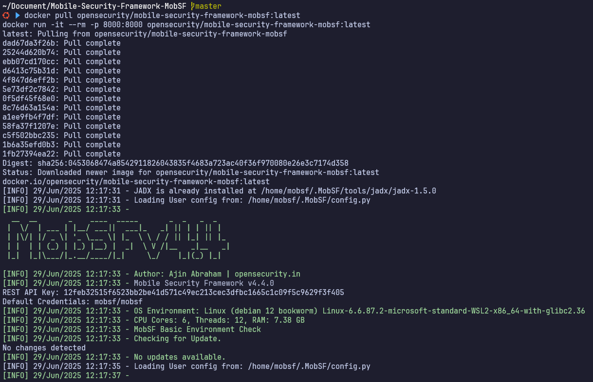
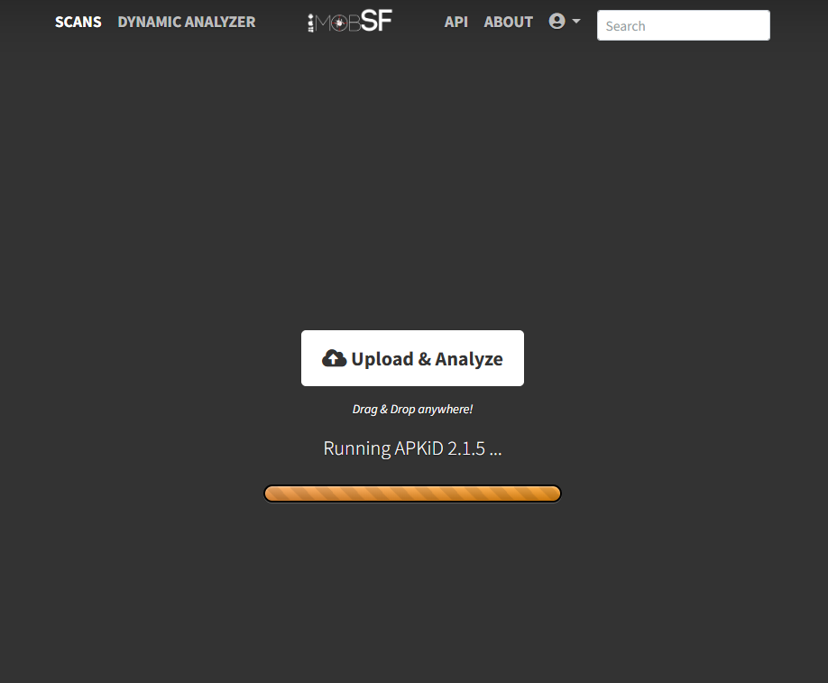
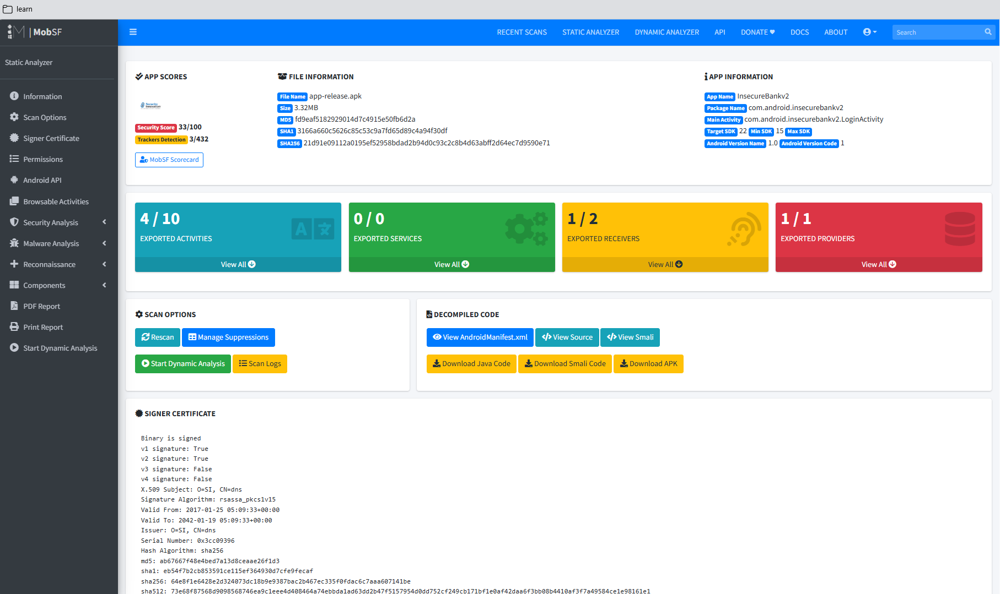
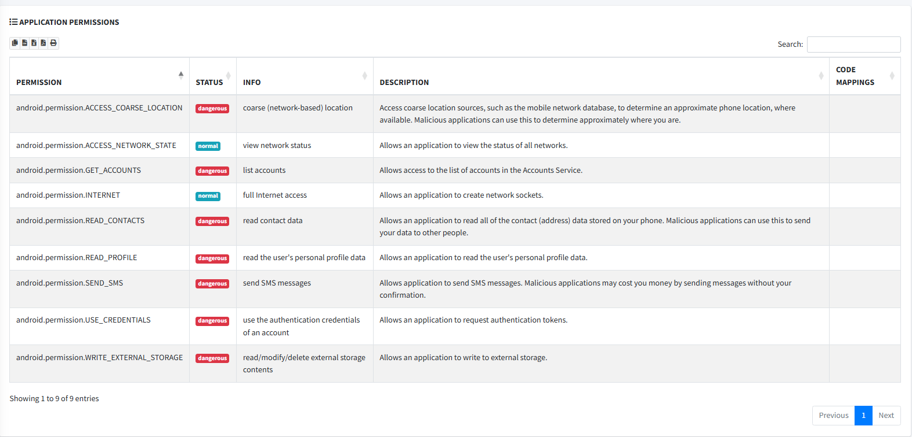
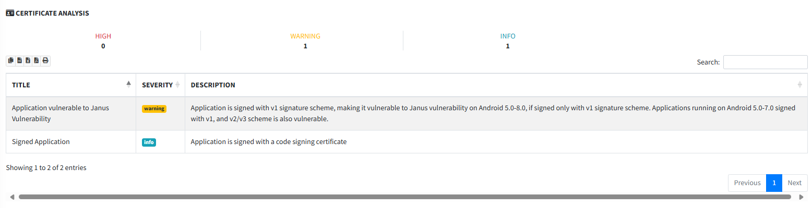
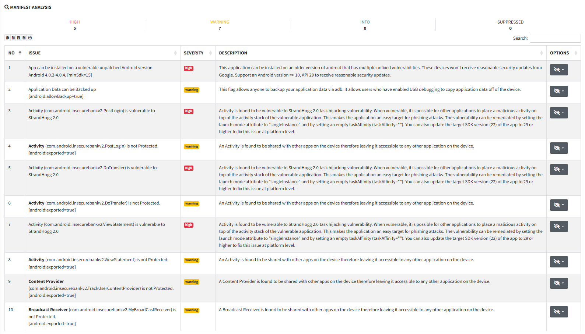
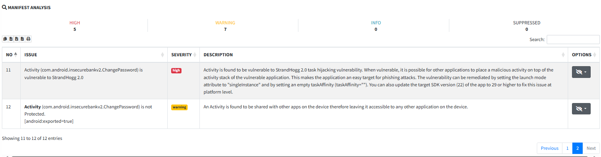

# InsecureBankv2
## 1. Informasi Umum

* **Nama Peserta**        : Aria Fatah
* **Tanggal Praktikum**   : 29 Juni 2025
* **Nama Praktikum**      : Lab Mobile Application Pentest
* **Target Sistem**       : InsecureBankv2
* **IP/URL Target**       : []()

---

## 2. Tujuan Praktikum
Tujuan dari praktikum ini adalah untuk **mengidentifikasi dan mengeksploitasi berbagai kerentanan umum pada aplikasi mobile**, khususnya pada platform Android. Target dari pengujian ini adalah **InsecureBankv2**, sebuah aplikasi Android

---

## 3. Tools dan Bahan
- **Tools Utama**:
  - MobSF (Mobile Security Framework) via Docker
  - Burp Suite (opsional, untuk intercept dan analisis komunikasi aplikasi jika dilakukan dynamic analysis)

---

## 4. Metodologi Pengujian
Metode pengujian mengacu pada standar **NIST SP 800-115**:

1. **Planning**
2. **Discovery**
3. **Attack**
4. **Reporting**

---

## 5. Langkah-Langkah Praktikum
[https://github.com/dineshshetty/Android-InsecureBankv2](https://github.com/dineshshetty/Android-InsecureBankv2)

---

### 1. Aktifkan service MobSF dengan Docker
```bash
# git clone https://github.com/MobSF/Mobile-Security-Framework-MobSF
# cd Mobile-Security-Framework-MobSF

docker pull opensecurity/mobile-security-framework-mobsf:latest
docker run -it --rm -p 8000:8000 opensecurity/mobile-security-framework-mobsf:latest
```


### 2. Download APK InsecureBankv2
```bash
git clone https://github.com/dineshshetty/Android-InsecureBankv2
cd Android-InsecureBankv2
# APK ada di folder `InsecureBankv2/bin/InsecureBankv2.apk`
```

Jika tidak ada file APK-nya:
```bash
# kamu bisa compile sendiri:
cd Android-InsecureBankv2/InsecureBankv2
./gradlew assembleDebug
```

### 3. Analisis APK dengan MobSF
- Buka MobSF di browser: [http://localhost:8000](http://localhost:8000)
- default cred mobsf:mobsf
- Drag & Drop InsecureBankv2.apk ke halaman MobSF
  
- Tunggu proses static analysis selesai
  

### 4. Result
#### application permission


#### CERTIFICATE ANALYSIS


#### MANIFEST ANALYSIS



### 5. Opsi Analisis Lanjutan
Jika ingin Dynamic Analysis:
- ⚠️ Wajib emulator/real device + MobSF Dynamic Analyzer
- Jalankan Android emulator (Genymotion atau AVD bawaan Android Studio)
- Pastikan konek ke MobSF (biasanya MobSF inject device-agent)
- Upload APK dan klik "Dynamic Analysis"