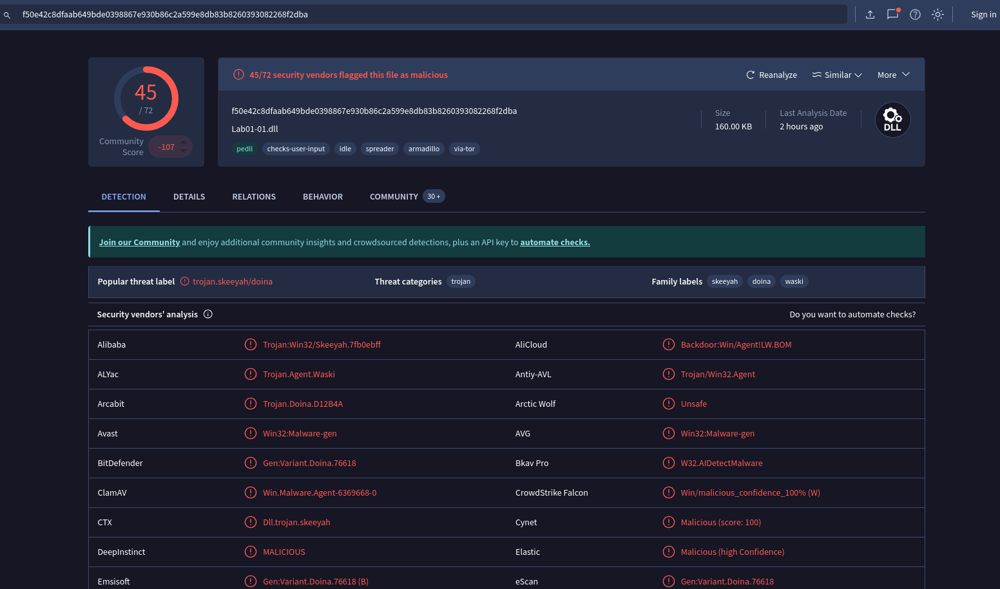

# Walawe Malware Analysis

## 📝 Deskripsi Singkat
Analisis file `Lab01-01.dll` (alias `walawe.exe`) yang diduga malware Windows. Laporan ini berisi langkah-langkah lengkap analisis statis, setup tools, command, hasil, dan indikator kompromi (IOC).

---

## 1. 🔐 Ekstraksi File
- **File:** `Lab01-01.dll` / `walawe.exe`
- **Password Arsip:**
  ```
  infected
  ```
- **Tips Keamanan:**
  - **JANGAN** ekstrak/analisis di sistem utama. Gunakan **VM** atau **sandbox**.
  - Matikan koneksi internet jika memungkinkan.

---

## 2. 🛠️ Setup Tools Analisis

### a. ClamAV (Antivirus)
- **Install:**
  ```bash
  sudo apt update && sudo apt install clamav -y
  sudo freshclam  # update database
  ```
- **Scan file:**
  ```bash
  clamscan Lab01-01.dll
  ```
- **Output:**
  - Jika terdeteksi: akan muncul nama signature.
  - Jika tidak: status OK.

### b. radare2 (Disassembler/Static Analysis)
- **Install:**
  ```bash
  sudo apt update && sudo apt install radare2 -y
  ```
- **Analisis dasar:**
  ```bash
  r2 -A Lab01-01.dll
  # Di dalam r2:
  iI   # Info header PE
  iS   # Section info
  iz   # Strings
  aaa  # Analisis semua
  ```
- **Keluar:**
  ```
  exit
  ```

### c. binwalk (File carving)
- **Install:**
  ```bash
  sudo apt update && sudo apt install binwalk -y
  ```
- **Analisis:**
  ```bash
  binwalk Lab01-01.dll
  ```

### d. IDA Pro (Disassembler GUI)
- **Download:** [IDA Freeware](https://hex-rays.com/ida-free)
- **Install:** Ikuti petunjuk installer (Windows/Linux).
- **Analisis:**
  1. Buka IDA, pilih **New Project** → **Lab01-01.dll**.
  2. Pilih format PE/Windows DLL.
  3. Tunggu proses auto-analysis.
  4. Navigasi ke **Entry Point** dan telusuri fungsi-fungsi mencurigakan.
- **Tips:**
  - Gunakan fitur **Strings** dan **Imports** untuk mencari API mencurigakan.
  - Tandai referensi ke IP, mutex, atau command.

---

## 3. 📦 File Information
| Properti     | Nilai                        |
| ------------ | ---------------------------- |
| File Name    | walawe.exe / Lab01-01.dll    |
| File Type    | Win32 DLL (PE32)             |
| Compile Time | 2010-12-19 11:16:38          |
| Arsitektur   | x86 (32-bit)                 |
| EntryPoint   | 0x100012fa                   |
| Compiler     | C (cdecl)                    |
| NX bit       | Tidak aktif (nx=false)       |
| Status Strip | Tidak strip (stripped=false) |
| Subsystem    | Windows GUI                  |

---

## 4. 🔑 File Hashes (IOC)
| Algoritma | Hash |
|-----------|---------------------------------------------------------------|
| MD5       | 290934c61de9176ad682ffdd65f0a669                             |
| SHA1      | a4b35de71ca20fe776dc72d12fb2886736f43c22                     |
| SHA256    | f50e42c8dfaab649bde0398867e930b86c2a599e8db83b8260393082268f2dba |

---

## 5. 🧪 Analisis Statis

### a. Section Analysis (`iS` di radare2)
| Section | Address    | Size    | Permission |
| ------- | ---------- | ------- | ---------- |
| .text   | 0x10001000 | 0x1000  | -r-x       |
| .rdata  | 0x10002000 | 0x24000 | -r--       |
| .data   | 0x10026000 | 0x1000  | -rw-       |
| .reloc  | 0x10027000 | 0x1000  | -r--       |

### b. Static Strings (`iz` di radare2/IDA)
Beberapa string mencurigakan:
- `CreateProcessA`, `CreateMutexA`, `OpenMutexA` (indikasi proses/sinkronisasi)
- `127.26.152.13` (hardcoded IP, dugaan C2)
- `WS2_32.dll`, `KERNEL32.dll` (API Windows)
- `SADFHUHF`, `exec`, `sleep`, `hello` (kemungkinan command embed)

### c. Metadata & Behavior
| Properti     | Nilai                        |
| ------------ | ---------------------------- |
| OS Target    | Windows                      |
| Format       | PE32                         |
| Relokasi     | Tidak digunakan              |
| Compiler     | C (cdecl)                    |
| NX bit       | Tidak aktif                  |
| Stripped     | Tidak                        |

### d. VirusTotal
- **Detection:** 
- **Link:** [VirusTotal Report](https://www.virustotal.com/gui/file/f50e42c8dfaab649bde0398867e930b86c2a599e8db83b8260393082268f2dba/detection)
- **Detection Rate:** 46/72 engines flagged as malicious
- **Popular Label:** Trojan.Skeeyah/Doina

---

## 6. 🚨 Indicators of Compromise (IOC)
- **File Hashes:** (lihat tabel di atas)
- **Hardcoded IP Address:** `127.26.152.13`
- **String mencurigakan:** `exec`, `CreateProcessA`, `CreateMutexA`, `WS2_32.dll`, `SADFHUHF`, `sleep`, `hello`
- **Compile Time:** 2010-12-19 11:16:38

---

## 7. ⚠️ Catatan Keamanan & Rekomendasi
- **JANGAN** jalankan file di sistem utama.
- Gunakan **sandbox** atau **VM** untuk analisis lebih lanjut (dynamic analysis).
- Monitor aktivitas jaringan ke IP mencurigakan.
- Update signature antivirus secara berkala.

---

## 8. 📚 Referensi & Tools
- [IDA Freeware](https://hex-rays.com/ida-free)
- [radare2](https://rada.re/n/)
- [ClamAV](https://www.clamav.net/)
- [binwalk](https://github.com/ReFirmLabs/binwalk)
- [VirusTotal](https://www.virustotal.com/)

---

> **Disusun oleh:** AI
