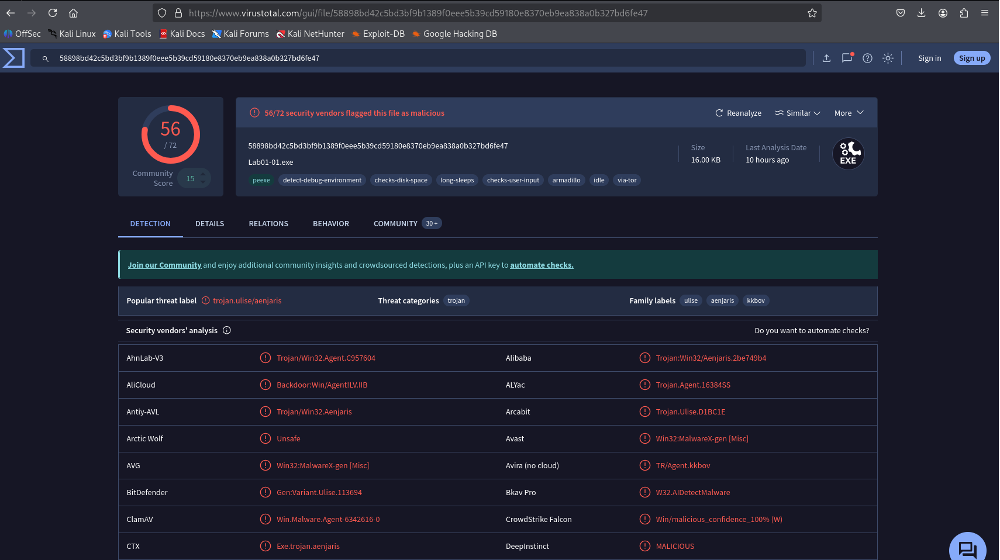

# Malware Analysis Summary: Lab01-01.exe

## 🔐 Extraction
- **File:** Lab01-01.exe
- **Password:** `infected`

## 📦 File Hashes
| Algoritma | Hash |
|----------|-----------------------------------------------|
| MD5      | bb7425b82141a1c0f7d60e5106676bb1              |
| SHA1     | 9dce39ac1bd36d877fdb0025ee88fdaff0627cdb      |
| SHA256   | 58898bd42c5bd3bf9b1389f0eee5b39cd59180e8370eb9ea838a0b327bd6fe47 |

## 🧪 Scan Results
- **ClamAV:**
  - Status: Not detected (OK)
  - Note: ClamAV may miss custom/packed malware.
- **VirusTotal:**
  - [VT Report Link](https://www.virustotal.com/gui/file/58898bd42c5bd3bf9b1389f0eee5b39cd59180e8370eb9ea838a0b327bd6fe47/detection)
  - Detection: **56/72** vendors flagged as malicious
  - Popular Label: `trojan.ulise/aenjaris`
  - Notable Vendors: Microsoft, BitDefender, Avast, Fortinet, Malwarebytes, ClamAV, Symantec, TrendMicro
  - Screenshot:
    

## 🧬 Threat Classification
- **Type:** Trojan, Backdoor, Downloader
- **Behavior Tags:** debug-check, disk-space-check, long-sleep, via-tor, armadillo (packer)
- **Family:** Ulise, Aenjaris, Agent, kkbov

## 🧰 Tools Used
- `md5sum`, `sha1sum`, `sha256sum` (hash)
- `clamscan` (antivirus)
- VirusTotal (multi-engine scan)

---
> Analyst: kali@idn | Date: 2025-07-19

## 📝 Kesimpulan
Berdasarkan hasil analisis multi-antivirus (VirusTotal) dan data statis, file `Lab01-01.exe` terindikasi kuat sebagai malware (Trojan/Backdoor). Hal ini didukung oleh deteksi dari mayoritas engine antivirus (56/72), label threat seperti 'trojan.ulise/aenjaris', serta adanya perilaku mencurigakan. Meski ClamAV tidak mendeteksi, file ini **sangat tidak aman** untuk dijalankan di sistem produksi.

> **Disusun oleh:** AI