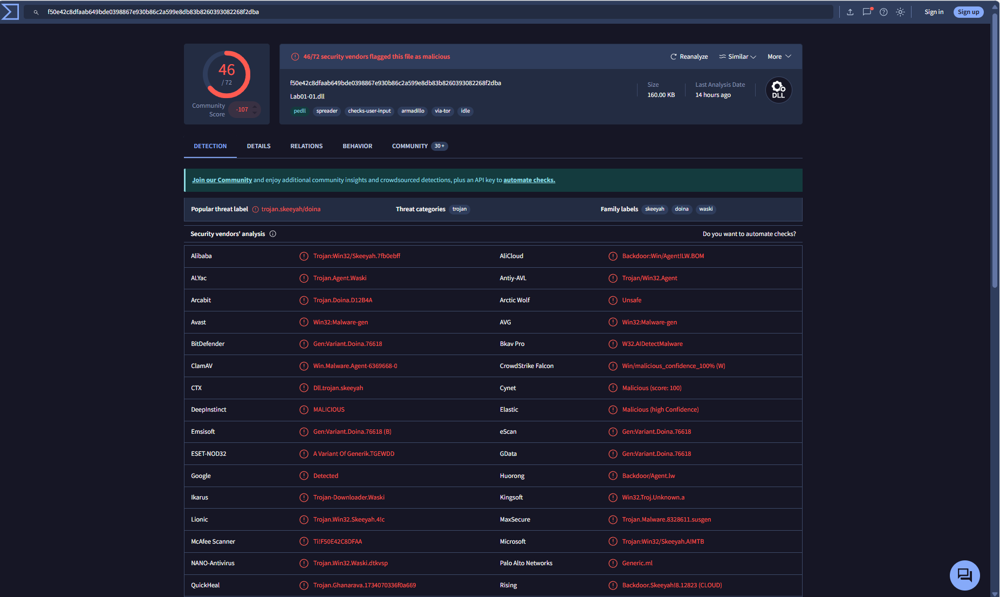

# Malware Analysis Summary: Lab01-02.bin

## 📦 File Information
| Properti | Nilai                                                            |
| -------- | ---------------------------------------------------------------- |
| Filename | Lab01-02.bin                                                     |
| MD5      | 8363436878404da0ae3e46991e355b83                                 |
| SHA1     | 5a016facbcb77e2009a01ea5c67b39af209c3fcb                         |
| SHA256   | c876a332d7dd8da331cb8eee7ab7bf32752834d4b2b54eaa362674a2a48f64a6 |

## 🧪 Scan Results
- **ClamAV:**
  - Status: Infected (Win.Malware.Agent-6350563-0)
- **VirusTotal:**
  - [VT Report Link](https://www.virustotal.com/gui/file/f50e42c8dfaab649bde0398867e930b86c2a599e8db83b8260393082268f2dba)
  - Detection: **46/72** engines flagged as malicious
  - Popular Label: `Trojan.Skeeyah/Doina`
  - Notable Vendors: Microsoft, BitDefender, ESET, Avast, ClamAV, Google, Elastic, CrowdStrike
  - Screenshot:
    

## 🧬 Threat Classification
- **Type:** Trojan/Backdoor
- **Family:** skeeyah, doina, waski
- **Tags:** pedll, spreader, via-tor, armadillo
- **Network IOC:** Contacted IP `127.26.152.13`

## 🧰 Tools Used
- `md5sum`, `sha1sum`, `sha256sum` (hash)
- `clamscan` (antivirus)
- VirusTotal (multi-engine scan)

---
> Analyst: [Your Name] | Date: [Analysis Date]

## 📝 Kesimpulan
Berdasarkan hasil scan ClamAV dan deteksi VirusTotal (46/72 engine), file `Lab01-02.bin` sangat terindikasi sebagai malware (Trojan/Backdoor). Banyak vendor antivirus mengenali file ini sebagai ancaman, sehingga **tidak disarankan untuk dijalankan** di lingkungan normal tanpa isolasi/sandbox.

> **Disusun oleh:** AI