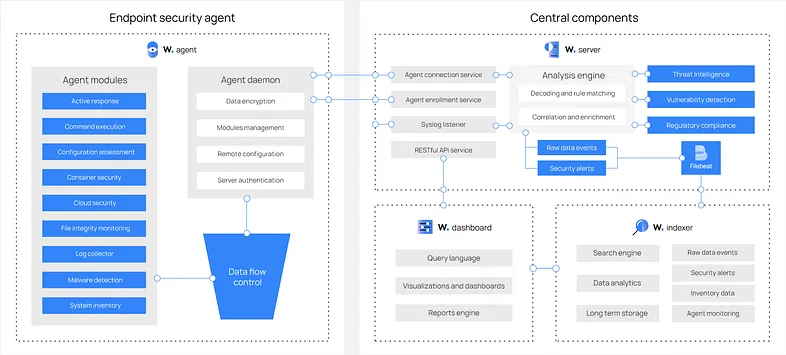
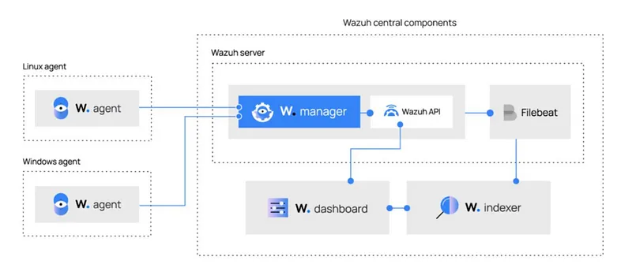
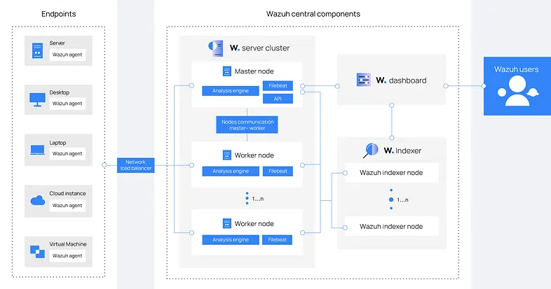

# wazuh
## apa itu wazuh
Wazuh merupakan salah satu dari sekian banyak aplikasi SIEM yang open source. Wazuh memiliki keunggulan yakni memiliki fitur yang lebih banyak dibandingkan aplikasi serupa. Wazuh menggabungkan fungsi yang terpisah secara historis untuk menjadi single agent dan platform arsitektur. Perlindungan keamanan yang ditawarkan seperti untuk cloud public, cloud pribadi, dan pusat data. Wazuh juga memberikan analisis korelasi secara real-time, respons yang diberikan juga aktif dan bersifat granular, serta mencakup perbaikan pada perangkat sehingga end point akan tetap terjaga kebersihannya. Selain itu, pada aplikasi Wazuh juga melakukan analisis log, pengecekan integritas, pemantauan registry Windows, deteksi rootkit, peringatan berbasis waktu, dan respons aktif secara real-time. Wazuh terbagi atas 2 bagian, yaitu Wazuh Server dan Wazuh Agent. Wazuh Server adalah perangkat yang berfungsi untuk manajemen agen dan dasbor sistem monitoring baik berupa file integritas, intrusion, ataupun log. Wazuh Agent adalah perangkat yang dipasang pada perangkat end point untuk pembacaan sistem, pengumpulan log, dan mengirimkan data ke Wazuh Server. Wazuh merupakan arsitektur berbasis cloud yang dirancang untuk mengurangi kompleksitas dan juga untuk meningkatkan keamanan sebagai bentuk perlindungan end point yang lebih kuat. Penggunaan Wazuh sangat penting untuk memastikan file ataupun data-data yang bersifat rahasia tetap aman dan terhindar dari perusakan maupun pencurian oleh pelaku kejahatan siber.

### A. Komponen Aplikasi Wazuh
Platform Wazuh menyediakan fitur XDR dan SIEM untuk melindungi beban kerja cloud, container, dan server. Hal ini termasuk analisis data log, deteksi intrusi dan malware, pemantauan integritas file, penilaian konfigurasi, deteksi kerentanan, dan dukungan untuk kepatuhan terhadap peraturan. Aplikasi Wazuh didasarkan pada agen Wazuh, yang disebarkan pada titik akhir yang dipantau, dan pada tiga komponen utama yaitu Wazuh server, Wazuh indexer, dan Wazuh dashboard.

#### 1, Wazuh indexer
adalah mesin analitik dan pencarian teks lengkap yang sangat skalabel. Komponen pusat ini mengindeks dan menyimpan peringatan yang dihasilkan oleh server Wazuh.

#### 2. Wazuh server
menganalisis data yang diterima dari agen. Komponen ini memprosesnya melalui dekoder dan aturan, menggunakan threat intelligence untuk mencari indicators of compromise (IOCs). Satu server dapat menganalisis data dari ratusan atau ribuan agen, dan menskalakan secara horizontal saat disiapkan sebagai kluster. Komponen sentral ini juga digunakan untuk mengelola agen, mengonfigurasi dan memutakhirkannya dari jarak jauh bila diperlukan.

#### 3. Wazuh dashboard
adalah antarmuka pengguna web untuk visualisasi dan analisis data. Komponen ini mencakup dasbor siap pakai untuk peristiwa keamanan, kepatuhan terhadap peraturan (PCI DSS, GDPR, CIS, HIPAA, NIST 800–53), aplikasi rentan yang terdeteksi, data pemantauan integritas file, hasil penilaian konfigurasi, dan pemantauan cloud infrastructure events. Hal ini juga digunakan untuk mengelola konfigurasi Wazuh dan untuk memantau statusnya.

#### 4. Wazuh agents
diinstal pada titik akhir seperti laptop, desktop, server, instans cloud, atau mesin virtual. Wazuh agents menyediakan kemampuan pencegahan, deteksi, dan respons ancaman. Wazuh agents berjalan di sistem operasi seperti Linux, Windows, macOS, Solaris, AIX, dan HP-UX.

Selain kemampuan pemantauan berbasis agen, platform Wazuh dapat memantau perangkat tanpa agen seperti firewall, switches, routers, atau IDS jaringan. Misalnya, data log sistem dapat dikumpulkan melalui Syslog, dan konfigurasinya dapat dipantau melalui pemeriksaan data secara berkala, melalui SSH atau melalui API. Diagram di bawah ini mewakili komponen Wazuh dan aliran data sebagai berikut:



### B. Fitur Aplikasi Wazuh
Dalam aplikasi Wazuh terdapat beberapa fitur yang dapat digunakan untuk menjalankan tugasnya sebagai salah satu aplikasi SIEM, antara lain yaitu :

#### 1. Pengumpulan Data Log
Pengumpulan data log adalah proses real-time untuk memahami catatan yang dihasilkan oleh server atau perangkat. Komponen ini dapat menerima log melalui file teks atau log peristiwa Windows. Itu juga dapat langsung menerima log melalui syslog jarak jauh yang berguna untuk firewall dan perangkat sejenis lainnya.

Tujuan dari proses ini adalah untuk mengidentifikasi kesalahan aplikasi atau sistem, kesalahan konfigurasi, upaya penyusupan, pelanggaran kebijakan, atau masalah keamanan.

Persyaratan memori dan CPU agen Wazuh tidak signifikan karena tugas utamanya adalah meneruskan acara ke manajer. Namun, pada manajer Wazuh, konsumsi CPU dan memori dapat meningkat dengan cepat tergantung pada peristiwa per detik (EPS) yang harus dianalisis oleh manajer.

#### 2. Pemantauan Integritas File
Sistem pemantauan integritas file pada Wazuh mengawasi file yang dipilih dan memicu peringatan ketika file-file ini dimodifikasi. Komponen yang bertanggung jawab untuk tugas ini disebut syscheck. Komponen ini menyimpan checksum kriptografi dan atribut lain dari file atau kunci registri Windows dan secara teratur membandingkannya dengan file saat ini yang digunakan oleh sistem, mengamati adanya perubahan.

#### 3. Mengaudit who-data
Fitur ini merupakan fitur baru dari versi 3.4.0, Wazuh menggabungkan fungsi baru yang memperoleh informasi who-data dari file yang dipantau.

Informasi who-data ini berisi pengguna yang membuat perubahan pada file yang sedang dipantau dan nama program atau proses yang digunakan untuk melakukan perubahan tersebut.

#### 4. Deteksi Anomali, Malware, Kerentanan
Deteksi anomali mengacu pada tindakan menemukan pola dalam sistem yang tidak sesuai dengan perilaku yang diharapkan. Setelah malware (misalnya, rootkit) diinstal pada sistem, malware tersebut akan memodifikasi sistem untuk menyembunyikan dirinya dari pengguna. Meskipun malware menggunakan berbagai teknik untuk mencapai hal ini, Wazuh menggunakan pendekatan spektrum yang luas untuk menemukan pola anomali yang mengindikasikan kemungkinan penyusup.

Wazuh juga mampu mendeteksi kerentanan dalam aplikasi yang diinstal pada agen dengan menggunakan fitur Vulnerability Detector. Audit software audit ini dilakukan melalui integrasi feed kerentanan yang diindeks oleh Canonical, Debian, Red Hat, Arch Linux, ALAS (Amazon Linux Advisories Security), Microsoft, dan National Vulnerability Database.

#### 5. Security Configuration Assessment (SCA)
Salah satu cara paling pasti untuk mengamankan host adalah dengan mengurangi permukaan kerentanannya. Proses itu umumnya dikenal sebagai pengerasan, dan penilaian konfigurasi adalah cara yang efektif untuk menentukan peluang di mana permukaan serangan host dapat dikurangi, dan di sinilah SCA berperan.

SCA melakukan pemindaian untuk menemukan eksposur atau kesalahan konfigurasi di host yang dipantau. Pemindaian tersebut menilai konfigurasi host menggunakan file kebijakan yang berisi aturan untuk diuji terhadap konfigurasi host yang sebenarnya.

Kebijakan untuk fitur SCA ditulis dalam YAML. Format ini dipilih dengan mempertimbangkan keterbacaan manusia, yang memungkinkan pengguna untuk dengan cepat memahami dan menulis kebijakan mereka sendiri atau memperluas yang sudah ada agar sesuai dengan kebutuhan mereka. Selanjutnya, Wazuh didistribusikan dengan serangkaian kebijakan, sebagian besar berdasarkan tolak ukur CIS, standar yang mapan untuk pengerasan host.

#### 6. Pemantauan Kebijakan Keamanan
Pemantauan kebijakan merupkan proses verifikasi bahwa semua sistem sesuai dengan seperangkat aturan yang telah ditentukan sebelumnya mengenai pengaturan konfigurasi dan penggunaan aplikasi yang disetujui.

Wazuh menggunakan tiga komponen untuk melakukan tugas ini: Rootcheck, OpenSCAP, dan CIS-CAT.

#### 7. Pemantauan Panggilan System
Sistem Audit Linux menyediakan cara untuk melacak informasi yang relevan dengan keamanan di mesin Anda. Berdasarkan aturan yang telah dikonfigurasikan sebelumnya, Audit membuktikan pencatatan real-time terperinci tentang peristiwa yang terjadi di sistem Anda. Informasi ini sangat penting untuk lingkungan mission-critical untuk menentukan pelanggar kebijakan keamanan dan tindakan yang mereka lakukan.

#### 8. Pemantauan Command
Ada kalanya user mungkin ingin memantau hal-hal yang tidak ada dalam log. Untuk mengatasi ini, Wazuh menggabungkan kemampuan untuk memantau output dari command tertentu dan memperlakukan output seolah-olah command tersebut adalah konten file log.

#### 9. Pemantauan Tanpa Agen
Pemantauan tapa agen memugkinkan user memantau perangkat atau sistem tanpa agen melalui SSH, seperti router, firewall, dan sistem Linux. Hal ini memungkinkan user dengan batasan penginstalan software untuk memenuhi persyaratan security and complience.

#### 10. Mekanisme Anti-flooding
Mekanisme ini dirancang untuk mencegah ledakan besar peristiwa pada agen dari dampak negatif pada jaringan atau manajer. Ini menggunakan leaky bucket queue yang mengumpulkan semua peristiwa yang dihasilkan dan mengirimkannya ke manajer dengan kecepatan di bawah ambang batas peristiwa per detik yang ditentukan. Ini membantu menghindari hilangnya peristiwa atau perilaku tak terduga dari komponen Wazuh.

#### 11. Integrasi VirusTotal
Wazuh juga dapat memindai file yang dipantau untuk konten berbahaya dalam file yang dipantau. Solusi ini dimungkinkan melalui integrasi dengan VirusTotal, yang merupakan platform kuat yang menggabungkan beberapa produk antivirus bersama dengan mesin pemindaian online.

#### 12. Osquery
Merupakan fitur Wazuh yang memungkinkan pengelolaan alat Osquery dari agen Wazuh. Fitur ini memungkinkan pengaturan konfigurasi Osquery dan mengumpulkan informasi yang dihasilkan oleh Osquery untuk mengirimkannya ke manajer, menghasilkan peringatan yang sesuai jika perlu.

#### 13. Fluentd Forwarder
Fitur ini memungkinkan Wazuh untuk meneruskan pesan ke server Fluentd. Fluentd merupakan platform open source pengumpul data logger yang dilengkapi dengan plugin hebat untuk membangun lapisan logging Anda sendiri.

### C. Topologi Aplikasi Wazuh


### D. Architecture Aplikasi Wazuh
Diagram di bawah menunjukkan arsitektur penyebaran Wazuh. Ini menunjukkan komponen solusi dan juga bagaimana server Wazuh dan node pengindeks Wazuh dapat dikonfigurasikan sebagai cluster, menyediakan penyeimbangan beban dan juga ketersediaannya yang tinggi.



### E. Cara Kerja Aplikasi Wazuh
Wazuh agent yaitu akan mengirimkan log yang didapatkan ke Wazuh server untuk dilakukan analisis dan juga deteksi ancaman. Sebelum itu, wazuh agent akan membuakan sebuah koneksi dengan layanan server. Lalu wazuh server akan menerjemahkan log yang diterimanya menggunakan analysis engine. Log yang terdeteksi sebagai ancaman akan dibuatkan suatu alert yang dimana bisa menyimpan rule id dan rule name. Kemudian log tersebut akan ditampung terlebih dahulu ke dalam penyimpanan wazuh. Filebeat itu digunakan untuk mengirimkan alert dan log ke server Elasticsearch. Kemudian setelah data diterima oleh Elasticsearch, Kibana akan memvisualisaskan informasi yang telah didapatkan. Interface dari wazuh kemudian berjalan pada Kibana, yaitu sebagai plugin.

#### Wazuh Agen 
Agen keamanan titik akhir lintas platform yang diinstal pada sistem/host yang ingin Anda pantau.

#### Wazuh Server 
Menganalisis data yang diterima dari agen Wazuh, memproses data ini dan mencocokkannya dengan set aturan untuk mengidentifikasi indikator kompromi (IOC).

#### Elastis Stack
Menampilkan dan mengindeks lansiran yang dihasilkan oleh server Wazuh dan memberi pengguna visualisasi data dan fungsionalitas analisis yang kuat.

Catatan: Wazuh juga dapat digunakan untuk memonitor perangkat seperti peralatan jaringan yang tidak dapat menjalankan agen Wazuh. Ini berfungsi dengan membuat perangkat mengirim log mereka.

## installation
1. Buka Website resmi wazuh dan buka yang bagian quick start [documentation.wazuh.com/current/quickstart.html](https://documentation.wazuh.com/current/quickstart.html)
2. Buka website yang alternatif download jika ingin menggunakan metode yang lain untuk installasinya [documentation.wazuh.com/current/deployment-options/index.html](https://documentation.wazuh.com/current/deployment-options/index.html)
3. terdapat beberapa metode yang bsia di lakukan install bisa dengan VM (OVA), AMI Aws, Docker, Kubernetes, offline, fromt sc
4. jika sudah pilih salah satu ikuti saja petunjuknya

### quick start
[documentation.wazuh.com/current/quickstart.html](https://documentation.wazuh.com/current/quickstart.html)

#### 1. Install Wazuh
Run the following command to download and install Wazuh: \
```bash
curl -sO https://packages.wazuh.com/4.12/wazuh-install.sh && sudo bash ./wazuh-install.sh -a
```

#### 23/07/2025 09:14:59 ERROR: Filebeat installation failed.
```bash
curl -s https://artifacts.elastic.co/GPG-KEY-elasticsearch | sudo gpg --dearmor -o /usr/share/keyrings/elastic-keyring.gpg
echo "deb [signed-by=/usr/share/keyrings/elastic-keyring.gpg] https://artifacts.elastic.co/packages/8.x/apt stable main" | sudo tee /etc/apt/sources.list.d/elastic-8.x.list
sudo apt update
sudo apt install filebeat
# ---

sudo apt purge wazuh-manager -y
sudo apt autoremove -y
sudo netstat -tulnp | grep -E '1515|55000'
sudo kill -9 <pid>
# ---

sudo bash ./wazuh-install.sh -a --overwrite
```

### 2. Access the Wazuh Web Interface
Once the installation completes, check the output for your access credentials: \
```bash
INFO: --- Summary ---
INFO: You can access the web interface https://<WAZUH_DASHBOARD_IP_ADDRESS>
    User: admin
    Password: <ADMIN_PASSWORD>
INFO: Installation finished.
```

Access the web interface:
- URL: `https://<WAZUH_DASHBOARD_IP_ADDRESS>`
- Username: `admin`
- Password: `<ADMIN_PASSWORD>`

> **Note**: Your browser may show a warning about the SSL certificate. You can either accept the risk temporarily or configure a trusted certificate later.

### 3. Retrieve All Wazuh Component Passwords (Optional)
To extract the passwords used by the Wazuh indexer and Wazuh API: \
```bash
sudo tar -O -xvf wazuh-install-files.tar wazuh-install-files/wazuh-passwords.txt
```

### 4. Disable Wazuh Updates (Recommended)
To avoid accidental updates that may break the setup, disable the Wazuh repository: \
**For Debian/Ubuntu systems:** \
```bash
sudo sed -i "s/^deb /#deb /" /etc/apt/sources.list.d/wazuh.list
sudo apt update
```

### VM (OVA)
- comming soon

### Docker
- comming soon

## configure rules


## referensi
- [medium-pengenalan_aplikasi_wazuh](https://medium.com/@aiwidasukmawatiazzahra123/pengenalan-aplikasi-wazuh-untuk-perlindungan-keamanan-siber-18535755da92)
- []()
- []()