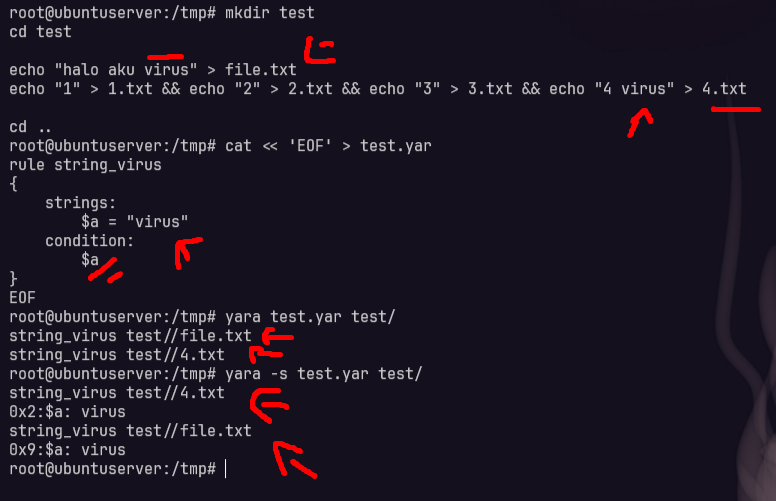
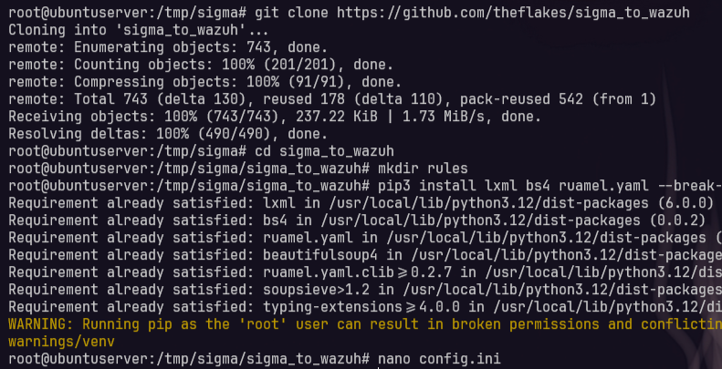
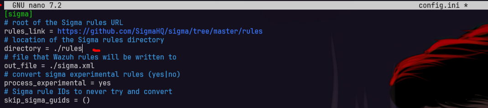
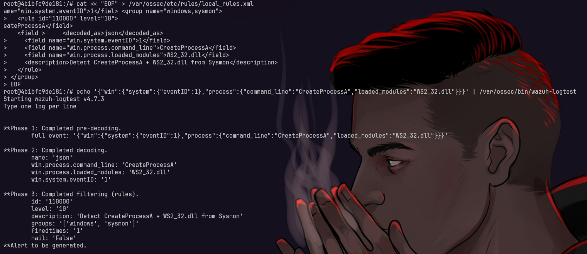
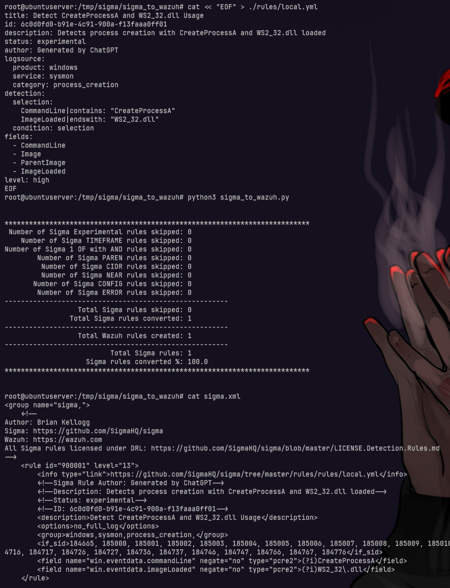
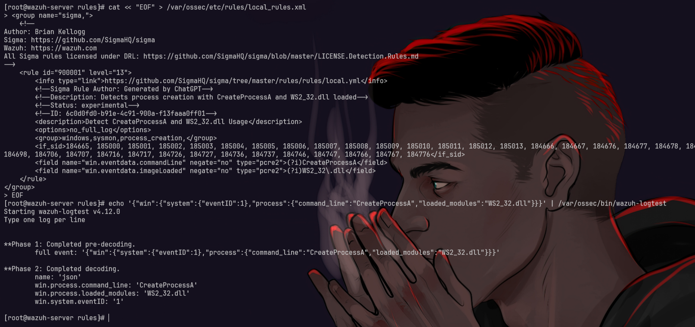
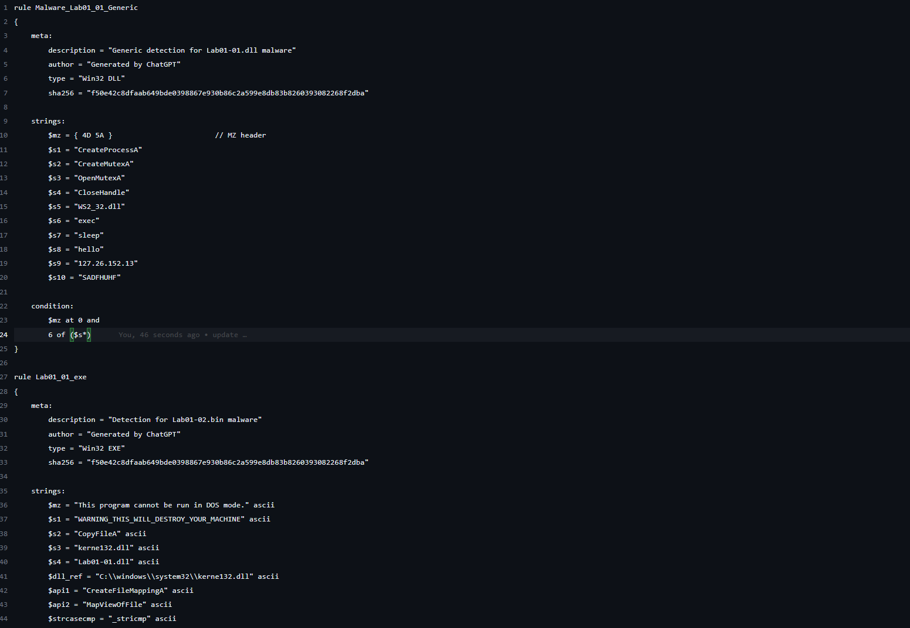
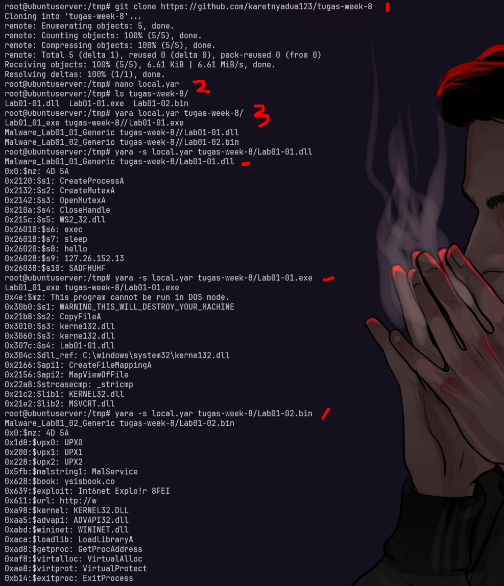

# Sigma & YARA Rules
## A. YARA
YARA adalah tool yang digunakan untuk mendeteksi dan mengklasifikasi malware berdasarkan pola tertentu (rules) yang ditulis dalam format teks. YARA banyak digunakan oleh malware analyst dan threat hunter.

### Struktur Dasar YARA Rule
```yara
rule RuleName {
    strings:
        $a = "malicious_string"
        $b = {6A 40 68 00 30 00 00 6A 14 8D 91}

    condition:
        $a or $b
}
```

### Penjelasan:
* `rule RuleName`: Nama rule (tidak boleh ada spasi).
* `strings`: Bagian yang mendefinisikan pola string atau hex yang dicari.
* `condition`: Syarat kapan rule akan dianggap match, misal jika salah satu string ditemukan.

### Tipe Data dalam Strings:
* **Plain text**: Contoh: `"MZ"`
* **Hex pattern**: Contoh: `{E8 ?? ?? ?? ?? 85 C0}`
* **Regex**: Contoh: `/malware[0-9]+/`

YARA biasa digunakan untuk scan file secara lokal atau integrasi dengan sistem deteksi malware seperti VirusTotal, Wazuh, dan lainnya.

<div style="page-break-after: always;"></div>

## B. Yara Lab
### 1. setup
```bash
apt update
apt install yara
```

### 2. cara menggunakan yara
- diisni saya akan mencoba membuat file yang berisi string tertentu
  ```bash
  mkdir test
  cd test

  echo "halo aku virus" > file.txt
  echo "1" > 1.txt && echo "2" > 2.txt && echo "3" > 3.txt && echo "4 virus" > 4.txt

  cd ..
  ```
- lalu saya akan coba buat sebuah rules yara untuk mendeteksi apakah terdapat string virus
  ```bash
  cat << 'EOF' > test.yar
  rule string_virus
  {
      strings:
          $a = "virus"
      condition:
          $a
  }
  EOF
  ```
- jika sudah kita coba jalankan
  ```bash
  yara test.yar test/
  ```
  atau gunakan -s untuk melihat apa saja yang cocok
  ```bash
  yara -s test.yar test/
  ```
  

<div style="page-break-after: always;"></div>

## C. Sigma
Sigma adalah format rule open-source untuk mendeteksi aktivitas mencurigakan dalam log (SIEM). Sigma bertujuan untuk menjadi "YARA untuk log".

## flow sigma
```bash
Log mentah (raw logs dari Windows/Linux) 
     ↓
  Dikirim ke SIEM (Splunk, Elastic, dll)
     ↓
 SIEM parsing dan indexing log
     ↓
 Sigma Rule (format .yml) dipakai → dikonversi ke query SIEM pakai sigma-cli
     ↓
 Query dijalankan di SIEM → menghasilkan alert atau hasil pencarian
```

### Struktur Dasar Sigma Rule
```yaml
title: Suspicious PowerShell Execution
logsource:
  category: process_creation
  product: windows

detection:
  selection:
    Image|endswith: 'powershell.exe'
    CommandLine|contains: 'Invoke-WebRequest'
  condition: selection

level: high
```

### Penjelasan:
* `title`: Nama rule.
* `logsource`: Menentukan jenis log yang dituju.
* `detection`: Pola yang ingin dicocokkan dalam log.
* `level`: Tingkat keparahan (low/medium/high/critical).

Sigma rules dapat dikonversi ke query SIEM seperti Splunk, Elastic, Graylog menggunakan Sigma CLI.
---

Keduanya, **YARA** dan **Sigma**, sangat penting dalam dunia **threat detection**:
* YARA: fokus ke *file-based detection*.
* Sigma: fokus ke *log-based detection*.

<div style="page-break-after: always;"></div>

## D. Sigma Lab
- sigma cli (msh gagal) [github.com/SigmaHQ/sigma](https://github.com/SigmaHQ/sigma)
- sigma_to_wazuh [https://github.com/theflakes/sigma_to_wazuh?tab=readme-ov-file](https://github.com/theflakes/sigma_to_wazuh?tab=readme-ov-file)

#### 1. setup
```bash
git clone https://github.com/theflakes/sigma_to_wazuh
cd sigma_to_wazuh
mkdir rules
```

lalu coba pip install, dan ubah config.ini untuk mengubah path rules sigma
```bash
pip3 install lxml bs4 ruamel.yaml --break-system-packages

nano config.ini
# untuk mengubah config path
# ubah ini jadi directory = ./rules agar bisa baca rulesnya

python3 sigma_to_wazuh.py
```




<!-- #### 2. testing untuk rules sigma (opsional ini contoh rules untuk detecsi sebuah process)
- ini rules wazuh untuk testing apakah lognya bisa ke detect (untuk lognya sendiri itu dari ai, semuanya dari AI :v)
- lakukan test ini di wazuh manager
    ```bash
    cat << "EOF" > /var/ossec/etc/rules/local_rules.xml
    <group name="windows,sysmon">
      <rule id="110000" level="10">
        <decoded_as>json</decoded_as>
        <field name="win.system.eventID">1</field>
        <field name="win.process.command_line">CreateProcessA</field>
        <field name="win.process.loaded_modules">WS2_32.dll</field>
        <description>Detect CreateProcessA + WS2_32.dll from Sysmon</description>
      </rule>
    </group>
    EOF

    echo '{"win":{"system":{"eventID":1},"process":{"command_line":"CreateProcessA","loaded_modules":"WS2_32.dll"}}}' | /var/ossec/bin/wazuh-logtest
    ```
     -->
  
<div style="page-break-after: always;"></div>

#### 2. buat rules sigma yang mirip dengan rules wazuh di atas
- nah lalu kita buat sebuah rules dari yaml menggunakan sigma yang di convert ke wazuh nantinya sebagai xml

```bash
cat << "EOF" > ./rules/local.yml
title: Detect CreateProcessA and WS2_32.dll Usage
id: 6c0d0fd0-b91e-4c91-900a-f13faaa0ff01
description: Detects process creation with CreateProcessA and WS2_32.dll loaded
status: experimental
author: Generated by ChatGPT
logsource:
  product: windows
  service: sysmon
  category: process_creation
detection:
  selection:
    CommandLine|contains: "CreateProcessA"
    ImageLoaded|endswith: "WS2_32.dll"
  condition: selection
fields:
  - CommandLine
  - Image
  - ParentImage
  - ImageLoaded
level: high
EOF

python3 sigma_to_wazuh.py
cat sigma.xml
```


<!-- <div style="page-break-after: always;"></div>

#### 4. testing rules xml menggunakan wazuh
- lakukan **copy paste output sigma.xml** yang dihasilakan **sigma_to_wazuh**, dan **lakukan test dengan log di atas** tadi
```bash
cat << "EOF" > /var/ossec/etc/rules/local_rules.xml
## paste output hasil dari cat sigma.xml
EOF

echo '{"win":{"system":{"eventID":1},"process":{"command_line":"CreateProcessA","loaded_modules":"WS2_32.dll"}}}' | /var/ossec/bin/wazuh-logtest
```
 -->

---

<div style="page-break-after: always;"></div>

# Rules dari Malware sebelumnya
## A. Yara
### 1. cara buat rules yara menggunakan chat gpt
* Dapatkan sample malware (contoh: .exe, .dll, .bin)
* Jalankan `strings namafile` untuk melihat isi string mencurigakan
* (Opsional) Upload ke VirusTotal untuk cek SHA256 dan behavior
* Salin hasil `strings` ke ChatGPT untuk dibuatkan YARA rule
* Simpan dan tes dengan `yara rule.yar namafile`

### 2. setup
```bash
git clone https://github.com/karetnyadua123/tugas-week-8
```

### 3. buat rules yang sudah dibuat berdasarkan IOC (Indicators of Compromise)
- [./local.yar](https://github.com/ariafatah0711/idn_bootcamp/blob/main/task/week_9/1_sigma_yara_rules/rules/local.yar)
  

```bash
cat << "EOF" > local.yar
## copy paste rule di link di atas
EOF
```

### 4. testing rulesnya ke directory tugas_week_8
```bash
yara local.yar tugas-week-8/

yara -s local.yar tugas-week-8/Lab01-01.dll
yara -s local.yar tugas-week-8/Lab01-01.exe
yara -s local.yar tugas-week-8/Lab01-02.bin
```

atau gunakan -s
```bash
yara -s local.yar tugas-week-8/
```



<!-- ## B. Sigma
comming soon -->