# fine tunning pada ruleset dan decoder wazuh
## A. Descriptiom
1. Buat Ruleset & Decoder baru untuk 2 log file dibawah ini, dengan konsep atomic ruleset dan siblings decoder 
2. Testing dengan logtest atau wazuh log testing di dashboard wazuh.

<div style="page-break-after: always;"></div>

## B. ruleset
- [./decoders/0585-openstack-nova.xml](https://github.com/ariafatah0711/idn_bootcamp/blob/main/task/week_9/2_fine_tunning_wazuh/rules/decoders/0585-openstack-nova.xml)
  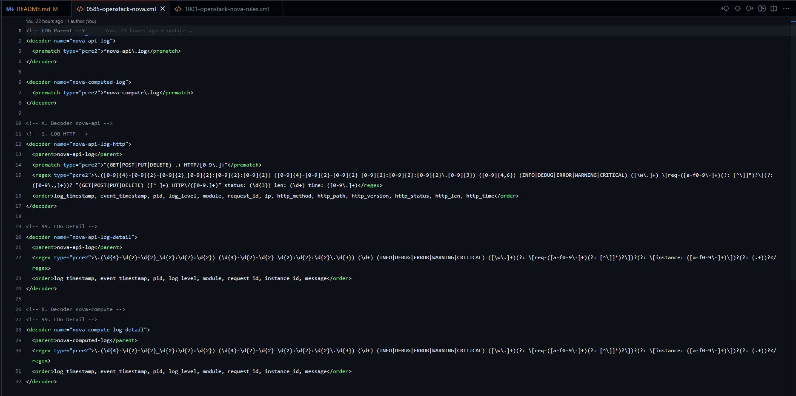
- [./ruleset/1001-openstack-nova-rules.xml](https://github.com/ariafatah0711/idn_bootcamp/blob/main/task/week_9/2_fine_tunning_wazuh/rules/ruleset/1001-openstack-nova-rules.xml)
  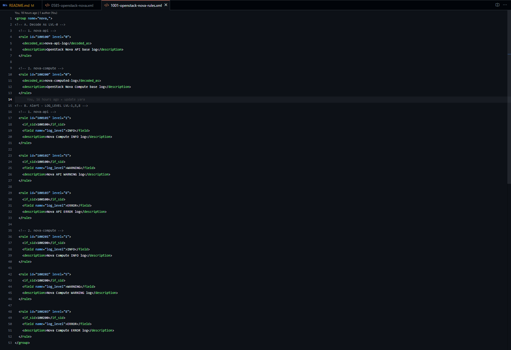

<div style="page-break-after: always;"></div>

## C. how to setup
### 1. setup & install wazuh-manager
#### a. wazuh manager only with Docker
- buat container terlebih dahulu dengan ketentuan seperti ini: image=wazuh/wazuh-manager, volume=wazuh:/var/ossec (opsional), dan port forwardnya seperti dibawah
- lalu setelah terbuat jangan lupa install nano karena belum ada nano

```bash
mkdir -p wazuh
# docker run -d --name wazuh-manager \
#   -p 1514:1514/udp \
#   -p 1515:1515 \
#   -v wazuh:/var/ossec \
#   wazuh/wazuh-manager:4.7.3

docker run -d --name wazuh-manager \
  -p 1514:1514/udp \
  -p 1515:1515 \
  wazuh/wazuh-manager:4.7.3

docker exec -it wazuh-manager apt install nano

### masuk ke shell
docker exec -it wazuh-manager bash
```

#### b. wazuh with ova (Virtual Box)
- install ova dari url [https://documentation.wazuh.com/current/deployment-options/virtual-machine/virtual-machine.html](https://documentation.wazuh.com/current/deployment-options/virtual-machine/virtual-machine.html)
- setelah itu **import di virtual box** dan jalankan
- lalu **sesuaikan network adaptor**
- jangan lupa gunakan **RAM minimal 6Gb / 8Gb, CPU 4, dan Storage 30-50Gb**
- lalu jalankan vm nya
  - credensial **untuk ssh / login** adalah **wazuh-user:wazuh**
  - credensial **untuk web** adalah **admin:admin**

### 2. how to make decoder rules
- pertama tama kita coba buat sebuah rules untuk mendapatkan string awal atau nama program lognya terlebih dahulu dengan regex, saya mencari regexnya dengan bantuan AI. ini adalah regex yang saya dapatkan ```^nova\-[^ ]+\.log```
- jika sudah coba lakukan di [regex101](https://regex101.com/) dan test dengan salah satu log nova-api
  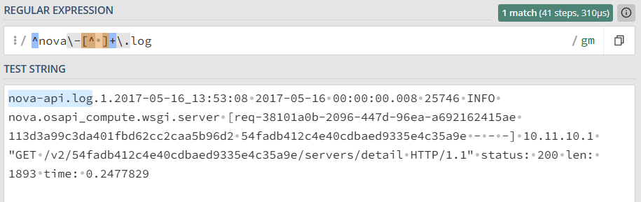
- jika sudah dapet kita coba buat rules decoder parent nya dulu
  ```xml
  <decoder name="nova-log">
    <prematch type="pcre2">^nova\-[^ ]+\.log</prematch>
  </decoder>
  ```
- lalu saya coba simpan di ```/var/ossec/ruleset/decoders/0585-openstack-nova.xml```
  ```bash
  nano /var/ossec/ruleset/decoders/0585-openstack-nova.xml # isi rulesnya
  chown -R root:wazuh /var/ossec/ruleset/decoders/0585-openstack-nova.xml # permission
  ```
- jika sudah di simpan, dan mengubah permissionya, kita bisa lakukan test
  dengan menggunakan **logtest cli** dengan perintah 
  ```bash
  echo 'nova-api.log.1.2017-05-16_13:53:08 2017-05-16 00:00:00.008 25746 INFO nova.osapi_compute.wsgi.server [req-38101a0b-2096-447d-96ea-a692162415ae 113d3a99c3da401fbd62cc2caa5b96d2 54fadb412c4e40cdbaed9335e4c35a9e - - -] 10.11.10.1 "GET /v2/54fadb412c4e40cdbaed9335e4c35a9e/servers/detail HTTP/1.1" status: 200 len: 1893 time: 0.2477829' | /var/ossec/bin/wazuh-logtest
  ```
  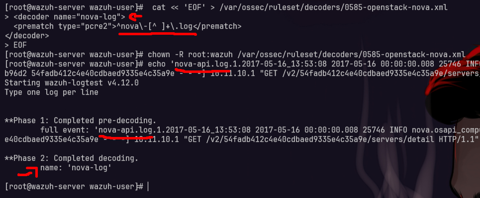
- jika sudah kita bisa buat regex untuk dapetin log untuk dapetin data selanjutnya
- kita coba di regex101 lagi dengan regex seperti ini ```([0-9]{4}-[0-9]{2}-[0-9]{2}_[0-9]{2}:[0-9]{2}:[0-9]{2})```
  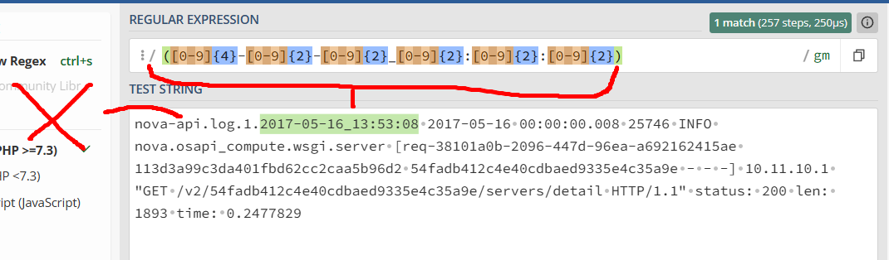
- *teks yang **nova-api.log** tidak diambil karena **udh di ambil di name prematch sebelumnya**, dan kita hanya melanjutkan saja bagian selanjutnya
- kita coba dengan menambahkan rule decoder baru seperti ini
  ```bash
  <decoder name="nova-log-api">
    <parent>nova-log</parent>
    <regex type="pcre2" offset="after_parent">([0-9]{4}-[0-9]{2}-[0-9]{2}_[0-9]{2}:[0-9]{2}:[0-9]{2})</regex>
    <order>log_timestamp</order>
  </decoder>
  ``` 
- ini saya coba tambahkan lagi rule baru dan coba testing lagi
  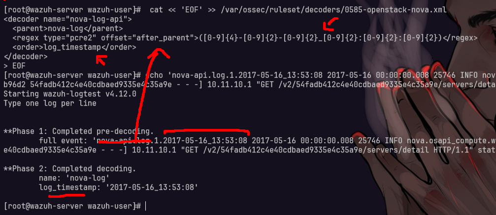
- jika sudah kita bisa kembangkan lagi sampai bisa dapet beberapa data, ini adalah contoh di regex 101 ketika sudah dapet semua datanya
  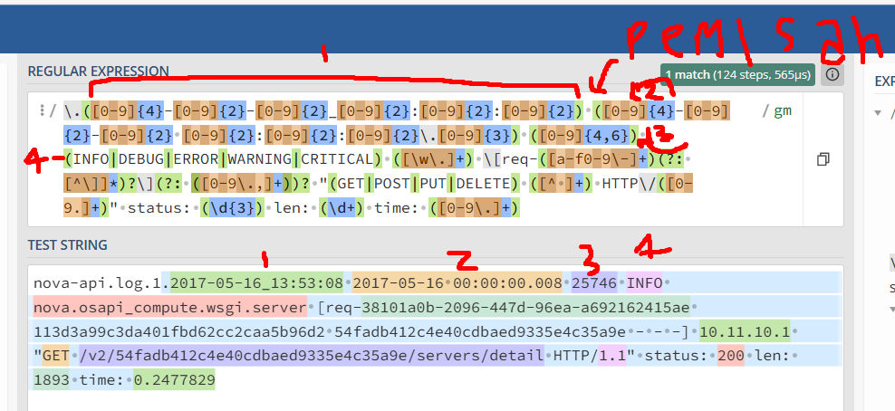

### 3. lakukan test dengan decoders yang sudah dibuat
copy paste rules nya dengan nano, atau output redirection
```bash
nano /var/ossec/ruleset/decoders/0585-openstack-nova.xml
# lalu masukan rulesnya di link di atas atau gunaka output redirection

cat << 'EOF' > /var/ossec/ruleset/decoders/0585-openstack-nova.xml
## copy paste rulesnya
EOF
```

> file rulesnya ada di link diatas

lalu lakukan **test dengan beberapa log yang berbeda** karena ada log dari **nova-api, dan nova-compute** 

```bash
echo 'nova-api.log.1.2017-05-16_13:53:08 2017-05-16 06:24:34.596 25786 INFO nova.metadata.wsgi.server [req-62f52759-163e-469d-9823-a6562fed14d7 - - - - -] 10.11.23.165,10.11.10.1 "GET /openstack/2013-10-17/vendor_data.json HTTP/1.1" status: 200 len: 124 time: 0.2370501' | /var/ossec/bin/wazuh-logtest
echo 'nova-compute.log.1.2017-05-16_13:55:31 2017-05-16 03:19:50.385 2931 INFO nova.virt.libvirt.imagecache [req-addc1839-2ed5-4778-b57e-5854eb7b8b09 - - - - -] Removable base files: /var/lib/nova/instances/_base/a489c868f0c37da93b76227c91bb03908ac0e742' | /var/ossec/bin/wazuh-logtest
```

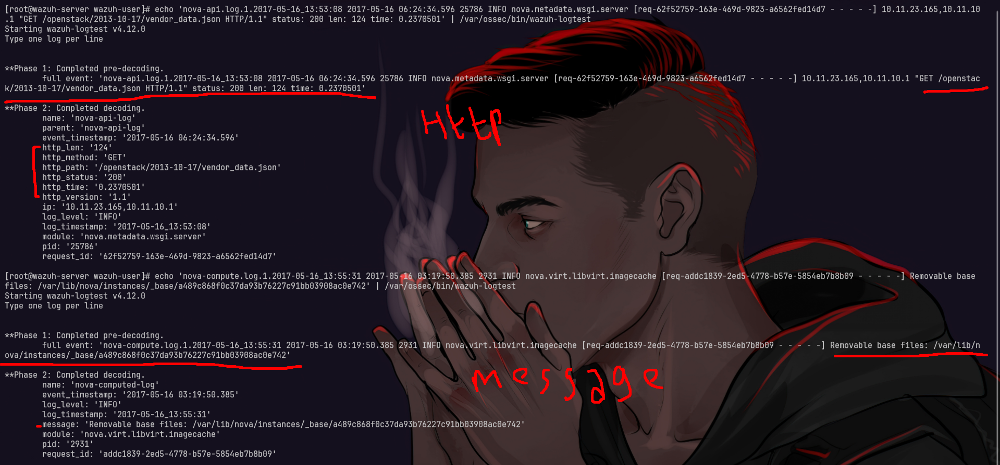

di gambar di atas terdapat 2 log yaitu nova-api, dan nova-compute yang **nova api itu mengarah ke HTTP**, **sedangkan nova-compute lebih ke message**

### 4. how to make rulesets
- pertama tama kita test dengan membaut ruleset yang mendeteksi **LOG_LEVEL=INFO**, untuk rulenya kurang lebih seperti ini
  ```xml
  <group name="nova,">
    <!-- Untuk nova-api -->
    <rule id="100100" level="0">
        <decoded_as>nova-api-log</decoded_as>
        <description>OpenStack Nova API base log</description>
    </rule>

    <!-- Untuk nova-compute -->
    <rule id="100200" level="0">
        <decoded_as>nova-computed-log</decoded_as>
        <description>OpenStack Nova Compute base log</description>
    </rule>

    <rule id="100101" level="1">
        <if_sid>100100</if_sid>
        <field name="log_level">INFO</field>
        <description>Nova Api INFO log</description>
    </rule>

    <rule id="100201" level="1">
        <if_sid>100200</if_sid>
        <field name="log_level">INFO</field>
        <description>Nova Compute INFO log</description>
    </rule>
  </group>
  ```
- disini kita buat filenya dulu dan ubah permissionya
  ```bash
  nano /var/ossec/ruleset/rules/1001-openstack-nova-rules.xml
  chown -R root:wazuh /var/ossec/ruleset/rules/1001-openstack-nova-rules.xml

  # atau gunakan output redirection
  cat << 'EOF' > /var/ossec/ruleset/rules/1001-openstack-nova-rules.xml
  ## copy paste rulesnya
  EOF
  ```
- lalu lakukan test dengan menggunakan **wazuh-logtest** untuk memastikan bahwa log yang kita buat sebelum
- kita bisa gunakan perintah yang sebelumnya
  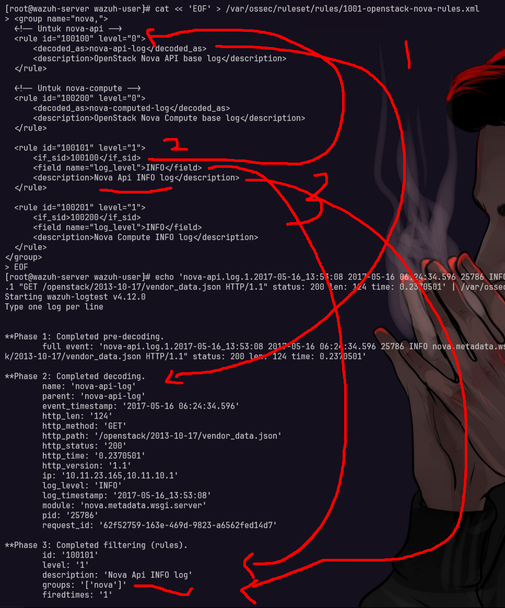

### 5. lakukan test dengan rulesets yang sudah dibuat
copy paste rules nya dengan nano, atau output redirection, samain aja sama perintah di atas trus copy paste rulesnya

> file rulesnya ada di link diatas

lalu lakukan **test dengan beberapa log yang berbeda beda** jenisnya saya sudah mengumpulkan **beberapa log yang berbeda** seperti ada **INFO, WARNING< ERROR, dan HTTP**

```bash
# INFO
## normal
echo 'nova-api.log.1.2017-05-16_13:53:08 2017-05-16 06:24:34.596 25786 INFO nova.metadata.wsgi.server [req-62f52759-163e-469d-9823-a6562fed14d7 - - - - -] 10.11.23.165,10.11.10.1 "GET /openstack/2013-10-17/vendor_data.json HTTP/1.1" status: 200 len: 124 time: 0.2370501' | /var/ossec/bin/wazuh-logtest
echo 'nova-compute.log.1.2017-05-16_13:55:31 2017-05-16 03:19:50.385 2931 INFO nova.virt.libvirt.imagecache [req-addc1839-2ed5-4778-b57e-5854eb7b8b09 - - - - -] Removable base files: /var/lib/nova/instances/_base/a489c868f0c37da93b76227c91bb03908ac0e742' | /var/ossec/bin/wazuh-logtest

## abnormal
echo 'nova-api.log.2017-05-14_21:27:04 2017-05-14 19:39:01.445 25746 INFO nova.osapi_compute.wsgi.server [req-5a2050e7-b381-4ae9-92d2-8b08e9f9f4c0 113d3a99c3da401fbd62cc2caa5b96d2 54fadb412c4e40cdbaed9335e4c35a9e - - -] 10.11.10.1 "GET /v2/54fadb412c4e40cdbaed9335e4c35a9e/servers/detail HTTP/1.1" status: 200 len: 1583 time: 0.1919448' | /var/ossec/bin/wazuh-logtest
echo 'nova-compute.log.2017-05-14_21:27:09 2017-05-14 19:39:02.007 2931 INFO nova.virt.libvirt.driver [req-e285b551-587f-4c1d-8eba-dceb2673637f 113d3a99c3da401fbd62cc2caa5b96d2 54fadb412c4e40cdbaed9335e4c35a9e - - -] [instance: 3edec1e4-9678-4a3a-a21b-a145a4ee5e61] Creating image' | /var/ossec/bin/wazuh-logtest

# ERROR
## normal
echo 'nova-api.log.1.2017-05-16_13:53:08 2017-05-16 06:25:02.867 25746 ERROR keystonemiddleware.auth_token [req-1cc7d50c-25a2-46b0-a668-9c00f589160c 113d3a99c3da401fbd62cc2caa5b96d2 54fadb412c4e40cdbaed9335e4c35a9e - - -] Bad response code while validating token: 503' | /var/ossec/bin/wazuh-logtest
echo 'nova-compute.log.1.2017-05-16_13:55:31 2017-05-16 03:19:45.356 2931 ERROR oslo_service.periodic_task Traceback (most recent call last):' | /var/ossec/bin/wazuh-logtest

# warning
## normal
echo 'nova-api.log.1.2017-05-16_13:53:08 2017-05-16 06:25:02.868 25746 WARNING keystonemiddleware.auth_token [req-1cc7d50c-25a2-46b0-a668-9c00f589160c 113d3a99c3da401fbd62cc2caa5b96d2 54fadb412c4e40cdbaed9335e4c35a9e - - -] Identity response: <!DOCTYPE HTML PUBLIC "-//IETF//DTD HTML 2.0//EN">' | /var/ossec/bin/wazuh-logtest
echo 'nova-compute.log.1.2017-05-16_13:55:31 2017-05-16 03:19:50.384 2931 WARNING nova.virt.libvirt.imagecache [req-addc1839-2ed5-4778-b57e-5854eb7b8b09 - - - - -] Unknown base file: /var/lib/nova/instances/_base/a489c868f0c37da93b76227c91bb03908ac0e742' | /var/ossec/bin/wazuh-logtest

## abnormal
echo 'nova-compute.log.2017-05-14_21:27:09 2017-05-14 19:59:40.806 2931 WARNING nova.virt.libvirt.imagecache [req-addc1839-2ed5-4778-b57e-5854eb7b8b09 - - - - -] Unknown base file: /var/lib/nova/instances/_base/a489c868f0c37da93b76227c91bb03908ac0e742' | /var/ossec/bin/wazuh-logtest
```

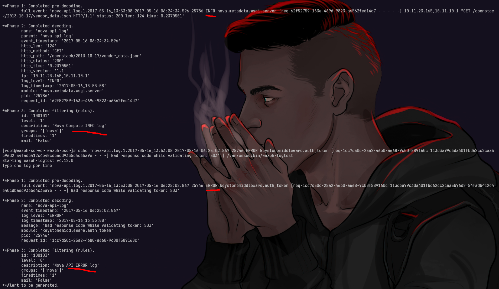

> bisa juga gunakan di webnya ada di <ip_wazuh>/app/ruleset-test#/wazuh-dev?tab=logtest

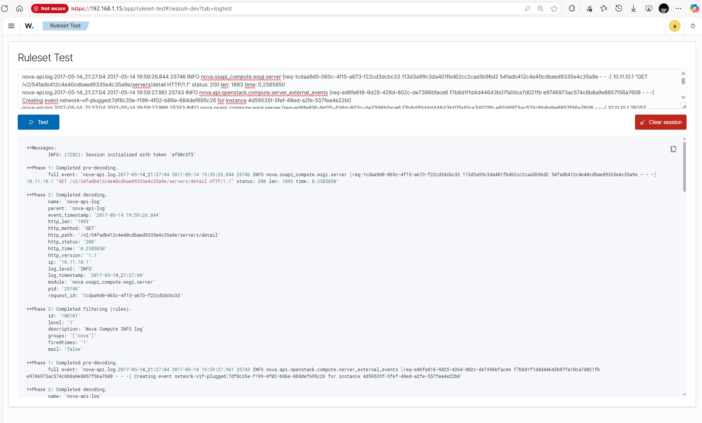