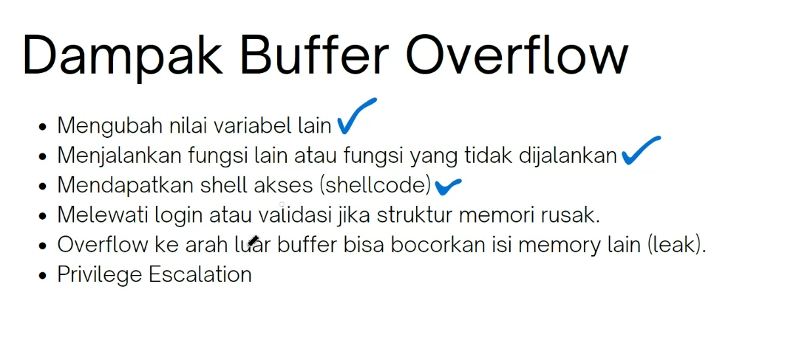

call memanggil fuction


- EIP 32 bit, kalo pkae R kaya RIP berarti 64 bit
  
- ESP 
- EBP
  
  
  
stack frame


push => masukin
call => manggil function lain dan membuat stack frame baru gitu kalo gak salah
pop => keluarin


## lab
- https://exploit.education
```bash
sudo apt update
sudo apt install gcc-multilab gdb
sudo apt install gcc-multilib g++-multilib libc6-dev-i386
```
- https://github.com/longld/peda

### 1 stack zero
- https://exploit.education/phoenix/stack-zero/
```
cat > vuln.c << EOF
/*
 * phoenix/stack-zero, by https://exploit.education
 *
 * The aim is to change the contents of the changeme variable.
 *
 * Scientists have recently discovered a previously unknown species of
 * kangaroos, approximately in the middle of Western Australia. These
 * kangaroos are remarkable, as their insanely powerful hind legs give them
 * the ability to jump higher than a one story house (which is approximately
 * 15 feet, or 4.5 metres), simply because houses can't can't jump.
 */

#include <stdio.h>
#include <stdlib.h>
#include <string.h>
#include <unistd.h>

#define LEVELNAME "stack-zero"
#define BANNER \
  "Welcome to " LEVELNAME ", brought to you by https://exploit.education"

char *gets(char *);

int main(int argc, char **argv) {
  struct {
    char buffer[64];
    volatile int changeme;
  } locals;

  printf("%s\n", BANNER);

  locals.changeme = 0;
  gets(locals.buffer);

  if (locals.changeme != 0) {
    puts("Well done, the 'changeme' variable has been changed!");
  } else {
    puts(
        "Uh oh, 'changeme' has not yet been changed. Would you like to try "
        "again?");
  }

  exit(0);
}
EOF

gcc -m32 vuln.c -fno-stack-protector -no-pie -z execstack -o vuln
# 32 bit, no stack protector, dan menonaktifkan keamanan binary di linux

gdb vuln
info function
disas main # dipecah untuk cari stack frame main
b 
c
/x
```