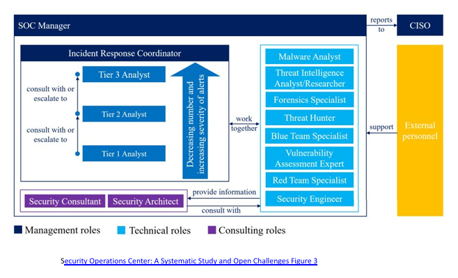
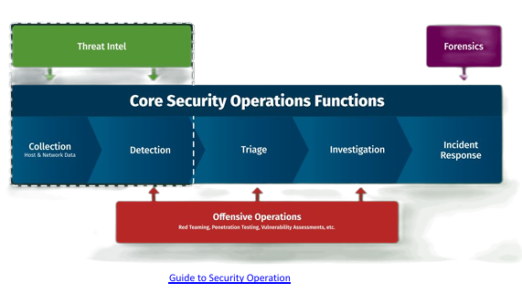
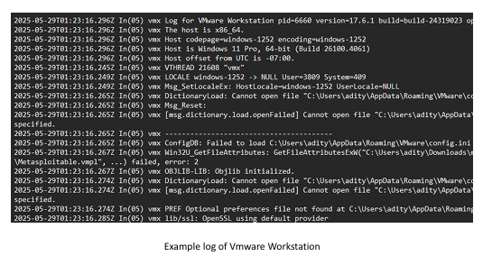

# Modern SOC 
Implementasi dengan Alat Open-Source Memanfaatkan panduan SANS, NIST, dan IEEE untuk SOC generasi berikutnya

## apa itu Security Operations Center (SOC)?

- 24/7 centralized cyber threat team (Tim ancaman siber terpusat 24/7)
- Protects systems, data, people (Melindungi sistem, data, orang-orang)
- Combines people, process, tech (Menggabungkan orang, proses, teknologi)
- Incident collaboration hub (Pusat kolaborasi insiden)

## Core SOC Functions

- Collection: Logs from endpoint, network, cloud
- Detection: Alerting via analytics, threat intel
- Triage: Prioritize alerts by severity and risk
- Investigation: Validate and scope incidents
- Response: Containment, recovery

Feedback loop for detection improvements

## Key Data Sources

- Network logs, NetFlow (Suricata/Mirror Port )
- Endpoint logs (OSSEC/Wazuh)
- Cloud, virtualization
- Security tools, threat intel feeds ( TIA ) 

### TAKE A BREAK !
• For your information, many application in 
industry is non standar, and don’t have 
logging function and make it harder doing 
DFIR

---

ndr, soar, dll
agar bisa deteksi device agar bisa tau detail device yang terinfeksi

